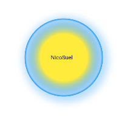
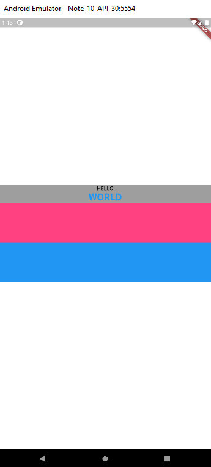
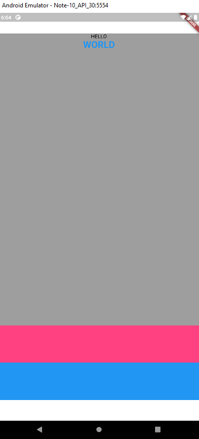
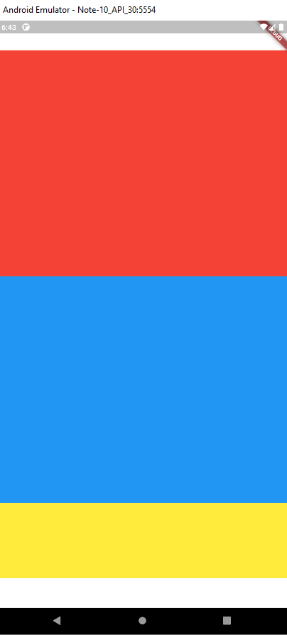
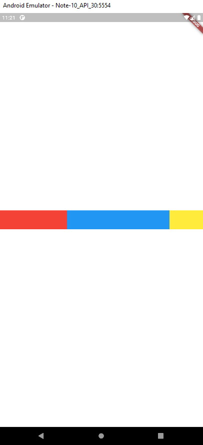
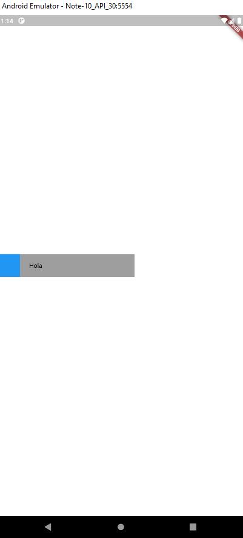

# Seccion 1: Informacion del curso

## 1. Codigo fuente

https://github.com/darwin-morocho/curso-flutter-desde-cero-2021

# Seccion 2: Programacion con dart y null safety

## 2. Introduccion

- Instalar dark
- Verificar con dart -- version si se instalo de manera correcta

## 3. Visual Studio Code

- Instalar Visual Studio Code

## 4. El metodo main

```dart
void main() {
  print("hello");
}
```

## 5. Creando un proyecto de linea de comandos

```dart
void main() {
  print("hello");
  print(arguments);
}
```


- Para crear un proyecto dart con la terminal

  1. En la terminal escribimos dart create hello_world , donde hello_world es el nombre del proyecto
  2. Damos enter y se creara el proyecto

- Para crear un proyecto en dart desde VSC
  1. Presionamos ctrl+shif+p
  2. Escribemos dart
  3. Click en Dart New Project
  4. Click en "Console Aplicattion"
  5. Seleccionas la carpeta y el nombre del proyecto a guardar.

## 6. Estructura de un proyecto CLI

## 7. El archivo launch.json

```dart
void main(List<String> arguments) {
  print("dev mode");
  print(arguments);
}
```

```dart
void main(List<String> arguments) {
  print("prod mode");
  print(arguments);
}
```
```dart
{
    "configurations": [
        {
            "name": "Dev mode",
            "type": "dart",
            "request": "launch",
            "program": "bin/dev.dart",
            "args": [
                "mode","dev"
            ]
        },
        {
            "name": "Prod mode",
            "type": "dart",
            "request": "launch",
            "program": "bin/prod.dart",
            "args": [
                "mode","prod"
            ]
        }
    ]
}
```


# SECCION 5: WIDGETS MAS USADOS EN FLUTTER

## 80. INTRODUCCION


## 81. EL WIDGET TEXT - PARTE 1

```dart
import 'package:flutter/material.dart';

void main() {
  runApp(const MyApp());
}

class MyApp extends StatelessWidget {
  const MyApp({Key? key}) : super(key: key);

  // This widget is the root of your application.
  @override
  Widget build(BuildContext context) {
    return const MaterialApp(
      home: Center(
        child: DefaultTextStyle(
            style: TextStyle(),
            child: Text("HELLO",
                style: TextStyle(
                    fontSize: 80,
                    color: Colors.white,
                    decoration: TextDecoration.lineThrough))),
      ),
    );
  }
}
```

## 82. El widget Text - parte 2

```dart
import 'package:flutter/material.dart';

void main() {
  runApp(const MyApp());
}
class MyApp extends StatelessWidget {
  const MyApp({Key? key}) : super(key: key);

  @override
  Widget build(BuildContext context) {
    return const MaterialApp(
      home: Center(
        child: DefaultTextStyle(
            style: TextStyle(),
            child: Text(
              "Lorem Ipsum is simply dummy text of the printing and typesetting industry.",
              style: TextStyle(
                fontSize: 80,
                color: Colors.white,
              ),
              textAlign: TextAlign.center,
            )),
      ),
    );
  }
}
```


# 83. EL WIDGET TEXT - PARTE 3

```dart
import 'package:flutter/material.dart';

void main() {
  runApp(const MyApp());
}
class MyApp extends StatelessWidget {
  const MyApp({Key? key}) : super(key: key);

  @override
  Widget build(BuildContext context) {
    return const MaterialApp(
      home: Center(
        child: DefaultTextStyle(
            style: TextStyle(),
            child: Text(
              "Lorem Ipsum is simply dummy text"
              "of the printing and typesetting industry.",
              maxLines: 2,
              overflow: TextOverflow.ellipsis,
              style: TextStyle(
                fontSize: 40,
                color: Colors.white,
              ),
              textAlign: TextAlign.center,
            )),
      ),
    );
  }
}
```

# 84. El widget Container - parte 1

```dart
import 'package:flutter/material.dart';
import 'widgets/container.dart';

void main() {
  runApp(const MyApp());
}
class MyApp extends StatelessWidget {
  const MyApp({Key? key}) : super(key: key);

  @override
  Widget build(BuildContext context) {
    return MaterialApp(
      home: MyContainer(),
    );
  }
}
```

```dart
import 'package:flutter/material.dart';

class MyContainer extends StatelessWidget {
  @override
  Widget build(BuildContext context) {
    return DefaultTextStyle(
      style: TextStyle(),
      child: Center(
        child: Container(
          width: 200,
          height: 200,
          color: Colors.white,
          alignment: Alignment.center,
          child: Text(
            "Darwin Morocho",
            style: TextStyle(
              color: Colors.black,
            ),
          ),
        ),
      ),
    );
  }
}
```


# 85. El widget Container - parte 2

```dart
import 'package:flutter/material.dart';
class MyContainer extends StatelessWidget {
  @override
  Widget build(BuildContext context) {
    return DefaultTextStyle(
      style: TextStyle(),
      child: Center(
        child: Container(
          width: 200,
          height: 200,
          color: Colors.white,
          alignment: Alignment.centerRight,
          padding: EdgeInsets.only(
            right: 10,
          ),
          child: Text(
            "Darwin Morocho",
            style: TextStyle(
              color: Colors.black,
            ),
          ),
        ),
      ),
    );
  }
}
```


# 86. El widget Container - parte 3

```dart
import 'package:flutter/material.dart';
class MyContainer extends StatelessWidget {
  @override
  Widget build(BuildContext context) {
    return DefaultTextStyle(
      style: TextStyle(),
      child: Center(
        child: Container(
          width: 200,
          height: 200,
          alignment: Alignment.centerRight,
          decoration: BoxDecoration(
            color: Colors.white,
            borderRadius: BorderRadius.only(
                topLeft: Radius.circular(30),
                bottomRight: Radius.circular(30)),
          ),
          padding: EdgeInsets.only(
            right: 10,
          ),
          child: Text(
            "Darwin Morocho",
            style: TextStyle(
              color: Colors.black,
            ),
          ),
        ),
      ),
    );
  }
}
```


# 87. El widget Container - parte 4

```dart
import 'package:flutter/material.dart';
class MyContainer extends StatelessWidget {
  @override
  Widget build(BuildContext context) {
    return Container(
      color: Colors.white,
      child: DefaultTextStyle(
        style: TextStyle(),
        child: Center(
          child: Container(
            width: 200,
            height: 200,
            alignment: Alignment.center,
            decoration: BoxDecoration(
                color: Colors.white,
                shape: BoxShape.circle,
                boxShadow: [
                  BoxShadow(
                    color: Colors.blue.withOpacity(0.3),
                    blurRadius: 10,
                    spreadRadius: 20,
                    offset: Offset(10, 20),
                  ),
                ]),
            padding: EdgeInsets.only(
              right: 10,
            ),
            child: Text(
              "Darwin Morocho",
              style: TextStyle(
                color: Colors.black,
              ),
            ),
          ),
        ),
      ),
    );
  }
}
```


# 88. El widget Container - parte 5

```dart
import 'package:flutter/material.dart';
class MyContainer extends StatelessWidget {
  @override
  Widget build(BuildContext context) {
    return Container(
      color: Colors.white,
      child: DefaultTextStyle(
        style: TextStyle(),
        child: Center(
          child: Container(
            width: 200,
            height: 200,
            alignment: Alignment.center,
            decoration: BoxDecoration(
                color: Colors.white,
                shape: BoxShape.circle,
                gradient: RadialGradient(
                  colors: [
                    Colors.yellow,
                    Colors.blue.withOpacity(0.2),
                    Colors.blue,
                  ],
                  stops: const [
                    0.6,
                    0.95,
                    1,
                  ],
                ),
                boxShadow: [
                  BoxShadow(
                    color: Colors.blue.withOpacity(0.3),
                    blurRadius: 15,
                    spreadRadius: 10,
                    offset: Offset(5, 5),
                  ),
                ]),
            padding: EdgeInsets.only(
              right: 10,
            ),
            child: Text(
              "NicoSuel",
              style: TextStyle(
                color: Colors.black,
              ),
            ),
          ),
        ),
      ),
    );
  }
}
```



# 89. El widget Container - parte 6

```dart
import 'package:flutter/material.dart';
class MyContainer extends StatelessWidget {
  @override
  Widget build(BuildContext context) {
    return Container(
      color: Colors.white,
      alignment: Alignment.center,
      child: DefaultTextStyle(
        style: TextStyle(),
        child: Container(
          color: Colors.red,
          margin: EdgeInsets.symmetric(
            horizontal: 10,
            vertical: 50,
          ),
          padding: EdgeInsets.symmetric(
            horizontal: 30,
            vertical: 10,
          ),
          child: Text(
            "NicoSuel",
            style: TextStyle(
              color: Colors.black,
            ),
          ),
        ),
      ),
    );
  }
}
```


# 90. El widget Column - parte 1

```dart
import 'package:flutter/material.dart';
class MyColumn extends StatelessWidget {
  const MyColumn({Key? key}) : super(key: key);

  @override
  Widget build(BuildContext context) {
    return DefaultTextStyle(
        style: const TextStyle(color: Colors.black),
        child: Container(
          color: Colors.white,
          padding: const EdgeInsets.symmetric(
            vertical: 55,
          ),
          child: Center(
            child: Container(
              color: Colors.grey,
              child: Column(
                mainAxisSize: MainAxisSize.min,
                children: [
                  const Text("HELLO"),
                  const Text(
                    "WORLD",
                    style: TextStyle(
                        color: Colors.blue,
                        fontSize: 25,
                        fontWeight: FontWeight.bold),
                  ),
                  Container(
                    height: 100,
                    color: Colors.pinkAccent,
                  ),
                  Container(
                    height: 100,
                    color: Colors.blue,
                  ),
                ],
              ),
            ),
          ),
        ));
  }
}
```


# 91. El widget Column - parte 2

```dart
import 'package:flutter/material.dart';
class MyColumn extends StatelessWidget {
  const MyColumn({Key? key}) : super(key: key);
  @override
  Widget build(BuildContext context) {
    return DefaultTextStyle(
        style: const TextStyle(color: Colors.black),
        child: Container(
          color: Colors.white,
          padding: const EdgeInsets.symmetric(
            vertical: 55,
          ),
          child: Center(
            child: Container(
              color: Colors.grey,
              child: Column(
                children: [
                  const Text("HELLO"),
                  const Text(
                    "WORLD",
                    style: TextStyle(
                        color: Colors.blue,
                        fontSize: 25,
                        fontWeight: FontWeight.bold),
                  ),
                  const Spacer(),
                  Container(
                    height: 100,
                    color: Colors.pinkAccent,
                  ),
                  //const SizedBox(height: 100),
                  Container(
                    height: 100,
                    color: Colors.blue,
                  ),
                ],
              ),
            ),
          ),
        ));
  }
}
```



# 92. El widget Column - parte 3

```dart
import 'package:flutter/material.dart';
class MyColumn extends StatelessWidget {
  const MyColumn({Key? key}) : super(key: key);
  @override
  Widget build(BuildContext context) {
    return DefaultTextStyle(
        style: const TextStyle(color: Colors.black),
        child: Container(
          color: Colors.white,
          padding: const EdgeInsets.symmetric(
            vertical: 55,
          ),
          child: Center(
            child: Container(
              color: Colors.grey,
              child: Column(
                children: [
                  Expanded(
                    flex: 3,
                    child: Container(
                      color: Colors.red,
                    ),
                  ),

                  Expanded(
                    flex: 3,
                    child: Container(
                      color: Colors.blue,
                    ),
                  ),
                  Expanded(
                    flex: 1,
                    child: Container(
                      color: Colors.yellow,
                    ),
                  ),
                  //const SizedBox(height: 100),
                ],
              ),
            ),
          ),
        ));
  }
}
```


# 93. El widget Row

```dart
import 'package:flutter/material.dart';
class MyRow extends StatelessWidget {
  @override
  Widget build(BuildContext context) {
    return Container(
        color: Colors.white,
        child: Center(
          child: Row(
            mainAxisAlignment: MainAxisAlignment.spaceBetween,
            crossAxisAlignment: CrossAxisAlignment.center,
            children: [
              Expanded(
                flex: 2,
                child: Container(
                  width: 50,
                  height: 50,
                  color: Colors.red,
                ),
              ),
              Expanded(
                flex: 3,
                child: Container(
                  width: 50,
                  height: 50,
                  color: Colors.blue,
                ),
              ),
              Expanded(
                flex: 1,
                child: Container(
                  width: 50,
                  height: 50,
                  color: Colors.yellow,
                ),
              ),
            ],
          ),
        ));
  }
}
```



# 94. Errores de overflow

```dart
import 'package:flutter/material.dart';
class MyRow extends StatelessWidget {
  @override
  Widget build(BuildContext context) {
    return DefaultTextStyle(
      style: const TextStyle(color: Colors.black),
      child: Container(
          color: Colors.white,
          alignment: Alignment.centerLeft,
          child: Container(
            color: Colors.grey,
            width: 300,
            child: Row(
              mainAxisAlignment: MainAxisAlignment.center,
              crossAxisAlignment: CrossAxisAlignment.center,
              children: [
                Container(
                  width: 50,
                  height: 50,
                  color: Colors.blue,
                ),
                const SizedBox(width: 20),
                const Expanded(
                  child: Text("Hola"),
                )
              ],
            ),
          )),
    );
  }
}
```
