# Seccion 9: Programacion orientada a objetos (POO)
## 115. Miembros estaticos de una clase
- Tambien se les conoce como miembros de clase (ya que no le pertenece al objeto sino solo a la clase)
- Los miembros son los atributos y los metodos
- Para convertir un miembro a estatico tenemos que agregar la palabra static que ira despues del modificador de acceso.
Ejemplo:    private static numero = 1;
Al yo agregar static y posteriormente agrego un cambio en algun atributo no importa en que objeto este repercute y se asignara el ultimo cambio la cual sera el definitivo para todos los objetos

**Sin static**
```java
public class Estatico {
    private String frase = "Primera frase";
    public static void main(String[] args) {
        Estatico ob1 = new Estatico();
        Estatico ob2 = new Estatico();
        
        ob2.frase = "Segunda frase";
        
        System.out.println(ob1.frase);
        System.out.println(ob2.frase);
    }
}
```
Resultado obtenido: 

Primera frase

Segunda frase


**Con static**
```java
public class Estatico {
    private static String frase = "Primera frase";
    public static void main(String[] args) {
        Estatico ob1 = new Estatico();
        Estatico ob2 = new Estatico();
        
        ob2.frase = "Segunda frase";
        
        System.out.println(ob1.frase);
        System.out.println(ob2.frase);
    }
}
```
Resultado obtenido: 

Segunda frase

Segunda frase

Todos los objetos van a compartir ese atributo, que si yo lo cambio en un objeto cambiara para todos los objetos porque ya no le pertenece a cada objeto individual porque ahora es de la clase
- Otra caracteristica que tienen los atributos staticos es que ya no necesitan que instanciemos un objeto para poder utilizarlos. Ejemplo
```java
public class Estatico {
    private static String frase = "Primera frase";
    public static void main(String[] args) {
        //Podemos imprimir sin necesidad de instanciar un objeto
        System.out.println(Estatico.frase);
    }
}
```
Resultado obtenido: 

Primera frase

- Lo mismo ocurre con los metodos estaticos. Ejemplo:
```java
public class Estatico {
    public static int sumar(int n1, int n2){
            int suma = n1 + n2;
            return suma;
        }
    public static void main(String[] args) {
        System.out.println("La suma es: "+Estatico.sumar(3, 4));
    }
}
```
Resultado obtenido:

La suma es: 7

## 116. Ejercicio 1 - Obtener el perimetro y area de un cuadrilatero 
Construir un programa que calcule el area y el perimetro de un cuadrilatero dada la longitud de sus dos lados. Los valores de la longitud deberan introducirse por linea de ordenes. Si es un cuadrado, solo se proporcionara la longitud de uno de los lados al constructor. 

**Solucion**

Diagrama de clases:

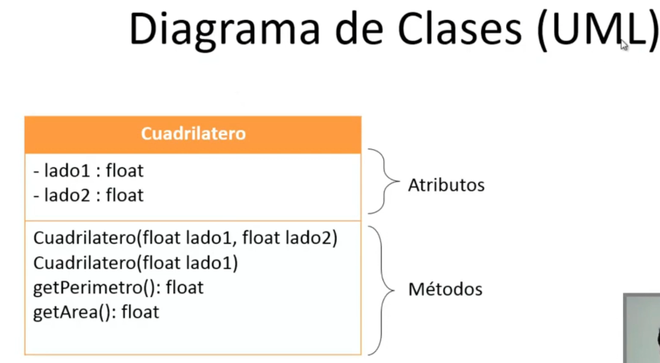

```java
package Ejercicio1;
public class Cuadrilatero {
    //Atributos
    private float lado1;
    private float lado2;
    //Metodos
    //Metodo constructor 1 (Cuadrilatero)
    public Cuadrilatero(float lado1, float lado2) {
        this.lado1 = lado1;
        this.lado2 = lado2;
    }
    //Metodo constructor 2 (Cuadrado)
    public Cuadrilatero(float lado1) {
        this.lado1 = this.lado2 = lado1;
    }
    public float getPerimetro(){
        float perimetro = 2 * (lado1 + lado2);
        return perimetro;
    }
    public float getArea(){
        float area = (lado1 * lado2);
        return area;
    }
}
```

```java
package Ejercicio1;
import javax.swing.JOptionPane;
public class Principal {
    public static void main(String[] args) {
        Cuadrilatero c1;
        float lado1,lado2;    
        lado1 = Float.parseFloat(JOptionPane.showInputDialog("Digite el lado1: "));
        lado2 = Float.parseFloat(JOptionPane.showInputDialog("Digite el lado2: "));      
        if(lado1 == lado2){ //Es un cuadrado
            c1 = new Cuadrilatero(lado1);
        }
        else{
            c1 = new Cuadrilatero(lado1, lado2);
        }     
        System.out.println("El perimetro es: "+c1.getPerimetro());
        System.out.println("El area es: "+c1.getArea());
    }
}
```

## 117. Ejercicio 2 - Mover un objeto en un tablero
Construir un programa que permita dirigir el movimiento de un objeto dentro de un tablero y actualice su posicion dentro del mismo. Los movimientos posibles son ARRIBA, ABAJO, IZQUIERDA Y DERECHA. Tras cada movimiento el programa mostrara la nueva direccion elegida y las coordenadas de situacion del objeto dentro del tablero.

**Solucion:**
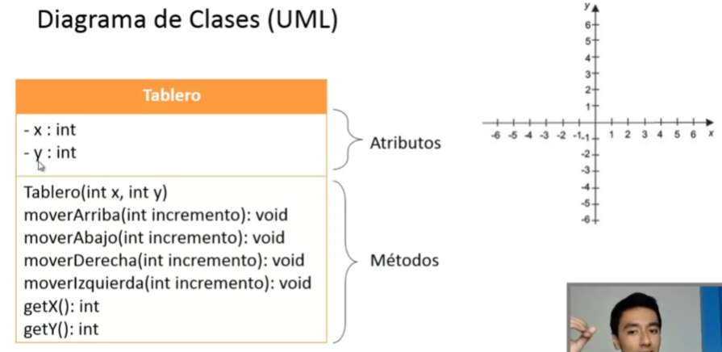

```java
package Ejercicio2;
public class Tablero {
    private int x;
    private int y;
    //Constructor
    public Tablero(int x, int y) {
        this.x = x;
        this.y = y;
    }
    public void moverArriba(int incremento){
        y+=incremento;
    }
    public void moverAbajo(int incremento){
        y-=incremento;
    }
    public void moverDerecha(int incremento){
        x+=incremento;
    }
    public void moverIzquierda(int incremento){
        x-=incremento;
    }
    public int getX() {
        return x;
    }
    public int getY() {
        return y;
    }
}

```

```java
package Ejercicio2;
import java.util.Scanner;
public class Principal {
    public static void main(String[] args) {
        Scanner entrada = new Scanner(System.in);
        Tablero t1;
        int x,y,opcion,incremento=0;
        System.out.print("Digite la coordenada inicial de X: ");
        x=entrada.nextInt();
        System.out.print("Digite la coordenada inicial de Y: ");
        y=entrada.nextInt();
        //Posicion inicial del objeto
        t1=new Tablero(x, y);
        do {            
            System.out.println("\n\t.:MENU:.");
            System.out.println("1. Mover hacia ARRIBA");
            System.out.println("2. Mover hacia ABAJO");
            System.out.println("3. Mover hacia DERECHA");
            System.out.println("4. Mover hacia IZQUIERDA");
            System.out.println("5. Salir");
            System.out.print("Digite la opcion: ");
            opcion=entrada.nextInt();
            
            if(opcion>=1 && opcion<=4){
                System.out.print("\nDigite la cantidad de espacios a moverse: ");
                incremento = entrada.nextInt();
            }
            switch(opcion){
                case 1: t1.moverArriba(incremento); break;
                case 2: t1.moverAbajo(incremento); break;
                case 3: t1.moverDerecha(incremento); break;
                case 4: t1.moverIzquierda(incremento); break;
                case 5: break;
                default: System.out.print("Error, se equivoco de opcion de menu"); break;
            }
            System.out.print("\nPosicion Actual (X,Y): ("+t1.getX()+" , "+t1.getY()+")"); 
        } while (opcion !=5);
    }
}

```
## 118. Ejercicio 3 - Encontrar el vehiculo mas barato
Construir un programa que dada una serie de vehiculos caracterizados por su marca, modelo y precio, imprima las propiedades del vehiculo mas barato. Para ello, se deberan leer por teclado las caracteristicas de cada vehiculo y crear una clase que represente a cada uno de ellos.

**Solucion:**


```java
package Ejercicio3;
public class Vehiculo {
    private String marca;
    private String modelo;
    private float precio;
    //Constructor
    public Vehiculo(String marca, String modelo, float precio) {
        this.marca = marca;
        this.modelo = modelo;
        this.precio = precio;
    }
    public float getPrecio() {
        return precio;
    }
    public String mostrarDatos(){
        return  "Marca: "+marca+"\nModelo: "+modelo+"\nPrecio: $"+precio+"\n";
    }
}
```

```java
package Ejercicio3;
import java.util.Scanner;
public class Principal {
    public static int indiceCocheMBarato(Vehiculo coches[]){
        float precio;
        int indice = 0;
        
        precio = coches[0].getPrecio();
        for (int i = 1; i < coches.length; i++) {
            if (coches[i].getPrecio()<precio) {
                precio = coches[i].getPrecio();
                indice = i;
            }
        }
        return indice;
    }
    public static void main(String[] args) {
        Scanner entrada = new Scanner(System.in);
        String marca,modelo;
        float precio;
        int numeroVehiculos,indiceBarato;
        
        System.out.print("Digite la cantidad de Vehiculos: ");
        numeroVehiculos = entrada.nextInt();
        
        //Creamos los objetos para los coches
        Vehiculo coches[] = new Vehiculo[numeroVehiculos];
        
        for (int i = 0; i < coches.length; i++) {   //tambien se puede poner numeroVehiculos en vez de coches.length
            entrada.nextLine(); //Corrige errores cuando el programa nos pide string
            System.out.println("Digite las caracteristicas del coche"+(i+1)+": ");
            System.out.print("Introduzca Marca: ");
            marca = entrada.nextLine();
            System.out.print("Introduzca Modelo: ");
            modelo = entrada.nextLine();
            System.out.print("Introduzca Precio: ");
            precio = entrada.nextFloat();
            
            coches[i] = new Vehiculo(marca,modelo, precio);
        }
        indiceBarato = indiceCocheMBarato(coches);
        System.out.println("\nEl coche mas barato es: ");
        System.out.println(coches[indiceBarato].mostrarDatos());
    }
}
```

- Con entrada.nextLine(); corregimos errores que a veces salen cuando ejecutamos programas que nos pidan datos de tipo string. Esto ocurre porque el buffer no queda completamente vacio para poner el siguiente dato
- Para poner datos de tipo decimal en java se tiene que usar el punto y no la coma.

## 119. Ejercicio 4 - Hacer un programa para una competencia de atletismo
Construir un programa para una competencia de atletismo, el programa debe gestionar una serie de atletas caracterizados por su numero de atleta, nombre y tiempo de carrera, al final el programa debe mostrar los datos del atleta ganador de la carrera.

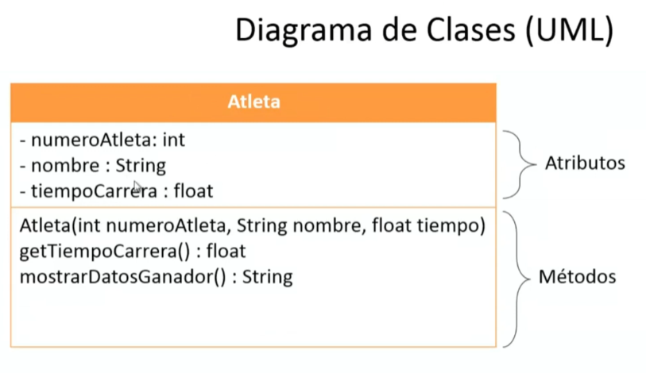

```java
package Ejercicio4;
public class Atleta {
    private int numeroAtleta;
    private String nombre;
    private float tiempoCarrera;
    //Constructor
    public Atleta(int numeroAtleta, String nombre, float tiempoCarrera) {
        this.numeroAtleta = numeroAtleta;
        this.nombre = nombre;
        this.tiempoCarrera = tiempoCarrera;
    }
    public float getTiempoCarrera(){
        return tiempoCarrera;
    }
    public String mostrarDatosGanador(){
        return "Numero de Atleta: "+numeroAtleta+"\nNombre Atleta: "+nombre+"\nTiempo Carrera: "+tiempoCarrera+"\n";
    }
}
```

```java
package Ejercicio4;
import java.util.Scanner;
public class Principal {
    public static int indiceGanador(Atleta atletas[]){
        float tiempoCarrera;
        int indice = 0;
        tiempoCarrera = atletas[indice].getTiempoCarrera();
        for (int i = 1; i < atletas.length; i++) {
            if (atletas[i].getTiempoCarrera()<tiempoCarrera) {
                tiempoCarrera = atletas[i].getTiempoCarrera();
                indice = i;
            } 
        }
        return indice;
    }
    public static void main(String[] args) {
        Scanner entrada = new Scanner(System.in);
        String nombre;
        int numeroAtleta,nAtletas,indiceAtletaGanador;
        float tiempoCarrera;
        
        System.out.print("Digite el numero de atletas a participar: ");
        nAtletas = entrada.nextInt();   
        //Creamos los objetos para cada atleta
        Atleta atletas[] = new Atleta[nAtletas];
        
        for (int i = 0; i < atletas.length; i++) {
            System.out.println("\nDigite los datos del atleta "+(i+1)+": ");
            System.out.print("Introduzca Numero de atleta: ");
            numeroAtleta = entrada.nextInt();
            entrada.nextLine();
            System.out.print("Introduzca Nombre de atleta: ");
            nombre = entrada.nextLine();
            System.out.print("Introduzca tiempo de carrera: ");
            tiempoCarrera = entrada.nextFloat();
            
            atletas[i] = new Atleta(numeroAtleta, nombre, tiempoCarrera);
        }
        indiceAtletaGanador = indiceGanador(atletas);
        System.out.println("\nEl atleta ganador es: ");
        System.out.println(atletas[indiceAtletaGanador].mostrarDatosGanador());
    }
}
```

## 120. Ejercicio 5 - Area y perimetro de triangulos isosceles

Diseñar un programa para trabajar con triangulos isosceles. Para ello defina los atributos necesarios que se requieren, proporcione metodos de consulta, un metodo constructor e implemente metodos para calcular el perimetro y el area de un triangulo, ademas implementar un metodo que a partir de un arreglo de triangulos devuelva el area del triangulo de mayor superficie.

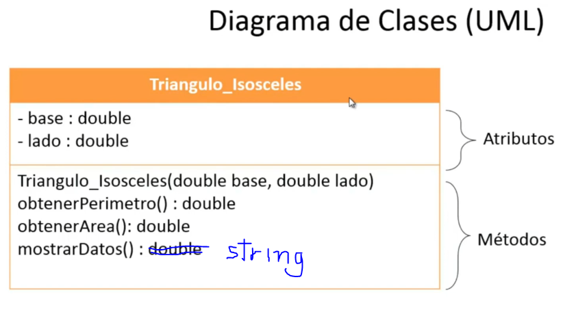

```java
package Ejercicio5;
public class Triangulo_Isosceles {
    private double base;
    private double lado;
    public Triangulo_Isosceles(double base, double lado) {
        this.base = base;
        this.lado = lado;
    }
    public double obtenerPerimetro(){
        double perimetro = 2*lado + base;
        return perimetro;
    }
    public double obtenerArea(){
        double area = (base*Math.sqrt(lado*lado-(base*base)/4))/2;
        return area;
    }
}
```

```java
package Ejercicio5;
import java.util.Scanner;
public class Principal {
    public static double mayorArea(Triangulo_Isosceles triangulos[]){
        double area;
        area = triangulos[0].obtenerArea();
        for (int i = 1; i < triangulos.length; i++) {
            if(triangulos[i].obtenerArea()>area){
                area = triangulos[i].obtenerArea();
            }
        }
        return area;
    }
    public static void main(String[] args) {
        Scanner entrada = new Scanner(System.in);
        double base,lado;
        int nTriangulos;
        System.out.print("Digite el numero de triangulos a ingresar: ");
        nTriangulos = entrada.nextInt();
        Triangulo_Isosceles triangulos[] = new Triangulo_Isosceles[nTriangulos]; 
        for (int i = 0; i < triangulos.length; i++) {
            System.out.println("\nDigite los valores para el triangulo "+(i+1)+":");
            System.out.print("Introduzca la base: ");
            base = entrada.nextDouble();
            System.out.print("Introduzca el lado: ");
            lado = entrada.nextDouble();
            
            triangulos[i] = new Triangulo_Isosceles(base, lado);
            
            System.out.println("\nEl perimetro del triangulo es: "+triangulos[i].obtenerPerimetro());
            System.out.println("El area del triangulo es: "+triangulos[i].obtenerArea());
        }
        System.out.println("\nEl area del triangulo de mayor superficie es: "+mayorArea(triangulos));
    }  
}
```

## 121. Ejercicio 6 - Operaciones con numeros complejos (parte 1)
## 122. Ejercicio 6 - Operaciones con numeros complejos (parte 2)
Construir un programa para trabajar con 2 numeros complejos, implemente el siguiente menu:
1. Sumar dos numeros complejos
2. Multiplicar 2 numeros complejos
3. Comparar 2 numeros complejos (iguales o no)
4. Multiplicar un numero complejo por un entero

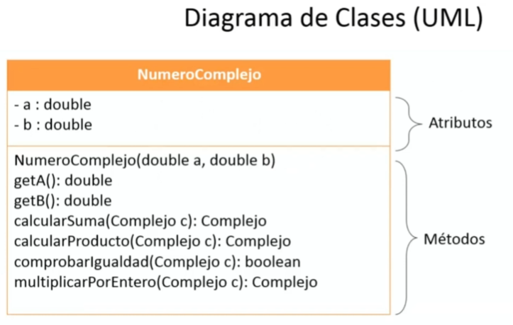

```java
package Ejercicio6;
public class NumeroComplejo {
        private double a;   //parte real
        private double b;   //parte imaginaria

    public NumeroComplejo(double a, double b) {
        this.a = a;
        this.b = b;
    }
    public double getA() {
        return a;
    }
    public double getB() {
        return b;
    }
    public NumeroComplejo calcularSuma(NumeroComplejo c){
        NumeroComplejo suma = new NumeroComplejo(a+c.getA(), b+c.getB());
        return suma;
    }
    public NumeroComplejo calcularProducto(NumeroComplejo c){
        NumeroComplejo mult = new NumeroComplejo(a*c.getA()-b*c.getB(), a*c.getB()+b*c.getA());
        return mult;
    }
    public boolean comprobarIgualdad(NumeroComplejo c){
        boolean igualdad = false;
        if (a==c.getA() && b==c.getB()) {
            igualdad = true;
        }
        return igualdad;
    }
    public NumeroComplejo multiplicarPorEntero(int x){
        NumeroComplejo producto = new NumeroComplejo(a*x, b*x);
        return producto;
    }  
}
```
```java
package Ejercicio6;
import java.util.Scanner;
public class Principal {
    public static void main(String[] args) {
        Scanner entrada = new Scanner(System.in);
        NumeroComplejo numero1,numero2,suma,mult;
        double a,b,c,d;
        int opcion,numero;
        do {            
            System.out.println("\t.:Operaciones con Numeros Complejos:.");
            System.out.println("1. Sumar 2 numeros complejos");
            System.out.println("2. Multiplicar 2 numeros complejos");
            System.out.println("3. Comparar 2 numeros complejos (iguales o no)");
            System.out.println("4. Multiplicar un numero complejo por un entero");
            System.out.println("5. Salir");
            System.out.print("Digite la opcion de menu: ");
            opcion = entrada.nextInt();                        
            switch(opcion){
                case 1: System.out.println("\nDigite el primer numero complejo: ");
                        System.out.print("Digite la parte real: ");
                        a = entrada.nextDouble();
                        System.out.print("Digite la parte imaginaria: ");
                        b = entrada.nextDouble();
                        System.out.println("\nDigite el segundo numero complejo: ");
                        System.out.print("Digite la parte real: ");
                        c = entrada.nextDouble();
                        System.out.print("Digite la parte imaginaria: ");
                        d = entrada.nextDouble();
                        
                        numero1 = new NumeroComplejo(a, b);
                        numero2 = new NumeroComplejo(c, d);
                        
                        suma = numero1.calcularSuma(numero2);
                        System.out.println("\nLa suma es: "+suma.getA()+" + "+suma.getB()+" i ");
                        break;
                case 2: System.out.println("\nDigite el primer numero complejo: ");
                        System.out.println("Digite la parte real: ");
                        a = entrada.nextDouble();
                        System.out.print("Digite la parte imaginaria: ");
                        b = entrada.nextDouble();
                        System.out.println("\nDigite el segundo numero complejo: ");
                        System.out.print("Digite la parte real: ");
                        c = entrada.nextDouble();
                        System.out.print("Digite la parte imaginaria: ");
                        d = entrada.nextDouble();
                        
                        numero1 = new NumeroComplejo(a, b);
                        numero2 = new NumeroComplejo(c, d);
                        
                        mult = numero1.calcularProducto(numero2);
                        System.out.println("\nLa multiplicacion es: "+mult.getA()+" + "+mult.getB()+" i ");
                        break;
                case 3: System.out.println("\nDigite el primer numero complejo: ");
                        System.out.print("Digite la parte real: ");
                        a = entrada.nextDouble();
                        System.out.print("Digite la parte imaginaria: ");
                        b = entrada.nextDouble();
                        System.out.println("\nDigite el segundo numero complejo: ");
                        System.out.print("Digite la parte real: ");
                        c = entrada.nextDouble();
                        System.out.print("Digite la parte imaginaria: ");
                        d = entrada.nextDouble();
                        
                        numero1 = new NumeroComplejo(a, b);
                        numero2 = new NumeroComplejo(c, d);
                        
                        if (numero1.comprobarIgualdad(numero2)) {
                            System.out.println("\nLos numeros complejos son iguales");
                        }
                        else{
                            System.out.println("\nLos numeros complejos NO son iguales");
                        }
                        break;
                case 4: System.out.println("\nDigite el primer numero complejo: ");
                        System.out.print("Digite la parte real: ");
                        a = entrada.nextDouble();
                        System.out.print("Digite la parte imaginaria: ");
                        b = entrada.nextDouble();
                        System.out.println("Ahora digite el numero entero: ");
                        numero = entrada.nextInt();
                        numero1 = new NumeroComplejo(a, b);
                        mult = numero1.multiplicarPorEntero(numero);
                        System.out.println("\nLa multiplicacion es: "+mult.getA()+" + "+mult.getB()+" i ");
            }
            System.out.println("");            
        } while (opcion !=5);
    }
}
```
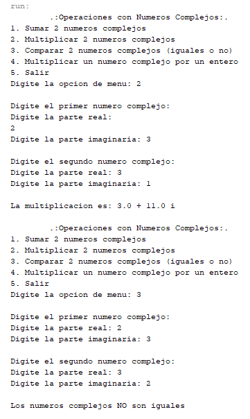

## 123. Ejercicio 7 - Registro de las cuentas bancarias de un cliente (parte 1)
## 124. Ejercicio 7 - Registro de las cuentas bancarias de un cliente (parte 2)
## 125. Ejercicio 7 - Registro de las cuentas bancarias de un cliente (parte 3)

Ejercicio 7: Hacer un programa sencillo para realizar gestiones en un banco para lo cual tendremos 2 clases (Cliente y Cuenta). Considerar que un cliente se caracteriza por su nombre, apellido y DNI. El cliente puede consultar saldo, asi como ingresar y retirar dinero de sus cuentas. Ademas cada cuenta se caracteriza por un numero de cuenta y un saldo

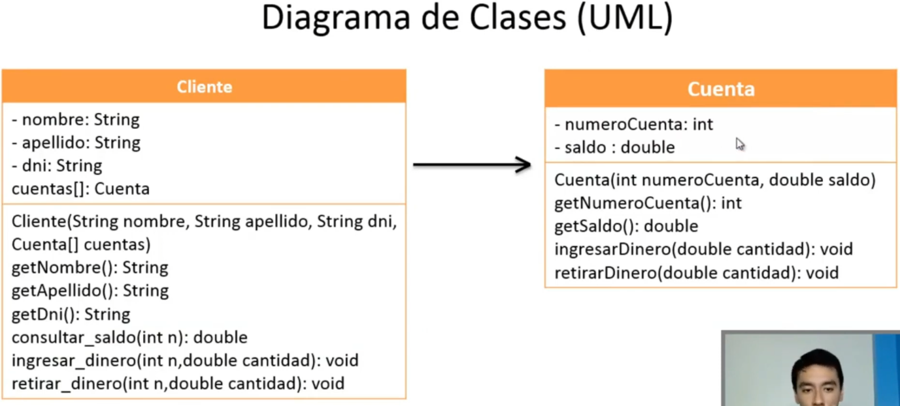


# Seccion 13: Interfaces Graficas de Usuario (GUI)
## 168. Introduccion al capitulo de Interfaces graficas de usuario
**Objetivos:**
- Crear sus propias aplicaciones graficas en java
- Crear interfaces desde codigo o desde el diseñador de NetBeans
- Utilizar Layouts para sus aplicaciones (layout son diferentes estilos de diseño que podemos poner dentro de las aplicaciones).
- Crear ejecutables .jar
- Crear ejecutables .exe

**Contenido:**
1. Contenedores:

    a) Ventanas (JFrame)

    b) Paneles (JPanel)

2. Componentes:

    a) Etiquetas (JLabel)

    b) Botones (JButton)

    c) Radio Botones (JRadioButton)

    d) Botones de Activacion (JToggleButton)

    e) Caja de texto (JTextField)

    f) Area de texto (JTextArea)

    g) Casillas de verificacion (JCheckBox)

    h) Listas desplegables (JComboBox)

    i) Campo de contraseña (JPasswordField)

    j) Tablas (JTable)

    k) Listas (JList)

3. Eventos:

    a) Oyente de accion (ActionListener)

    b) Oyente de raton (MouseListener)

    c) Metodos de los eventos de raton (MouseEvent)

    d) Oyente del movimiento del raton (MouseMotionListener)

    e) Oyente de la rueda del raton (MouseWheelListener)

    f) Oyente de teclado (KeyListener)

4. Ejercicio 1: Contabilizar clics

5. Ejercicio 2: Escoger deporte favorito

6. Ejercicio 3: Jugar con los colores RGB

7. El diseñador de Interfaces Graficas de NetBeans

8. Ejercicio 4: Interfaz para un grupo de personas

9. Ejercicio 5: Desarrollando un cronometro

10. Ejercicio 6: Interfaz grafica para un login

11. Diseño (Layout):

    a) FlowLayout

    b) BoxLayout

    c) BorderLayout

    d) GridLayout

    e) GridBagLayout

12. Ejercicio 7: Cartelera de cine

13. Barra de menu

    a) Creacion de una Barra de Menu

    b) Submenu y componentes de la Barra de Menu

    c) Menu Desplegable (JPopupMenu)

14. Estilos de Ventana (LookAndFeel)

15. Descargar mas estilos de Ventana (LookAndFeel)

16. Ejercicio 8: Calculadora y Conversor de Divisas

17. Crear ventanas secundarias (JDialog)

18. Mostrar datos en arbol jerarquico (JTree)

19. Eventos en el JTree

20. Ejercicio 9 - Juego de 3 en Raya

21. Crear un ejecutable .exe

## 169. Ventanas (JFrame) - creacion de una ventana

```java
package ventana;
import javax.swing.JFrame;
public class Ventana extends JFrame{
    public Ventana(){
        this.setSize(500, 500); //Establecemos el tamaño de la ventana
    }
}
```

```java
package ventana;
public class Principal {
    public static void main(String[] args) {
        Ventana v1 = new Ventana();
        v1.setVisible(true); //Hacemos visible la ventana
    }
}
```

## 170. Ventanas (JFrame) - Cierre de ventana y titulo

```java
package ventana;
import javax.swing.JFrame;
public class Ventana extends JFrame{
    public Ventana(){
        setSize(500, 500); //Establecemos el tamaño de la ventana
        setDefaultCloseOperation(EXIT_ON_CLOSE);
        setTitle("El mejor titulo"); //Establecemos el titulo de la ventana
    }
}
```

## 171. Ventanas (JFrame) - Posicion inicial de la ventana

```java
package ventana;
import javax.swing.JFrame;
public class Ventana extends JFrame{
    public Ventana(){
        setSize(500, 500); //Establecemos el tamaño de la ventana
        setTitle("El mejor titulo"); //Establecemos el titulo de la ventana
        //setLocation(100, 200); // Establecemos la posicion inicial de la ventana
        //setBounds(100, 200, 500, 500); //Juntamos el setlocation con setsize
        setLocationRelativeTo(null); //Establecemos la ventana en el centro   
        setDefaultCloseOperation(EXIT_ON_CLOSE);
    }
}
```

## 172. Ventanas (JFrame) - Redimensionar y color de la ventana
```java
package ventana;
import java.awt.Color;
import java.awt.Dimension;
import javax.swing.JFrame;
public class Ventana extends JFrame{
    public Ventana(){
        setSize(500, 500); //Establecemos el tamaño de la ventana
        setTitle("El mejor titulo"); //Establecemos el titulo de la ventana
        //setLocation(100, 200); // Establecemos la posicion inicial de la ventana
        //setBounds(100, 200, 500, 500); //Juntamos el setlocation con setsize
        setLocationRelativeTo(null); //Establecemos la ventana en el centro
        
        //setResizable(false); //Establecemos si la ventana puede cambiar de tamaño o no
        setMinimumSize(new Dimension(200,200)); //Establecemos el tamaño minimo
        
        this.getContentPane().setBackground(Color.blue);//Establecer el color de la ventana
        
        setDefaultCloseOperation(EXIT_ON_CLOSE);
    }
}
```
## 173. Panel (JPanel) - Creacion de un panel
```java
package ventana;
import java.awt.Color;
import java.awt.Dimension;
import javax.swing.JFrame;
import javax.swing.JPanel;
public class Ventana extends JFrame{
    public Ventana(){
        setSize(500, 500);
        setTitle("El mejor titulo"); 
        setLocationRelativeTo(null);
        setMinimumSize(new Dimension(200,200)); 
        iniciarComponentes();
        
        setDefaultCloseOperation(EXIT_ON_CLOSE);
    }
    private void iniciarComponentes(){
        JPanel panel = new JPanel(); //Creacion de un panel
        this.getContentPane().add(panel);//Agregamos el panel a la ventana
        panel.setBackground(Color.GREEN); //Establecemos el color del panel
    }
}
```

## 174. Etiquetas (JLabel) - Creacion de una etiqueta
```java
package ventana;
import java.awt.Color;
import java.awt.Dimension;
import javax.swing.JFrame;
import javax.swing.JLabel;
import javax.swing.JPanel;
public class Ventana extends JFrame{
    public Ventana(){
        setSize(500, 500);
        setTitle("El mejor titulo"); 
        setLocationRelativeTo(null);
        setMinimumSize(new Dimension(200,200)); 
        iniciarComponentes();
        
        setDefaultCloseOperation(EXIT_ON_CLOSE);
    }
    private void iniciarComponentes(){
        JPanel panel = new JPanel(); //Creacion de un panel
        panel.setLayout(null); //Desactivamos el diseño por defecto
        this.getContentPane().add(panel);//Agregamos el panel a la ventana
        //panel.setBackground(Color.GREEN); //Establecemos el color del panel
        JLabel etiqueta = new JLabel(); //Creamos una etiqueta
        etiqueta.setText("Hola"); //Establecemos el texto de la etiqueta
        etiqueta.setBounds(100, 100, 50, 30);
        panel.add(etiqueta); //Agregamos la etiqueta al panel
    }
}
```
## 175. Etiquetas (JLabel) - Cambiar el color de letra y el fondo

```java
package ventana;
import java.awt.Color;
import java.awt.Dimension;
import javax.swing.JFrame;
import javax.swing.JLabel;
import javax.swing.JPanel;
public class Ventana extends JFrame{
    public Ventana(){
        setSize(500, 500);
        setTitle("El mejor titulo"); 
        setLocationRelativeTo(null);
        setMinimumSize(new Dimension(200,200)); 
        iniciarComponentes();
        
        setDefaultCloseOperation(EXIT_ON_CLOSE);
    }
    private void iniciarComponentes(){
        JPanel panel = new JPanel(); //Creacion de un panel
        panel.setLayout(null); //Desactivamos el diseño por defecto
        this.getContentPane().add(panel);//Agregamos el panel a la ventana
        //panel.setBackground(Color.GREEN); //Establecemos el color del panel
        JLabel etiqueta = new JLabel(); //Creamos una etiqueta
        etiqueta.setText("Hola"); //Establecemos el texto de la etiqueta
        etiqueta.setBounds(10, 10, 30, 20);
        etiqueta.setForeground(Color.WHITE);//Establecemos el color de la letra
        etiqueta.setOpaque(true);//Establecemos pintar el fondo de la etiqueta
        etiqueta.setBackground(Color.black);
        panel.add(etiqueta); //Agregamos la etiqueta al panel
    }
}
```

## 176. Etiquetas (JLabel) - Cambiar ubicación del texto
```java
package ventana;
import java.awt.Color;
import java.awt.Dimension;
import javax.swing.JFrame;
import javax.swing.JLabel;
import javax.swing.JPanel;
import javax.swing.SwingConstants;
public class Ventana extends JFrame{
    public Ventana(){
        setSize(500, 500);
        setTitle("El mejor titulo"); 
        setLocationRelativeTo(null);
        setMinimumSize(new Dimension(200,200)); 
        iniciarComponentes();
        
        setDefaultCloseOperation(EXIT_ON_CLOSE);
    }
    private void iniciarComponentes(){
        JPanel panel = new JPanel(); //Creacion de un panel
        panel.setLayout(null); //Desactivamos el diseño por defecto
        this.getContentPane().add(panel);//Agregamos el panel a la ventana
        //panel.setBackground(Color.GREEN); //Establecemos el color del panel
        JLabel etiqueta = new JLabel(); //Creamos una etiqueta
        etiqueta.setText("Hola"); //Establecemos el texto de la etiqueta
        etiqueta.setHorizontalAlignment(SwingConstants.CENTER);//Establecemos la alineacion horizontal del texto
        etiqueta.setBounds(10, 10, 80, 20);
        etiqueta.setForeground(Color.WHITE);//Establecemos el color de la letra
        etiqueta.setOpaque(true);//Establecemos pintar el fondo de la etiqueta
        etiqueta.setBackground(Color.black);
        panel.add(etiqueta); //Agregamos la etiqueta al panel
    }
}
```

## 177. Etiquetas (JLabel) - Modificar fuente del texto
```java
package ventana;
import java.awt.Color;
import java.awt.Dimension;
import java.awt.Font;
import javax.swing.JFrame;
import javax.swing.JLabel;
import javax.swing.JPanel;
import javax.swing.SwingConstants;
public class Ventana extends JFrame{
    public Ventana(){
        setSize(500, 500);
        setTitle("El mejor titulo"); 
        setLocationRelativeTo(null);
        setMinimumSize(new Dimension(200,200)); 
        iniciarComponentes();
        
        setDefaultCloseOperation(EXIT_ON_CLOSE);
    }
    private void iniciarComponentes(){
        JPanel panel = new JPanel(); //Creacion de un panel
        panel.setLayout(null); //Desactivamos el diseño por defecto
        this.getContentPane().add(panel);//Agregamos el panel a la ventana
        //panel.setBackground(Color.GREEN); //Establecemos el color del panel
        JLabel etiqueta = new JLabel(); //Creamos una etiqueta
        etiqueta.setText("Hola"); //Establecemos el texto de la etiqueta
        etiqueta.setHorizontalAlignment(SwingConstants.CENTER);//Establecemos la alineacion horizontal del texto
        etiqueta.setBounds(10, 10, 90, 40);
        etiqueta.setForeground(Color.WHITE);//Establecemos el color de la letra
        etiqueta.setOpaque(true);//Establecemos pintar el fondo de la etiqueta
        etiqueta.setBackground(Color.black);
        etiqueta.setFont(new Font("arial",Font.ITALIC,30));
        panel.add(etiqueta); //Agregamos la etiqueta al panel
    }
}
```

## 178. Etiquetas (JLabel) - Etiqueta tipo imagen
```java
package ventana;
import java.awt.Color;
import java.awt.Dimension;
import java.awt.Font;
import javax.swing.ImageIcon;
import javax.swing.JFrame;
import javax.swing.JLabel;
import javax.swing.JPanel;
import javax.swing.SwingConstants;
public class Ventana extends JFrame{
    public Ventana(){
        setSize(900, 900);
        setTitle("El mejor titulo"); 
        setLocationRelativeTo(null);
        setMinimumSize(new Dimension(200,200)); 
        iniciarComponentes();
        
        setDefaultCloseOperation(EXIT_ON_CLOSE);
    }
    private void iniciarComponentes(){
        JPanel panel = new JPanel(); //Creacion de un panel
        panel.setLayout(null); //Desactivamos el diseño por defecto
        this.getContentPane().add(panel);//Agregamos el panel a la ventana
        JLabel etiqueta = new JLabel(); //Creamos una etiqueta
        etiqueta.setText("Mundial 2018"); //Establecemos el texto de la etiqueta
        etiqueta.setHorizontalAlignment(SwingConstants.CENTER);//Establecemos la alineacion horizontal del texto
        etiqueta.setBounds(85, 10, 300, 80);
        etiqueta.setForeground(Color.BLACK);//Establecemos el color de la letra
        etiqueta.setFont(new Font("cooper black",0,40));
        panel.add(etiqueta); //Agregamos la etiqueta al panel
        
        //Etiqueta 2 - etiqueta tipo imagen
        JLabel etiqueta2 = new JLabel();
        etiqueta2.setIcon(new ImageIcon("balon.jpg"));
        etiqueta2.setBounds(10, 80, 450, 450);
        panel.add(etiqueta2);
    }
}
```

## 179. Etiquetas (JLabel) - Cambiar el tamaño de la imagen
```java
package ventana;
import java.awt.Color;
import java.awt.Dimension;
import java.awt.Font;
import java.awt.Image;
import javax.swing.ImageIcon;
import javax.swing.JFrame;
import javax.swing.JLabel;
import javax.swing.JPanel;
import javax.swing.SwingConstants;
public class Ventana extends JFrame{
    public Ventana(){
        setSize(900, 900);
        setTitle("El mejor titulo"); 
        setLocationRelativeTo(null);
        setMinimumSize(new Dimension(200,200)); 
        iniciarComponentes();
        
        setDefaultCloseOperation(EXIT_ON_CLOSE);
    }
    private void iniciarComponentes(){
        JPanel panel = new JPanel(); //Creacion de un panel
        panel.setLayout(null); //Desactivamos el diseño por defecto
        this.getContentPane().add(panel);//Agregamos el panel a la ventana
        JLabel etiqueta = new JLabel(); //Creamos una etiqueta
        etiqueta.setText("Mundial 2018"); //Establecemos el texto de la etiqueta
        etiqueta.setHorizontalAlignment(SwingConstants.CENTER);//Establecemos la alineacion horizontal del texto
        etiqueta.setBounds(230, 10, 300, 80);
        etiqueta.setForeground(Color.BLACK);//Establecemos el color de la letra
        etiqueta.setFont(new Font("cooper black",0,40));
        panel.add(etiqueta); //Agregamos la etiqueta al panel
        
        //Etiqueta 2 - etiqueta tipo imagen
        ImageIcon imagen = new ImageIcon("balon.jpg");
        JLabel etiqueta2 = new JLabel();
        etiqueta2.setBounds(10, 80, 750, 555);
        etiqueta2.setIcon(new ImageIcon(imagen.getImage().getScaledInstance(etiqueta2.getWidth(),etiqueta2.getHeight(),Image.SCALE_SMOOTH)));
        panel.add(etiqueta2);
    }
}
```
## 180. Botones (JButton) - Crear un boton
```java
package ventana;
import java.awt.Color;
import java.awt.Dimension;
import java.awt.Font;
import java.awt.Image;
import javax.swing.ImageIcon;
import javax.swing.JButton;
import javax.swing.JFrame;
import javax.swing.JLabel;
import javax.swing.JPanel;
import javax.swing.SwingConstants;
public class Ventana extends JFrame{
    public JPanel panel;
    
    public Ventana(){
        setSize(900, 900);
        setTitle("El mejor titulo"); 
        setLocationRelativeTo(null);
        setMinimumSize(new Dimension(200,200)); 
        iniciarComponentes();
        
        setDefaultCloseOperation(EXIT_ON_CLOSE);
    }
    private void iniciarComponentes(){
        colocarPaneles();
        //colocarEtiquetas();
        colocarBotones();
    }
    private void colocarPaneles(){
        panel = new JPanel(); //Creacion de un panel
        panel.setLayout(null); //Desactivamos el diseño por defecto
        this.getContentPane().add(panel);//Agregamos el panel a la ventana
    }
    private void colocarEtiquetas(){
        JLabel etiqueta = new JLabel(); //Creamos una etiqueta
        etiqueta.setText("Mundial 2018"); //Establecemos el texto de la etiqueta
        etiqueta.setHorizontalAlignment(SwingConstants.CENTER);//Establecemos la alineacion horizontal del texto
        etiqueta.setBounds(230, 10, 300, 80);
        etiqueta.setForeground(Color.BLACK);//Establecemos el color de la letra
        etiqueta.setFont(new Font("cooper black",0,40));
        panel.add(etiqueta); //Agregamos la etiqueta al panel
        
        //Etiqueta 2 - etiqueta tipo imagen
        ImageIcon imagen = new ImageIcon("balon.jpg");
        JLabel etiqueta2 = new JLabel();
        etiqueta2.setBounds(10, 80, 750, 555);
        etiqueta2.setIcon(new ImageIcon(imagen.getImage().getScaledInstance(etiqueta2.getWidth(),etiqueta2.getHeight(),Image.SCALE_SMOOTH)));
        panel.add(etiqueta2);
    }
    private void colocarBotones(){
        JButton boton1 = new JButton();
        boton1.setText("Click");//Establecemos un texto al boton
        boton1.setBounds(100, 100, 100, 40);
        boton1.setEnabled(true);//Habilita o desabilita un boton
        boton1.setMnemonic('b');//Establecemeos alt+letra
        panel.add(boton1);
    }
}
```

## 181. Botones (JButton) - Ajustes del boton (Texto)
```java
package ventana;
import java.awt.Color;
import java.awt.Dimension;
import java.awt.Font;
import java.awt.Image;
import javax.swing.ImageIcon;
import javax.swing.JButton;
import javax.swing.JFrame;
import javax.swing.JLabel;
import javax.swing.JPanel;
import javax.swing.SwingConstants;
public class Ventana extends JFrame{
    public JPanel panel;
    
    public Ventana(){
        setSize(900, 900);
        setTitle("El mejor titulo"); 
        setLocationRelativeTo(null);
        setMinimumSize(new Dimension(200,200)); 
        iniciarComponentes();
        
        setDefaultCloseOperation(EXIT_ON_CLOSE);
    }
    private void iniciarComponentes(){
        colocarPaneles();
        //colocarEtiquetas();
        colocarBotones();
    }
    private void colocarPaneles(){
        panel = new JPanel(); //Creacion de un panel
        panel.setLayout(null); //Desactivamos el diseño por defecto
        this.getContentPane().add(panel);//Agregamos el panel a la ventana
    }
    private void colocarEtiquetas(){
        JLabel etiqueta = new JLabel(); //Creamos una etiqueta
        etiqueta.setText("Mundial 2018"); //Establecemos el texto de la etiqueta
        etiqueta.setHorizontalAlignment(SwingConstants.CENTER);//Establecemos la alineacion horizontal del texto
        etiqueta.setBounds(230, 10, 300, 80);
        etiqueta.setForeground(Color.BLACK);//Establecemos el color de la letra
        etiqueta.setFont(new Font("cooper black",0,40));
        panel.add(etiqueta); //Agregamos la etiqueta al panel
        
        //Etiqueta 2 - etiqueta tipo imagen
        ImageIcon imagen = new ImageIcon("balon.jpg");
        JLabel etiqueta2 = new JLabel();
        etiqueta2.setBounds(10, 80, 750, 555);
        etiqueta2.setIcon(new ImageIcon(imagen.getImage().getScaledInstance(etiqueta2.getWidth(),etiqueta2.getHeight(),Image.SCALE_SMOOTH)));
        panel.add(etiqueta2);
    }
    private void colocarBotones(){
        JButton boton1 = new JButton();
        boton1.setText("Click");//Establecemos un texto al boton
        boton1.setBounds(100, 100, 100, 40);
        boton1.setEnabled(true);//Habilita o desabilita un boton
        boton1.setMnemonic('b');//Establecemeos alt+letra
        boton1.setForeground(Color.BLUE);
        boton1.setFont(new Font("cooper black", 3, 20));
        panel.add(boton1);
    }
}
```
## 182. Botones (JButton) - Ajustes del boton (Imagenes)
```java
package ventana;
import java.awt.Color;
import java.awt.Dimension;
import java.awt.Font;
import java.awt.Image;
import javax.swing.ImageIcon;
import javax.swing.JButton;
import javax.swing.JFrame;
import javax.swing.JLabel;
import javax.swing.JPanel;
import javax.swing.SwingConstants;
public class Ventana extends JFrame{
    public JPanel panel;
    
    public Ventana(){
        setSize(900, 900);
        setTitle("El mejor titulo"); 
        setLocationRelativeTo(null);
        setMinimumSize(new Dimension(200,200)); 
        iniciarComponentes();
        
        setDefaultCloseOperation(EXIT_ON_CLOSE);
    }
    private void iniciarComponentes(){
        colocarPaneles();
        //colocarEtiquetas();
        colocarBotones();
    }
    private void colocarPaneles(){
        panel = new JPanel(); //Creacion de un panel
        panel.setLayout(null); //Desactivamos el diseño por defecto
        this.getContentPane().add(panel);//Agregamos el panel a la ventana
    }
    private void colocarEtiquetas(){
        JLabel etiqueta = new JLabel(); //Creamos una etiqueta
        etiqueta.setText("Mundial 2018"); //Establecemos el texto de la etiqueta
        etiqueta.setHorizontalAlignment(SwingConstants.CENTER);//Establecemos la alineacion horizontal del texto
        etiqueta.setBounds(230, 10, 300, 80);
        etiqueta.setForeground(Color.BLACK);//Establecemos el color de la letra
        etiqueta.setFont(new Font("cooper black",0,40));
        panel.add(etiqueta); //Agregamos la etiqueta al panel
        
        //Etiqueta 2 - etiqueta tipo imagen
        ImageIcon imagen = new ImageIcon("balon.jpg");
        JLabel etiqueta2 = new JLabel();
        etiqueta2.setBounds(10, 80, 750, 555);
        etiqueta2.setIcon(new ImageIcon(imagen.getImage().getScaledInstance(etiqueta2.getWidth(),etiqueta2.getHeight(),Image.SCALE_SMOOTH)));
        panel.add(etiqueta2);
    }
    private void colocarBotones(){
        //Boton 1 - boton de texto
        JButton boton1 = new JButton();
        boton1.setText("Click");//Establecemos un texto al boton
        boton1.setBounds(100, 100, 100, 40);
        boton1.setEnabled(true);//Habilita o desabilita un boton
        boton1.setMnemonic('b');//Establecemeos alt+letra
        boton1.setForeground(Color.BLUE);
        boton1.setFont(new Font("cooper black", 3, 20));
        panel.add(boton1);
        
        //Boton 2 - boton de imagen
        JButton boton2 = new JButton();
        boton2.setBounds(100, 200, 100, 40);
        //boton2.setOpaque(true);
        ImageIcon imagen2 = new ImageIcon("check.png");
        boton2.setIcon(new ImageIcon(imagen2.getImage().getScaledInstance(boton2.getWidth(), boton2.getHeight(), Image.SCALE_SMOOTH)));
        //boton2.setBackground(Color.blue);
        panel.add(boton2);
    }
}
```

## 183. Botones (JButton) - Borde del boton
```java
package ventana;
import java.awt.Color;
import java.awt.Dimension;
import java.awt.Font;
import java.awt.Image;
import javax.swing.BorderFactory;
import javax.swing.ImageIcon;
import javax.swing.JButton;
import javax.swing.JFrame;
import javax.swing.JLabel;
import javax.swing.JPanel;
import javax.swing.SwingConstants;
public class Ventana extends JFrame{
    public JPanel panel;
    
    public Ventana(){
        setSize(900, 900);
        setTitle("El mejor titulo"); 
        setLocationRelativeTo(null);
        setMinimumSize(new Dimension(200,200)); 
        iniciarComponentes();
        
        setDefaultCloseOperation(EXIT_ON_CLOSE);
    }
    private void iniciarComponentes(){
        colocarPaneles();
        //colocarEtiquetas();
        colocarBotones();
    }
    private void colocarPaneles(){
        panel = new JPanel(); //Creacion de un panel
        panel.setLayout(null); //Desactivamos el diseño por defecto
        this.getContentPane().add(panel);//Agregamos el panel a la ventana
    }
    private void colocarEtiquetas(){
        JLabel etiqueta = new JLabel(); //Creamos una etiqueta
        etiqueta.setText("Mundial 2018"); //Establecemos el texto de la etiqueta
        etiqueta.setHorizontalAlignment(SwingConstants.CENTER);//Establecemos la alineacion horizontal del texto
        etiqueta.setBounds(230, 10, 300, 80);
        etiqueta.setForeground(Color.BLACK);//Establecemos el color de la letra
        etiqueta.setFont(new Font("cooper black",0,40));
        panel.add(etiqueta); //Agregamos la etiqueta al panel
        
        //Etiqueta 2 - etiqueta tipo imagen
        ImageIcon imagen = new ImageIcon("balon.jpg");
        JLabel etiqueta2 = new JLabel();
        etiqueta2.setBounds(10, 80, 750, 555);
        etiqueta2.setIcon(new ImageIcon(imagen.getImage().getScaledInstance(etiqueta2.getWidth(),etiqueta2.getHeight(),Image.SCALE_SMOOTH)));
        panel.add(etiqueta2);
    }
    private void colocarBotones(){
        //Boton 1 - boton de texto
        JButton boton1 = new JButton();
        boton1.setText("Click");//Establecemos un texto al boton
        boton1.setBounds(100, 100, 100, 40);
        boton1.setEnabled(true);//Habilita o desabilita un boton
        boton1.setMnemonic('b');//Establecemeos alt+letra
        boton1.setForeground(Color.BLUE);
        boton1.setFont(new Font("cooper black", 3, 20));
        panel.add(boton1);
        
        //Boton 2 - boton de imagen
        JButton boton2 = new JButton();
        boton2.setBounds(100, 200, 100, 40);
        //boton2.setOpaque(true);
        ImageIcon imagen2 = new ImageIcon("check.png");
        boton2.setIcon(new ImageIcon(imagen2.getImage().getScaledInstance(boton2.getWidth(), boton2.getHeight(), Image.SCALE_SMOOTH)));
        //boton2.setBackground(Color.blue);
        panel.add(boton2);
        
        //Boton 3 - boton de bordes
        JButton boton3 = new JButton();
        boton3.setBounds(100, 300, 110, 50);
        boton3.setBorder(BorderFactory.createLineBorder(Color.blue, 4, true));
        panel.add(boton3);
    }
}
```

## 184. Radio Botones (JRadioButton) - Crear botones de opcion
```java
package ventana;
import java.awt.Color;
import java.awt.Dimension;
import java.awt.Font;
import java.awt.Image;
import javax.swing.BorderFactory;
import javax.swing.ButtonGroup;
import javax.swing.ImageIcon;
import javax.swing.JButton;
import javax.swing.JFrame;
import javax.swing.JLabel;
import javax.swing.JPanel;
import javax.swing.JRadioButton;
import javax.swing.SwingConstants;
public class Ventana extends JFrame{
    public JPanel panel;
    
    public Ventana(){
        setSize(900, 900);
        setTitle("El mejor titulo"); 
        setLocationRelativeTo(null);
        setMinimumSize(new Dimension(200,200)); 
        iniciarComponentes();
        
        setDefaultCloseOperation(EXIT_ON_CLOSE);
    }
    private void iniciarComponentes(){
        colocarPaneles();
        //colocarEtiquetas();
        //colocarBotones();
        colocarRadioBotones();
    }
    private void colocarPaneles(){
        panel = new JPanel(); //Creacion de un panel
        panel.setLayout(null); //Desactivamos el diseño por defecto
        this.getContentPane().add(panel);//Agregamos el panel a la ventana
    }
    private void colocarEtiquetas(){
        JLabel etiqueta = new JLabel(); //Creamos una etiqueta
        etiqueta.setText("Mundial 2018"); //Establecemos el texto de la etiqueta
        etiqueta.setHorizontalAlignment(SwingConstants.CENTER);//Establecemos la alineacion horizontal del texto
        etiqueta.setBounds(230, 10, 300, 80);
        etiqueta.setForeground(Color.BLACK);//Establecemos el color de la letra
        etiqueta.setFont(new Font("cooper black",0,40));
        panel.add(etiqueta); //Agregamos la etiqueta al panel
        
        //Etiqueta 2 - etiqueta tipo imagen
        ImageIcon imagen = new ImageIcon("balon.jpg");
        JLabel etiqueta2 = new JLabel();
        etiqueta2.setBounds(10, 80, 750, 555);
        etiqueta2.setIcon(new ImageIcon(imagen.getImage().getScaledInstance(etiqueta2.getWidth(),etiqueta2.getHeight(),Image.SCALE_SMOOTH)));
        panel.add(etiqueta2);
    }
    
    private void colocarBotones(){
        //Boton 1 - boton de texto
        JButton boton1 = new JButton();
        boton1.setText("Click");//Establecemos un texto al boton
        boton1.setBounds(100, 100, 100, 40);
        boton1.setEnabled(true);//Habilita o desabilita un boton
        boton1.setMnemonic('b');//Establecemeos alt+letra
        boton1.setForeground(Color.BLUE);
        boton1.setFont(new Font("cooper black", 3, 20));
        panel.add(boton1);
        
        //Boton 2 - boton de imagen
        JButton boton2 = new JButton();
        boton2.setBounds(100, 200, 100, 40);
        //boton2.setOpaque(true);
        ImageIcon imagen2 = new ImageIcon("check.png");
        boton2.setIcon(new ImageIcon(imagen2.getImage().getScaledInstance(boton2.getWidth(), boton2.getHeight(), Image.SCALE_SMOOTH)));
        //boton2.setBackground(Color.blue);
        panel.add(boton2);
        
        //Boton 3 - boton de bordes
        JButton boton3 = new JButton();
        boton3.setBounds(100, 300, 110, 50);
        boton3.setBorder(BorderFactory.createLineBorder(Color.blue, 4, true));
        panel.add(boton3);
    }
    
    private void colocarRadioBotones(){
        JRadioButton radioBoton1 = new JRadioButton("Opcion 1", true);
        radioBoton1.setBounds(50, 100, 200, 50);
        radioBoton1.setEnabled(true);
        radioBoton1.setText("Programacion");
        radioBoton1.setFont(new Font("cooper black",0,20));
        panel.add(radioBoton1);
        
        JRadioButton radioBoton2 = new JRadioButton("Opcion 2", false);
        radioBoton2.setBounds(50, 150, 100, 50);
        panel.add(radioBoton2);
        
        JRadioButton radioBoton3 = new JRadioButton("Opcion 3", false);
        radioBoton3.setBounds(50, 200, 100, 50);
        panel.add(radioBoton3);
        
        ButtonGroup grupoRadioBotones = new ButtonGroup();
        grupoRadioBotones.add(radioBoton1);
        grupoRadioBotones.add(radioBoton2);
        grupoRadioBotones.add(radioBoton3);
    }
}
```
## 185. Crear botonoes de activacion (JToggleButton)
```java
package ventana;
import java.awt.Color;
import java.awt.Dimension;
import java.awt.Font;
import java.awt.Image;
import javax.swing.BorderFactory;
import javax.swing.ButtonGroup;
import javax.swing.ImageIcon;
import javax.swing.JButton;
import javax.swing.JFrame;
import javax.swing.JLabel;
import javax.swing.JPanel;
import javax.swing.JRadioButton;
import javax.swing.JToggleButton;
import javax.swing.SwingConstants;
public class Ventana extends JFrame{
    public JPanel panel;
    
    public Ventana(){
        setSize(900, 900);
        setTitle("El mejor titulo"); 
        setLocationRelativeTo(null);
        setMinimumSize(new Dimension(200,200)); 
        iniciarComponentes();
        
        setDefaultCloseOperation(EXIT_ON_CLOSE);
    }
    private void iniciarComponentes(){
        colocarPaneles();
        colocarBotonesDeActivacion();
    }
    private void colocarPaneles(){
        panel = new JPanel(); //Creacion de un panel
        panel.setLayout(null); //Desactivamos el diseño por defecto
        this.getContentPane().add(panel);//Agregamos el panel a la ventana
    }
    
    private void colocarBotonesDeActivacion(){
        JToggleButton botonActivacion1 =  new JToggleButton("Opcion 1",true);
        botonActivacion1.setBounds(50, 100, 100, 40);
        panel.add(botonActivacion1);
        
        JToggleButton botonActivacion2 =  new JToggleButton("Opcion 2",false);
        botonActivacion2.setBounds(50, 150, 100, 40);
        panel.add(botonActivacion2);
        
        JToggleButton botonActivacion3 =  new JToggleButton("Opcion 3",false);
        botonActivacion3.setBounds(50, 200, 100, 40);
        panel.add(botonActivacion3);
        
        ButtonGroup grupoBotonesActivados = new ButtonGroup();
        grupoBotonesActivados.add(botonActivacion1);
        grupoBotonesActivados.add(botonActivacion2);
        grupoBotonesActivados.add(botonActivacion3);
    }
}
```

## 186. Crear una caja de texto (JTextField)
```java
package ventana;
import java.awt.Color;
import java.awt.Dimension;
import java.awt.Font;
import java.awt.Image;
import javax.swing.BorderFactory;
import javax.swing.ButtonGroup;
import javax.swing.ImageIcon;
import javax.swing.JButton;
import javax.swing.JFrame;
import javax.swing.JLabel;
import javax.swing.JPanel;
import javax.swing.JRadioButton;
import javax.swing.JTextField;
import javax.swing.JToggleButton;
import javax.swing.SwingConstants;
public class Ventana extends JFrame{
    public JPanel panel;
    
    public Ventana(){
        setSize(900, 900);
        setTitle("El mejor titulo"); 
        setLocationRelativeTo(null);
        setMinimumSize(new Dimension(200,200)); 
        iniciarComponentes();
        
        setDefaultCloseOperation(EXIT_ON_CLOSE);
    }
    private void iniciarComponentes(){
        colocarPaneles();
        colocarCajasDeTexto();
    }
    private void colocarPaneles(){
        panel = new JPanel(); //Creacion de un panel
        panel.setLayout(null); //Desactivamos el diseño por defecto
        this.getContentPane().add(panel);//Agregamos el panel a la ventana
    }
    
    private void colocarCajasDeTexto(){
        JTextField cajaTexto = new JTextField();
        cajaTexto.setBounds(50, 50, 200, 30);
        cajaTexto.setText("Hola");
        
        System.out.println("Texto en la caja: "+cajaTexto.getText());
        panel.add(cajaTexto);
    }
}
```
## 187. Crear una Area de texto (JTextArea)
```java
package ventana;
import java.awt.Color;
import java.awt.Dimension;
import java.awt.Font;
import java.awt.Image;
import javax.swing.BorderFactory;
import javax.swing.ButtonGroup;
import javax.swing.ImageIcon;
import javax.swing.JButton;
import javax.swing.JFrame;
import javax.swing.JLabel;
import javax.swing.JPanel;
import javax.swing.JRadioButton;
import javax.swing.JTextArea;
import javax.swing.JTextField;
import javax.swing.JToggleButton;
import javax.swing.SwingConstants;
public class Ventana extends JFrame{
    public JPanel panel;
    
    public Ventana(){
        setSize(900, 900);
        setTitle("El mejor titulo"); 
        setLocationRelativeTo(null);
        setMinimumSize(new Dimension(200,200)); 
        iniciarComponentes();
        
        setDefaultCloseOperation(EXIT_ON_CLOSE);
    }
    private void iniciarComponentes(){
        colocarPaneles();
        colocarAreasDeTexto();
        
    }
    private void colocarPaneles(){
        panel = new JPanel(); //Creacion de un panel
        panel.setLayout(null); //Desactivamos el diseño por defecto
        this.getContentPane().add(panel);//Agregamos el panel a la ventana
    }
    
    private void colocarAreasDeTexto(){
        JTextArea areaTexto = new JTextArea();
        areaTexto.setBounds(20, 20, 300, 200);
        areaTexto.setText("Escriba el texto aqui...");
        areaTexto.append("\nEscribe el texto aqui...");//Añade mas texto al area
        areaTexto.setEditable(true);//Editar el area de texto
        
        System.out.println("El texto es: "+ areaTexto.getText());
        panel.add(areaTexto);
    }
}
```

## 188. Agregar barra de desplazamiento(JScrollPane) al area de texto
```java
package ventana;
import java.awt.Color;
import java.awt.Dimension;
import java.awt.Font;
import java.awt.Image;
import javax.swing.BorderFactory;
import javax.swing.ButtonGroup;
import javax.swing.ImageIcon;
import javax.swing.JButton;
import javax.swing.JFrame;
import javax.swing.JLabel;
import javax.swing.JPanel;
import javax.swing.JRadioButton;
import javax.swing.JScrollPane;
import javax.swing.JTextArea;
import javax.swing.JTextField;
import javax.swing.JToggleButton;
import javax.swing.ScrollPaneConstants;
import javax.swing.SwingConstants;
public class Ventana extends JFrame{
    public JPanel panel;
    
    public Ventana(){
        setSize(900, 900);
        setTitle("El mejor titulo"); 
        setLocationRelativeTo(null);
        setMinimumSize(new Dimension(200,200)); 
        iniciarComponentes();
        
        setDefaultCloseOperation(EXIT_ON_CLOSE);
    }
    private void iniciarComponentes(){
        colocarPaneles();
        colocarAreasDeTexto();
        
    }
    private void colocarPaneles(){
        panel = new JPanel(); //Creacion de un panel
        panel.setLayout(null); //Desactivamos el diseño por defecto
        this.getContentPane().add(panel);//Agregamos el panel a la ventana
    }
    
    private void colocarAreasDeTexto(){
        JTextArea areaTexto = new JTextArea();
        areaTexto.setBounds(20, 20, 300, 200);
        areaTexto.setText("Escriba el texto aqui...");
        areaTexto.append("\nEscribe el texto aqui...");//Añade mas texto al area
        areaTexto.setEditable(true);//Editar el area de texto
        
        System.out.println("El texto es: "+ areaTexto.getText());
        panel.add(areaTexto);
        
        //Barras de desplazamiento
        JScrollPane barrasDesplazamiento = new JScrollPane(areaTexto);
        barrasDesplazamiento.setBounds(20, 20, 300, 200);
        barrasDesplazamiento.setVerticalScrollBarPolicy(ScrollPaneConstants.VERTICAL_SCROLLBAR_AS_NEEDED);
        barrasDesplazamiento.setHorizontalScrollBarPolicy(ScrollPaneConstants.HORIZONTAL_SCROLLBAR_AS_NEEDED);
        panel.add(barrasDesplazamiento);
    }
}
```

## 189. Crear casillas de verificacion(JCheckBox)
```java
package ventana;
import java.awt.Color;
import java.awt.Dimension;
import java.awt.Font;
import java.awt.Image;
import javax.swing.BorderFactory;
import javax.swing.ButtonGroup;
import javax.swing.ImageIcon;
import javax.swing.JButton;
import javax.swing.JCheckBox;
import javax.swing.JFrame;
import javax.swing.JLabel;
import javax.swing.JPanel;
import javax.swing.JRadioButton;
import javax.swing.JScrollPane;
import javax.swing.JTextArea;
import javax.swing.JTextField;
import javax.swing.JToggleButton;
import javax.swing.ScrollPaneConstants;
import javax.swing.SwingConstants;
public class Ventana extends JFrame{
    public JPanel panel;
    
    public Ventana(){
        setSize(900, 900);
        setTitle("El mejor titulo"); 
        setLocationRelativeTo(null);
        setMinimumSize(new Dimension(200,200)); 
        iniciarComponentes();
        
        setDefaultCloseOperation(EXIT_ON_CLOSE);
    }
    private void iniciarComponentes(){
        colocarPaneles();
        colocarCasillasDeVerificacion();
        
    }
    private void colocarPaneles(){
        panel = new JPanel(); //Creacion de un panel
        panel.setLayout(null); //Desactivamos el diseño por defecto
        this.getContentPane().add(panel);//Agregamos el panel a la ventana
    }
    
    private void colocarCasillasDeVerificacion(){
        JCheckBox casillaVerificacion1 = new JCheckBox("Leche");
        casillaVerificacion1.setBounds(20, 20, 100, 40);
        panel.add(casillaVerificacion1);
        
        JCheckBox casillaVerificacion2 = new JCheckBox("Galleta");
        casillaVerificacion2.setBounds(20, 50, 100, 40);
        panel.add(casillaVerificacion2);
        
        JCheckBox casillaVerificacion3 = new JCheckBox("Yogurt");
        casillaVerificacion3.setBounds(20, 80, 100, 40);
        panel.add(casillaVerificacion3);
        
        JCheckBox casillaVerificacion4 = new JCheckBox("Cereal");
        casillaVerificacion4.setBounds(20, 110, 100, 40);
        panel.add(casillaVerificacion4);
    }
}
```

## 190. Crear listas desplegables(JComboBox)
```java
package ventana;
import java.awt.Color;
import java.awt.Dimension;
import java.awt.Font;
import java.awt.Image;
import javax.swing.BorderFactory;
import javax.swing.ButtonGroup;
import javax.swing.ImageIcon;
import javax.swing.JButton;
import javax.swing.JCheckBox;
import javax.swing.JComboBox;
import javax.swing.JFrame;
import javax.swing.JLabel;
import javax.swing.JPanel;
import javax.swing.JRadioButton;
import javax.swing.JScrollPane;
import javax.swing.JTextArea;
import javax.swing.JTextField;
import javax.swing.JToggleButton;
import javax.swing.ScrollPaneConstants;
import javax.swing.SwingConstants;
public class Ventana extends JFrame{
    public JPanel panel;
    
    public Ventana(){
        setSize(900, 900);
        setTitle("El mejor titulo"); 
        setLocationRelativeTo(null);
        setMinimumSize(new Dimension(200,200)); 
        iniciarComponentes();
        
        setDefaultCloseOperation(EXIT_ON_CLOSE);
    }
    private void iniciarComponentes(){
        colocarPaneles();
        colocarListasDesplegables();
        
        
    }
    private void colocarPaneles(){
        panel = new JPanel(); //Creacion de un panel
        panel.setLayout(null); //Desactivamos el diseño por defecto
        this.getContentPane().add(panel);//Agregamos el panel a la ventana
    }
    
    private void colocarListasDesplegables(){
        String [] paises = {"Peru","Colombia","Paraguay","Ecuador"};
        JComboBox listaDesplegable = new JComboBox(paises);
        listaDesplegable.setBounds(20, 20, 100, 30);
        listaDesplegable.addItem("Argentina");//Añadir objetos a tu lista desplegable
        listaDesplegable.setSelectedItem("Paraguay");//Seleccionar el primer objeto visto
        panel.add(listaDesplegable);
    }
}
```

## 191. Usar modelos (DefaultComboBoxModel) en las listas desplegables
```java
package ventana;
import java.awt.Color;
import java.awt.Dimension;
import java.awt.Font;
import java.awt.Image;
import javax.swing.BorderFactory;
import javax.swing.ButtonGroup;
import javax.swing.DefaultComboBoxModel;
import javax.swing.ImageIcon;
import javax.swing.JButton;
import javax.swing.JCheckBox;
import javax.swing.JComboBox;
import javax.swing.JFrame;
import javax.swing.JLabel;
import javax.swing.JPanel;
import javax.swing.JRadioButton;
import javax.swing.JScrollPane;
import javax.swing.JTextArea;
import javax.swing.JTextField;
import javax.swing.JToggleButton;
import javax.swing.ScrollPaneConstants;
import javax.swing.SwingConstants;
public class Ventana extends JFrame{
    public JPanel panel;
    
    public Ventana(){
        setSize(900, 900);
        setTitle("El mejor titulo"); 
        setLocationRelativeTo(null);
        setMinimumSize(new Dimension(200,200)); 
        iniciarComponentes();
        
        setDefaultCloseOperation(EXIT_ON_CLOSE);
    }
    private void iniciarComponentes(){
        colocarPaneles();
        colocarListasDesplegables();
        
        
    }
    private void colocarPaneles(){
        panel = new JPanel(); //Creacion de un panel
        panel.setLayout(null); //Desactivamos el diseño por defecto
        this.getContentPane().add(panel);//Agregamos el panel a la ventana
    }
    
    private void colocarListasDesplegables(){
        Persona persona1 = new Persona ("Alejandro Taboada",21,"Peruano");
        Persona persona2 = new Persona ("Tania Bustamante",20,"Argentina");
        DefaultComboBoxModel modelo = new DefaultComboBoxModel();
        JComboBox listaDesplegable = new JComboBox(modelo);
        
        modelo.addElement(persona1);
        modelo.addElement(persona2);
        
        listaDesplegable.setBounds(20, 20, 200, 30);
        panel.add(listaDesplegable);
    }
}
```

```Java
package ventana;
public class Persona {
    private String nombre;
    private int edad;
    private String nacionalidad;

    public Persona(String nombre, int edad, String nacionalidad) {
        this.nombre = nombre;
        this.edad = edad;
        this.nacionalidad = nacionalidad;
    }
    public String getNombre() {
        return nombre;
    }
    public void setNombre(String nombre) {
        this.nombre = nombre;
    }
    public int getEdad() {
        return edad;
    }
    public void setEdad(int edad) {
        this.edad = edad;
    }
    public String getNacionalidad() {
        return nacionalidad;
    }
    public void setNacionalidad(String nacionalidad) {
        this.nacionalidad = nacionalidad;
    }
    @Override
    public String toString(){
        return this.nombre;
    }
}
```

## 192. Crear campo de contraseña (JPasswordField)
```java
package ventana;
import java.awt.Color;
import java.awt.Dimension;
import java.awt.Font;
import java.awt.Image;
import java.util.Arrays;
import javax.swing.BorderFactory;
import javax.swing.ButtonGroup;
import javax.swing.DefaultComboBoxModel;
import javax.swing.ImageIcon;
import javax.swing.JButton;
import javax.swing.JCheckBox;
import javax.swing.JComboBox;
import javax.swing.JFrame;
import javax.swing.JLabel;
import javax.swing.JPanel;
import javax.swing.JPasswordField;
import javax.swing.JRadioButton;
import javax.swing.JScrollPane;
import javax.swing.JTextArea;
import javax.swing.JTextField;
import javax.swing.JToggleButton;
import javax.swing.ScrollPaneConstants;
import javax.swing.SwingConstants;
public class Ventana extends JFrame{
    public JPanel panel;
    
    public Ventana(){
        setSize(900, 900);
        setTitle("El mejor titulo"); 
        setLocationRelativeTo(null);
        setMinimumSize(new Dimension(200,200)); 
        iniciarComponentes();
        
        setDefaultCloseOperation(EXIT_ON_CLOSE);
    }
    private void iniciarComponentes(){
        colocarPaneles();
        colocarCampoDeContraseña();
        
        
    }
    private void colocarPaneles(){
        panel = new JPanel(); //Creacion de un panel
        panel.setLayout(null); //Desactivamos el diseño por defecto
        this.getContentPane().add(panel);//Agregamos el panel a la ventana
    }
    private void colocarCampoDeContraseña(){
        JPasswordField campoContraseña = new JPasswordField();
        campoContraseña.setBounds(20, 20, 150, 30);
        campoContraseña.setText("hola");
        panel.add(campoContraseña);
        
        String contraseña = "";
        
        for (int i = 0; i < campoContraseña.getPassword().length; i++) {
            contraseña += campoContraseña.getPassword()[i];
        }
        
        System.out.println("Contraseña: "+ contraseña);
    }
}
```

## 193. Crear tablas (JTable)
```java
package ventana;
import java.awt.Color;
import java.awt.Dimension;
import java.awt.Font;
import java.awt.Image;
import java.util.Arrays;
import javax.swing.BorderFactory;
import javax.swing.ButtonGroup;
import javax.swing.DefaultComboBoxModel;
import javax.swing.ImageIcon;
import javax.swing.JButton;
import javax.swing.JCheckBox;
import javax.swing.JComboBox;
import javax.swing.JFrame;
import javax.swing.JLabel;
import javax.swing.JPanel;
import javax.swing.JPasswordField;
import javax.swing.JRadioButton;
import javax.swing.JScrollPane;
import javax.swing.JTable;
import javax.swing.JTextArea;
import javax.swing.JTextField;
import javax.swing.JToggleButton;
import javax.swing.ScrollPaneConstants;
import javax.swing.SwingConstants;
import javax.swing.table.DefaultTableModel;
public class Ventana extends JFrame{
    public JPanel panel;
    public Ventana(){
        setSize(900, 900);
        setTitle("El mejor titulo"); 
        setLocationRelativeTo(null);
        setMinimumSize(new Dimension(200,200)); 
        iniciarComponentes();
        
        setDefaultCloseOperation(EXIT_ON_CLOSE);
    }
    private void iniciarComponentes(){
        colocarPaneles();
        colocarTablas();
    }
    private void colocarPaneles(){
        panel = new JPanel(); //Creacion de un panel
        panel.setLayout(null); //Desactivamos el diseño por defecto
        this.getContentPane().add(panel);//Agregamos el panel a la ventana
    }
    private void colocarTablas(){
        DefaultTableModel modelo = new DefaultTableModel();
        
        modelo.addColumn("Nombre");
        modelo.addColumn("Edad");
        modelo.addColumn("Nacionalidad");
        
        String [] persona1 = {"Alejandro","21","Peruano"};
        String [] persona2 = {"Rosa","25","Mexicana"};
        
        modelo.addRow(persona1);
        modelo.addRow(persona2);
        
        JTable tabla = new JTable(modelo);
        
        tabla.setBounds(20, 20, 300, 200);
        panel.add(tabla);
        
        JScrollPane scroll = new JScrollPane(tabla, ScrollPaneConstants.VERTICAL_SCROLLBAR_AS_NEEDED,ScrollPaneConstants.HORIZONTAL_SCROLLBAR_AS_NEEDED);
        scroll.setBounds(20, 20, 300, 200);
        panel.add(scroll);
    }
}
```

## 194. Crear listas (JList)
```java
package ventana;
import java.awt.Color;
import java.awt.Dimension;
import java.awt.Font;
import java.awt.Image;
import java.util.Arrays;
import javax.swing.BorderFactory;
import javax.swing.ButtonGroup;
import javax.swing.DefaultComboBoxModel;
import javax.swing.DefaultListModel;
import javax.swing.ImageIcon;
import javax.swing.JButton;
import javax.swing.JCheckBox;
import javax.swing.JComboBox;
import javax.swing.JFrame;
import javax.swing.JLabel;
import javax.swing.JList;
import javax.swing.JPanel;
import javax.swing.JPasswordField;
import javax.swing.JRadioButton;
import javax.swing.JScrollPane;
import javax.swing.JTable;
import javax.swing.JTextArea;
import javax.swing.JTextField;
import javax.swing.JToggleButton;
import javax.swing.ScrollPaneConstants;
import javax.swing.SwingConstants;
import javax.swing.table.DefaultTableModel;
public class Ventana extends JFrame{
    public JPanel panel;
    public Ventana(){
        setSize(900, 900);
        setTitle("El mejor titulo"); 
        setLocationRelativeTo(null);
        setMinimumSize(new Dimension(200,200)); 
        iniciarComponentes();
        
        setDefaultCloseOperation(EXIT_ON_CLOSE);
    }
    private void iniciarComponentes(){
        colocarPaneles();
        colocarListas();
    }
    private void colocarPaneles(){
        panel = new JPanel(); //Creacion de un panel
        panel.setLayout(null); //Desactivamos el diseño por defecto
        this.getContentPane().add(panel);//Agregamos el panel a la ventana
    }
    private void colocarListas(){
        DefaultListModel modelo = new DefaultListModel();
        
        modelo.addElement(new Persona("Alejandro Taboada", 21, "Peruano"));
        modelo.addElement(new Persona("Alejandr Marin", 25, "Brasileño"));
        modelo.addElement(new Persona("Maria Torres", 26, "Chileno"));
        modelo.addElement(new Persona("Alejandro Taboada", 21, "Peruano"));
        modelo.addElement(new Persona("Alejandr Marin", 25, "Brasileño"));
        modelo.addElement(new Persona("Maria Torres", 26, "Chileno"));
        modelo.addElement(new Persona("Alejandro Taboada", 21, "Peruano"));
        modelo.addElement(new Persona("Alejandr Marin", 25, "Brasileño"));
        modelo.addElement(new Persona("Maria Torres", 26, "Chileno"));
        modelo.addElement(new Persona("Alejandro Taboada", 21, "Peruano"));
        modelo.addElement(new Persona("Alejandr Marin", 25, "Brasileño"));
        modelo.addElement(new Persona("Maria Torres", 26, "Chileno"));
        modelo.addElement(new Persona("Alejandro Taboada", 21, "Peruano"));
        modelo.addElement(new Persona("Alejandr Marin", 25, "Brasileño"));
        modelo.addElement(new Persona("Maria Torres", 26, "Chileno"));
        
        JList lista = new JList(modelo);
        lista.setBounds(20, 20, 200, 300);
        panel.add(lista);
        
        JScrollPane scroll = new JScrollPane(lista, ScrollPaneConstants.VERTICAL_SCROLLBAR_AS_NEEDED,ScrollPaneConstants.HORIZONTAL_SCROLLBAR_AS_NEEDED);
        scroll.setBounds(20, 20, 300, 200);
        panel.add(scroll);
    }
}
```

## 195. Eventos - Oyente de accion(ActionListener)
```java
package eventos;
import java.awt.Font;
import java.awt.event.ActionEvent;
import java.awt.event.ActionListener;
import javax.swing.JButton;
import javax.swing.JFrame;
import javax.swing.JLabel;
import javax.swing.JPanel;
import javax.swing.JTextField;

public class Ventana extends JFrame{
    private JPanel panel;
    private JLabel saludo;
    private JTextField cajaTexto;
    private JButton boton;
    
    public Ventana(){
        setBounds(50,50,500,500);
        setTitle("Eventos");
        
        iniciarComponentes();
        setDefaultCloseOperation(EXIT_ON_CLOSE);
    }
    private void iniciarComponentes(){
        colocarPanel();
        colocarEtiqueta();
        colocarCajaDeTexto();
        colocarBoton();
    }
    private void colocarPanel(){
        panel = new JPanel();
        panel.setLayout(null);
        this.add(panel);
    }
    private void colocarEtiqueta(){
        JLabel etiqueta = new JLabel("Ingrese su nombre: ");
        etiqueta.setBounds(30, 10, 200, 30);
        etiqueta.setFont(new Font("cooper black",0,15));
        panel.add(etiqueta);
    }
    private void colocarCajaDeTexto(){
        cajaTexto = new JTextField();
        cajaTexto.setBounds(30, 50, 300, 30);
        panel.add(cajaTexto);
    }
    private void colocarBoton(){
        boton = new JButton("¡Pulsa Aqui!");
        boton.setBounds(150, 100, 150, 40);
        boton.setFont(new Font("arial",0,15));
        panel.add(boton);
        
        saludo = new JLabel();
        saludo.setBounds(50, 200, 300, 40);
        saludo.setFont(new Font("arial",1,20));
        panel.add(saludo);
       
        //Agregando Evento de tipo ActionListener
        ActionListener oyenteDeAccion = new ActionListener() {
            @Override
            public void actionPerformed(ActionEvent e) {
                saludo.setText("Hola "+cajaTexto.getText());
            }
        };
        boton.addActionListener(oyenteDeAccion);
    }
}
```

```java
package eventos;
public class Principal {
    public static void main(String[] args) {
        Ventana v1 = new Ventana();
        v1.setVisible(true); 
    }
}
```

## 196. Eventos - Oyente de raton(MouseListener)
```java
package eventos;
import java.awt.Font;
import java.awt.event.ActionEvent;
import java.awt.event.ActionListener;
import java.awt.event.MouseEvent;
import java.awt.event.MouseListener;
import javax.swing.JButton;
import javax.swing.JFrame;
import javax.swing.JLabel;
import javax.swing.JPanel;
import javax.swing.JTextArea;
import javax.swing.JTextField;

public class Ventana extends JFrame{
    private JPanel panel;
    private JLabel saludo;
    private JTextField cajaTexto;
    private JButton boton;
    private JTextArea areaTexto;
    
    public Ventana(){
        setBounds(50,50,500,500);
        setTitle("Eventos");
        
        iniciarComponentes();
        setDefaultCloseOperation(EXIT_ON_CLOSE);
    }
    private void iniciarComponentes(){
        colocarPanel();
        colocarAreaTexto();
        colocarBoton();
    }
    private void colocarPanel(){
        panel = new JPanel();
        panel.setLayout(null);
        this.add(panel);
    }
    private void colocarAreaTexto(){
        areaTexto = new JTextArea();
        areaTexto.setBounds(20, 20, 200, 300);
        panel.add(areaTexto);
    }  
    private void colocarBoton(){
        boton = new JButton("¡Pulsa Aqui!");
        boton.setBounds(150, 350, 150, 40);
        boton.setFont(new Font("arial",0,15));
        panel.add(boton);
        
        eventoOyenteDeRaton();
    }
    private void eventoOyenteDeRaton(){     
        //Agregando Oyente de Raton - MouseListener
        MouseListener oyenteDeRaton = new MouseListener() {
            @Override
            public void mouseClicked(MouseEvent e) {
                areaTexto.append("mouseClicked\n");
            }
            @Override
            public void mousePressed(MouseEvent e) {
                areaTexto.append("mousePressed\n");
            }
            @Override
            public void mouseReleased(MouseEvent e) {
                areaTexto.append("mouseReleased\n");
            }
            @Override
            public void mouseEntered(MouseEvent e) {
                areaTexto.append("mouseEntered\n");
            }
            @Override
            public void mouseExited(MouseEvent e) {
                areaTexto.append("mouseExited\n");
            }
        };
        boton.addMouseListener(oyenteDeRaton);
    }
}
```

```java
package eventos;
public class Principal {
    public static void main(String[] args) {
        Ventana v1 = new Ventana();
        v1.setVisible(true); 
    }
}
```

## 197. Eventos - Metodos de los eventos del raton(MouseEvent)
```java
package eventos;
import java.awt.Font;
import java.awt.event.ActionEvent;
import java.awt.event.ActionListener;
import java.awt.event.MouseEvent;
import java.awt.event.MouseListener;
import javax.swing.JButton;
import javax.swing.JFrame;
import javax.swing.JLabel;
import javax.swing.JPanel;
import javax.swing.JTextArea;
import javax.swing.JTextField;

public class Ventana extends JFrame{
    private JPanel panel;
    private JLabel saludo;
    private JTextField cajaTexto;
    private JButton boton;
    private JTextArea areaTexto;
    
    public Ventana(){
        setBounds(50,50,500,500);
        setTitle("Eventos");
        
        iniciarComponentes();
        setDefaultCloseOperation(EXIT_ON_CLOSE);
    }
    private void iniciarComponentes(){
        colocarPanel();
        colocarAreaTexto();
        colocarBoton();
    }
    private void colocarPanel(){
        panel = new JPanel();
        panel.setLayout(null);
        this.add(panel);
    }
    private void colocarAreaTexto(){
        areaTexto = new JTextArea();
        areaTexto.setBounds(20, 20, 200, 300);
        panel.add(areaTexto);
    }  
    private void colocarBoton(){
        boton = new JButton("¡Pulsa Aqui!");
        boton.setBounds(150, 350, 150, 40);
        boton.setFont(new Font("arial",0,15));
        panel.add(boton);
        
        eventoOyenteDeRaton();
    }
    private void eventoOyenteDeRaton(){     
        //Agregando Oyente de Raton - MouseListener
        MouseListener oyenteDeRaton = new MouseListener() {
            @Override
            public void mouseClicked(MouseEvent e) {
                if (e.isAltDown()) {
                    areaTexto.append("Alt\n");
                }
                else if (e.isControlDown()) {
                    areaTexto.append("Control\n");
                }
                else if (e.isShiftDown()) {
                    areaTexto.append("Shift\n");
                }
                else if (e.isMetaDown()) {
                    areaTexto.append("Click derecho\n");
                }
                else {
                    areaTexto.append("Click izquierdo\n");
                }
                if (e.getClickCount()==2) {
                    areaTexto.append("Doble click\n");
                }
            }
            @Override
            public void mousePressed(MouseEvent e) {
                //areaTexto.append("mousePressed\n");
            }
            @Override
            public void mouseReleased(MouseEvent e) {
                //areaTexto.append("mouseReleased\n");
            }
            @Override
            public void mouseEntered(MouseEvent e) {
                //areaTexto.append("mouseEntered\n");
            }
            @Override
            public void mouseExited(MouseEvent e) {
                //areaTexto.append("mouseExited\n");
            }
        };
        boton.addMouseListener(oyenteDeRaton);
    }
}
```
## 198. Eventos - oyentes del movimiento del raton(MouseMotionListener)
```java
package eventos;
import java.awt.Font;
import java.awt.event.ActionEvent;
import java.awt.event.ActionListener;
import java.awt.event.MouseEvent;
import java.awt.event.MouseListener;
import java.awt.event.MouseMotionListener;
import javax.swing.JButton;
import javax.swing.JFrame;
import javax.swing.JLabel;
import javax.swing.JPanel;
import javax.swing.JScrollPane;
import javax.swing.JTextArea;
import javax.swing.JTextField;
import javax.swing.ScrollPaneConstants;

public class Ventana extends JFrame{
    private JPanel panel;
    private JLabel saludo;
    private JTextField cajaTexto;
    private JButton boton;
    private JTextArea areaTexto;
    
    public Ventana(){
        setBounds(50,50,500,500);
        setTitle("Eventos");
        
        iniciarComponentes();
        setDefaultCloseOperation(EXIT_ON_CLOSE);
    }
    private void iniciarComponentes(){
        colocarPanel();
        colocarAreaTexto();
        colocarBoton();
    }
    private void colocarPanel(){
        panel = new JPanel();
        panel.setLayout(null);
        this.add(panel);
        eventoMovimientoRaton();
    }
    private void colocarAreaTexto(){
        areaTexto = new JTextArea();
        areaTexto.setBounds(20, 20, 200, 300);
        panel.add(areaTexto);
        
        JScrollPane scroll = new JScrollPane(areaTexto,ScrollPaneConstants.VERTICAL_SCROLLBAR_AS_NEEDED,ScrollPaneConstants.HORIZONTAL_SCROLLBAR_AS_NEEDED);
        scroll.setBounds(20, 20, 200, 300);
        panel.add(scroll);
    }  
    private void colocarBoton(){
        boton = new JButton("¡Pulsa Aqui!");
        boton.setBounds(150, 350, 150, 40);
        boton.setFont(new Font("arial",0,15));
        panel.add(boton);
    }
    private void eventoMovimientoRaton(){
        MouseMotionListener oyenteMovimientoRaton = new MouseMotionListener() {
            @Override
            public void mouseDragged(MouseEvent e) {
                areaTexto.append("mouseDragged\n");
            }
            @Override
            public void mouseMoved(MouseEvent e) {
                areaTexto.append("mouseMoved\n");
            }
        };
        panel.addMouseMotionListener(oyenteMovimientoRaton);
    }
}
```
## 199. Eventos - Oyente de la rueda del raton(MouseWheelListener)  
```java
package eventos;
import java.awt.Font;
import java.awt.event.ActionEvent;
import java.awt.event.ActionListener;
import java.awt.event.MouseEvent;
import java.awt.event.MouseListener;
import java.awt.event.MouseMotionListener;
import java.awt.event.MouseWheelEvent;
import java.awt.event.MouseWheelListener;
import javax.swing.JButton;
import javax.swing.JFrame;
import javax.swing.JLabel;
import javax.swing.JPanel;
import javax.swing.JScrollPane;
import javax.swing.JTextArea;
import javax.swing.JTextField;
import javax.swing.ScrollPaneConstants;

public class Ventana extends JFrame{
    private JPanel panel;
    private JLabel saludo;
    private JTextField cajaTexto;
    private JButton boton;
    private JTextArea areaTexto;
    
    public Ventana(){
        setBounds(50,50,500,500);
        setTitle("Eventos");
        
        iniciarComponentes();
        setDefaultCloseOperation(EXIT_ON_CLOSE);
    }
    private void iniciarComponentes(){
        colocarPanel();
        colocarAreaTexto();
        colocarBoton();
    }
    private void colocarPanel(){
        panel = new JPanel();
        panel.setLayout(null);
        this.add(panel);
        eventoRuedaDelRaton();
    }
    private void colocarAreaTexto(){
        areaTexto = new JTextArea();
        areaTexto.setBounds(20, 20, 200, 300);
        panel.add(areaTexto);
        
        JScrollPane scroll = new JScrollPane(areaTexto,ScrollPaneConstants.VERTICAL_SCROLLBAR_AS_NEEDED,ScrollPaneConstants.HORIZONTAL_SCROLLBAR_AS_NEEDED);
        scroll.setBounds(20, 20, 200, 300);
        panel.add(scroll);
    }  
    private void colocarBoton(){
        boton = new JButton("¡Pulsa Aqui!");
        boton.setBounds(150, 350, 150, 40);
        boton.setFont(new Font("arial",0,15));
        panel.add(boton);
    }
    private void eventoRuedaDelRaton(){
        MouseWheelListener ruedaRaton = new MouseWheelListener() {
            @Override
            public void mouseWheelMoved(MouseWheelEvent e) {
                if(e.getPreciseWheelRotation()==-1){
                    areaTexto.append("Rueda hacia arriba\n");
                }
                if(e.getPreciseWheelRotation()==1){
                    areaTexto.append("Rueda hacia abajo\n");
                }
            }
        };
        panel.addMouseWheelListener(ruedaRaton);
    }
}
```
## 200. Eventos - Oyente de teclado(KeyListener)
```java
package eventos;
import java.awt.Font;
import java.awt.event.ActionEvent;
import java.awt.event.ActionListener;
import java.awt.event.KeyEvent;
import java.awt.event.KeyListener;
import java.awt.event.MouseEvent;
import java.awt.event.MouseListener;
import java.awt.event.MouseMotionListener;
import java.awt.event.MouseWheelEvent;
import java.awt.event.MouseWheelListener;
import javax.swing.JButton;
import javax.swing.JFrame;
import javax.swing.JLabel;
import javax.swing.JPanel;
import javax.swing.JScrollPane;
import javax.swing.JTextArea;
import javax.swing.JTextField;
import javax.swing.ScrollPaneConstants;

public class Ventana extends JFrame{
    private JPanel panel;
    private JLabel saludo;
    private JTextField cajaTexto;
    private JButton boton;
    private JTextArea areaTexto;
    
    public Ventana(){
        setBounds(50,50,500,500);
        setTitle("Eventos");
        
        iniciarComponentes();
        setDefaultCloseOperation(EXIT_ON_CLOSE);
    }
    private void iniciarComponentes(){
        colocarPanel();
        colocarAreaTexto();
        colocarCajaDeTexto();
    }
    private void colocarPanel(){
        panel = new JPanel();
        panel.setLayout(null);
        this.add(panel);
        eventoRuedaDelRaton();
    }
    private void colocarCajaDeTexto(){
        cajaTexto = new JTextField();
        cajaTexto.setBounds(20, 30, 150, 30);
        panel.add(cajaTexto);
        
        eventosDelTeclado();
    }
    private void colocarAreaTexto(){
        areaTexto = new JTextArea();
        areaTexto.setBounds(230, 30, 200, 300);
        panel.add(areaTexto);
        
        JScrollPane scroll = new JScrollPane(areaTexto,ScrollPaneConstants.VERTICAL_SCROLLBAR_AS_NEEDED,ScrollPaneConstants.HORIZONTAL_SCROLLBAR_AS_NEEDED);
        scroll.setBounds(230, 30, 200, 300);
        panel.add(scroll);
    }  
    private void eventoRuedaDelRaton(){
        MouseWheelListener ruedaRaton = new MouseWheelListener() {
            @Override
            public void mouseWheelMoved(MouseWheelEvent e) {
                if(e.getPreciseWheelRotation()==-1){
                    areaTexto.append("Rueda hacia arriba\n");
                }
                if(e.getPreciseWheelRotation()==1){
                    areaTexto.append("Rueda hacia abajo\n");
                }
            }
        };
        panel.addMouseWheelListener(ruedaRaton);
    }
    private void eventosDelTeclado(){
        KeyListener eventoTeclado = new KeyListener() {
            @Override
            public void keyTyped(KeyEvent e) {
                //areaTexto.append("keyTyped\n");
            }

            @Override
            public void keyPressed(KeyEvent e) {
                //areaTexto.append("keyPressed\n");
            }

            @Override
            public void keyReleased(KeyEvent e) {
                //areaTexto.append("keyReleased\n");
                if (e.getKeyChar()=='p') {
                    areaTexto.append("Letra p\n");
                }
                if (e.getKeyChar()=='\n') {
                    areaTexto.append("Enter \n");
                }
                if (e.getKeyChar()==' ') {
                    areaTexto.append("Espacio \n");
                }
            }
        };
        cajaTexto.addKeyListener(eventoTeclado);
    }
}
``` 
## 201. Ejercicio 1 - Contabilizar clics (Explicacion Ejercicio)
## 202. Ejercicio 1 - Contabilizar clics (parte 1)
## 203. Ejercicio 1 - Contabilizar clics (parte 2)
## 204. Ejercicio 1 - Contabilizar clics (parte 3)
```java
package Ejercicio1_Ejemplo;
import java.awt.Font;
import java.awt.event.ActionEvent;
import java.awt.event.ActionListener;
import java.awt.event.MouseEvent;
import java.awt.event.MouseListener;
import javax.swing.JButton;
import javax.swing.JFrame;
import javax.swing.JLabel;
import javax.swing.JPanel;
import javax.swing.SwingConstants;

public class Ventana extends JFrame{
    private JPanel panel;
    private JButton boton;
    private JLabel etiqueta;
    private int contador=0;
    public Ventana(){
        setSize(400,400);
        setTitle("Ejercicio 1 - Contador de click");
        setLocationRelativeTo(null);//centramos ventana
        setDefaultCloseOperation(EXIT_ON_CLOSE);
        iniciarComponentes();
    }
    private void iniciarComponentes(){
        colocarPanel();
        colocarEtiqueta();
        colocarBoton();
    }
    private void colocarPanel(){
        panel = new JPanel();
        panel.setLayout(null);
        this.add(panel);
    }
    private void colocarEtiqueta(){
        etiqueta = new JLabel();
        etiqueta.setText("Pulsa el boton");
        etiqueta.setFont(new Font("arial",0,20));
        etiqueta.setBounds(0, 50, 400, 40);
        etiqueta.setHorizontalAlignment(SwingConstants.CENTER);
        
        panel.add(etiqueta);
    }
    private void colocarBoton(){
        boton = new JButton("Pulsa Aqui");
        boton.setBounds(90, 250, 200, 50);
        boton.setHorizontalAlignment(SwingConstants.CENTER);
        boton.setFont(new Font("cooper black",0,20));
        panel.add(boton);
        
        eventoDeAccion();
    }
    private void eventoDeAccion(){
        ActionListener eventoAccion = new ActionListener() {
            @Override
            public void actionPerformed(ActionEvent e) {
                contador++;
                if(contador==1){
                    etiqueta.setText("Has presionado el boton 1 vez");
                }
                else {
                    etiqueta.setText("Has presionado el boton " +contador+" veces");
                }
            }
        };
        boton.addActionListener(eventoAccion);
    }
}
```
```java
package Ejercicio1_Ejemplo;
public class Principal {
    public static void main(String[] args) {
        Ventana v1 = new Ventana();
        v1.setVisible(true);
    }
}
```

## 205. Ejercicio 2 - Escoger deporte favorito (Explicacion del ejercicio)
## 206. Ejercicio 2 - Escoger deporte favorito (parte 1)
## 207. Ejercicio 2 - Escoger deporte favorito (parte 2)
## 208. Ejercicio 2 - Escoger deporte favorito (parte 3)
## 209. Ejercicio 2 - Escoger deporte favorito (parte 4)
```java

package Codigo;

import java.awt.Font;
import java.awt.Image;
import java.awt.event.ActionEvent;
import java.awt.event.ActionListener;
import javax.swing.ButtonGroup;
import javax.swing.ImageIcon;
import javax.swing.JFrame;
import javax.swing.JLabel;
import javax.swing.JPanel;
import javax.swing.JRadioButton;


public class Ventana  extends JFrame{
    private JPanel panel;
    private JLabel etiqueta,imagen;
    private JRadioButton rb1,rb2,rb3,rb4;
    public Ventana(){
        setSize(700,400);
        setTitle("Ejercicio 2");
        setLocationRelativeTo(null);
        
        
        iniciarComponentes();
        setDefaultCloseOperation(EXIT_ON_CLOSE);
    }
    private void iniciarComponentes(){
        colocarPanel();
        colocarEtiqueta();
        colocarRadioBotones();
    }
    private void colocarPanel(){
        panel = new JPanel();
        panel.setLayout(null);
        this.add(panel);
    }
    private void colocarEtiqueta(){
        etiqueta = new JLabel("Escoja su deporte favorito");
        etiqueta.setBounds(20, 10, 250, 40);
        etiqueta.setFont(new Font("arial",0,18));
        panel.add(etiqueta);
    }
    private void colocarRadioBotones(){
        rb1 = new JRadioButton("Futbol");
        rb1.setBounds(20, 80, 100, 40);
        rb1.setFont(new Font("arial rounded mt bold",0,18));
        panel.add(rb1);
        
        rb2 = new JRadioButton("Baloncesto");
        rb2.setBounds(20, 140, 150, 40);
        rb2.setFont(new Font("arial rounded mt bold",0,18));
        panel.add(rb2);
        
        rb3 = new JRadioButton("Tenis");
        rb3.setBounds(20, 200, 150, 40);
        rb3.setFont(new Font("arial rounded mt bold",0,18));
        panel.add(rb3);
        
        rb4 = new JRadioButton("Natacion");
        rb4.setBounds(20, 260, 150, 40);
        rb4.setFont(new Font("arial rounded mt bold",0,18));
        panel.add(rb4);
        
        ButtonGroup grupo = new ButtonGroup();
        grupo.add(rb1);
        grupo.add(rb2);
        grupo.add(rb3);
        grupo.add(rb4);
        
        eventoDeAccion();
    }
    private void eventoDeAccion(){   
        imagen = new JLabel();
        imagen.setBounds(200, 80, 400, 220);
        panel.add(imagen);
        
        ImageIcon imagenFutbol = new ImageIcon(getClass().getResource("/Imagenes/futbol.jpg"));
        ImageIcon imagenBaloncesto = new ImageIcon(getClass().getResource("/Imagenes/baloncesto.jpg"));
        ImageIcon imagenTenis = new ImageIcon(getClass().getResource("/Imagenes/tenis.jpg"));
        ImageIcon imagenNatacion = new ImageIcon(getClass().getResource("/Imagenes/natacion.jpg"));

        ActionListener eventoAccion1 = new ActionListener() {
            @Override
            public void actionPerformed(ActionEvent e) {
                imagen.setIcon(new ImageIcon(imagenFutbol.getImage().getScaledInstance(imagen.getWidth(), imagen.getHeight(), Image.SCALE_SMOOTH)));
            }
        };
        rb1.addActionListener(eventoAccion1);
        ActionListener eventoAccion2 = new ActionListener() {
            @Override
            public void actionPerformed(ActionEvent e) {
                imagen.setIcon(new ImageIcon(imagenBaloncesto.getImage().getScaledInstance(imagen.getWidth(), imagen.getHeight(), Image.SCALE_SMOOTH)));
            }
        };
        rb2.addActionListener(eventoAccion2);
        ActionListener eventoAccion3 = new ActionListener() {
            @Override
            public void actionPerformed(ActionEvent e) {
                imagen.setIcon(new ImageIcon(imagenTenis.getImage().getScaledInstance(imagen.getWidth(), imagen.getHeight(), Image.SCALE_SMOOTH)));
            }
        };
        rb3.addActionListener(eventoAccion3);
        ActionListener eventoAccion4 = new ActionListener() {
            @Override
            public void actionPerformed(ActionEvent e) {
                imagen.setIcon(new ImageIcon(imagenNatacion.getImage().getScaledInstance(imagen.getWidth(), imagen.getHeight(), Image.SCALE_SMOOTH)));
            }
        };
        rb4.addActionListener(eventoAccion4);
    }
}
```

## 210. Ejercicio 3 - Jugar con los colores RGB (Explicacion del ejercicio)
## 211. Ejercicio 3 - Jugar con los colores RGB (Parte 1)
## 212. Ejercicio 3 - Jugar con los colores RGB (Parte 2)
## 213. Ejercicio 3 - Jugar con los colores RGB (Parte 3)
```java
package Codigo;
import java.awt.Color;
import java.awt.Font;
import java.awt.event.ActionEvent;
import java.awt.event.ActionListener;
import java.awt.event.MouseWheelEvent;
import java.awt.event.MouseWheelListener;
import javax.swing.JButton;
import javax.swing.JFrame;
import javax.swing.JLabel;
import javax.swing.JPanel;
import javax.swing.SwingConstants;

public class Ventana  extends JFrame{
    private JPanel panel;
    private JLabel etiqueta;
    private JButton botonRojo,botonVerde,botonAzul;
    private int pulsado=0;
    private int contadorRojo=0,contadorVerde=0,contadorAzul=0;
    public Ventana(){
        setSize(600,400);
        setTitle("Ejercicio 3");
        setLocationRelativeTo(null);
        
        iniciarComponentes();
        setDefaultCloseOperation(EXIT_ON_CLOSE);
    }
    private void iniciarComponentes(){
        colocarPanel();
        colocarEtiqueta();
        colocarBotones();
    }
    private void colocarPanel(){
        panel = new JPanel();
        panel.setLayout(null);
        this.add(panel);
        
        eventoDeRuedaRaton();
    }
    private void colocarEtiqueta(){
        etiqueta = new JLabel("Color(Rojo, Verde, Azul)");
        etiqueta.setBounds(100, 30, 400, 50);
        etiqueta.setFont(new Font("arial",0,20));
        etiqueta.setHorizontalAlignment(SwingConstants.CENTER);
        panel.add(etiqueta);
    }
    private void colocarBotones() {
        /*
            pulsado = 1  -> botonRojo
            pulsado = 2  -> botonVerde
            pulsado = 3  -> botonAzul
        */
        botonRojo = new JButton("Rojo");
        botonRojo.setBounds(50, 230, 130, 50);
        botonRojo.setForeground(Color.red);
        botonRojo.setFont(new Font("arial rounded mt bold",0,20));
        panel.add(botonRojo);
        
        botonRojo.addActionListener(new ActionListener() {
            @Override
            public void actionPerformed(ActionEvent e) {
                pulsado=1;
            }
        });
        botonVerde = new JButton("Verde");
        botonVerde.setBounds(230, 230, 130, 50);
        botonVerde.setForeground(Color.GREEN);
        botonVerde.setFont(new Font("arial rounded mt bold",0,20));
        panel.add(botonVerde);
        
        botonVerde.addActionListener(new ActionListener() {
            @Override
            public void actionPerformed(ActionEvent e) {
                pulsado=2;
            }
        });
        botonAzul = new JButton("Azul");
        botonAzul.setBounds(410, 230, 130, 50);
        botonAzul.setForeground(Color.BLUE);
        botonAzul.setFont(new Font("arial rounded mt bold",0,20));
        panel.add(botonAzul);
        
        botonAzul.addActionListener(new ActionListener() {
            @Override
            public void actionPerformed(ActionEvent e) {
                pulsado=3;
            }
        });
    }
    private void eventoDeRuedaRaton() {
        MouseWheelListener eventoRueda = new MouseWheelListener() {
            @Override
            public void mouseWheelMoved(MouseWheelEvent e) {
                if (pulsado !=0) {
                    if (pulsado==1) {
                        contadorRojo+=e.getWheelRotation();
                        if (contadorRojo<0) {
                            contadorRojo=0;
                        }
                        if (contadorRojo>255) {
                            contadorRojo=255;
                        }
                    }
                    else if (pulsado==2) {
                        contadorVerde+=e.getWheelRotation();
                        if (contadorVerde<0) {
                            contadorVerde=0;
                        }
                        if (contadorVerde>255) {
                            contadorVerde=255;
                        }
                    }
                    else{
                        contadorAzul+=e.getWheelRotation();
                        if (contadorAzul<0) {
                            contadorAzul=0;
                        }
                        if (contadorAzul>255) {
                            contadorAzul=255;
                        }
                    }
                }
                etiqueta.setText("Color (Rojo = "+contadorRojo+", Verde= "+contadorVerde+", Azul= "+contadorAzul+" )");
                panel.setBackground(new Color(contadorRojo,contadorVerde,contadorAzul));
            }
        };
        panel.addMouseWheelListener(eventoRueda);
    }
}
```
## 214. El diseñador de Interfaces Graficas de NetBeans
## 215. Ejercicio 4 - Interfaz para un grupo de personas (parte 1)
## 216. Ejercicio 4 - Interfaz para un grupo de personas (parte 2)
## 217. Ejercicio 4 - Interfaz para un grupo de personas (parte 3)
## 218. Ejercicio 4 - Interfaz para un grupo de personas (parte 4)
```java
/*
 * To change this license header, choose License Headers in Project Properties.
 * To change this template file, choose Tools | Templates
 * and open the template in the editor.
 */
package ventana;

import javax.swing.DefaultComboBoxModel;
import javax.swing.event.ListSelectionEvent;
import javax.swing.event.ListSelectionListener;
import javax.swing.table.DefaultTableModel;

/**
 *
 * @author nicod
 */
public class Ventana extends javax.swing.JFrame {
    private DefaultComboBoxModel<Persona> modelo = new DefaultComboBoxModel<Persona>();
    private DefaultTableModel modeloTabla = new DefaultTableModel();

    /**
     * Creates new form Ventana
     */
    public Ventana() {
        llenarModeloComboBox();
        agregarModeloTabla();
        initComponents();
        setLocationRelativeTo(null);
    }
    private void agregarModeloTabla(){
        modeloTabla.addColumn("Nombres");
        modeloTabla.addColumn("Apellidos");
        modeloTabla.addColumn("Email");
        modeloTabla.addColumn("Celular");
        modeloTabla.addColumn("Direccion");
    }
    private void llenarModeloComboBox(){
        modelo.addElement(new Persona("Alejandro","Sanches Sanchez","alejandro@hotmail.com","222-333-444","Calle 5 #499"));
        modelo.addElement(new Persona("Pedro","Suekl Sanchez","ped@hotmail.com","2-333-444","Calle 6 #499"));
        modelo.addElement(new Persona("Martin","Ponte Sanchez","cua@hotmail.com","2782-333-444","Calle 7 #499"));
        modelo.addElement(new Persona("Maria","Lanu Sanchez","pol@hotmail.com","772-333-444","Calle 8 #499"));
        modelo.addElement(new Persona("Rosa","Yoplo Sanchez","iuo@hotmail.com","856-333-444","Calle 9 #499"));
        modelo.addElement(new Persona("Juana","Arroyo Sanchez","lopn@hotmail.com","999-333-444","Calle 10 #499"));
        modelo.addElement(new Persona("Lucero","Liop Sanchez","eirf@hotmail.com","882-333-444","Calle 11 #499"));
        modelo.addElement(new Persona("Nick","Kuart Sanchez","df@hotmail.com","8562-333-444","Calle 12 #499"));
        modelo.addElement(new Persona("Carmen","Sanches Sanchez","dfvfd@hotmail.com","256-333-444","Calle 13 #499"));
        modelo.addElement(new Persona("Raqel","Mande Sanchez","vbffd@hotmail.com","777-444","Calle 14 #499"));
        modelo.addElement(new Persona("Yamely","Kipo Sanchez","awaw@hotmail.com","666-333-444","Calle 15 #499"));
        modelo.addElement(new Persona("Freddy","Kujh Sanchez","rthtrh@hotmail.com","224242-333-444","Calle 16 #499"));

    }
    /**
     * This method is called from within the constructor to initialize the form.
     * WARNING: Do NOT modify this code. The content of this method is always
     * regenerated by the Form Editor.
     */
    @SuppressWarnings("unchecked")
    // <editor-fold defaultstate="collapsed" desc="Generated Code">                          
    private void initComponents() {

        panel = new javax.swing.JPanel();
        etiquetaPersona = new javax.swing.JLabel();
        comboPersonas = new javax.swing.JComboBox<>();
        botonInsertar = new javax.swing.JButton();
        scrollTabla = new javax.swing.JScrollPane();
        tabla = new javax.swing.JTable();
        separador = new javax.swing.JSeparator();
        etiquetaDatos = new javax.swing.JLabel();
        etiquetaNombre = new javax.swing.JLabel();
        cajaNombre = new javax.swing.JTextField();
        etiquetaApellidos = new javax.swing.JLabel();
        cajaApellidos = new javax.swing.JTextField();
        etiquetaEmail = new javax.swing.JLabel();
        cajaEmail = new javax.swing.JTextField();
        etiquetaCelular = new javax.swing.JLabel();
        cajaCelular = new javax.swing.JTextField();
        etiquetaDireccion = new javax.swing.JLabel();
        cajaDireccion = new javax.swing.JTextField();

        setDefaultCloseOperation(javax.swing.WindowConstants.EXIT_ON_CLOSE);

        etiquetaPersona.setFont(new java.awt.Font("Arial", 0, 14)); // NOI18N
        etiquetaPersona.setText("Persona");

        comboPersonas.setModel(modelo);

        botonInsertar.setFont(new java.awt.Font("Arial", 0, 12)); // NOI18N
        botonInsertar.setText("Insertar Persona");
        botonInsertar.addActionListener(new java.awt.event.ActionListener() {
            public void actionPerformed(java.awt.event.ActionEvent evt) {
                botonInsertarActionPerformed(evt);
            }
        });

        tabla.setModel(modeloTabla);
        ListSelectionListener oyenteSeleccion = new ListSelectionListener(){
            @Override
            public void valueChanged(ListSelectionEvent e){
                if(e.getValueIsAdjusting()){
                    int filaSeleccionada = tabla.getSelectedRow();
                    String nombres = (String) modeloTabla.getValueAt(filaSeleccionada, 0);
                    String apellidos = (String) modeloTabla.getValueAt(filaSeleccionada, 1);
                    String email = (String) modeloTabla.getValueAt(filaSeleccionada, 2);
                    String celular = (String) modeloTabla.getValueAt(filaSeleccionada, 3);
                    String direccion =(String)  modeloTabla.getValueAt(filaSeleccionada, 4);

                    cajaNombre.setText(nombres);
                    cajaApellidos.setText(apellidos);
                    cajaEmail.setText(email);
                    cajaCelular.setText(celular);
                    cajaDireccion.setText(direccion);
                }
            }
        };
        tabla.getSelectionModel().addListSelectionListener(oyenteSeleccion);
        scrollTabla.setViewportView(tabla);

        etiquetaDatos.setFont(new java.awt.Font("Arial Rounded MT Bold", 0, 14)); // NOI18N
        etiquetaDatos.setText("Datos de la Persona");

        etiquetaNombre.setFont(new java.awt.Font("Arial", 0, 12)); // NOI18N
        etiquetaNombre.setText("Nombre");

        etiquetaApellidos.setFont(new java.awt.Font("Arial", 0, 12)); // NOI18N
        etiquetaApellidos.setText("Apellidos");

        etiquetaEmail.setFont(new java.awt.Font("Arial", 0, 12)); // NOI18N
        etiquetaEmail.setText("Email");

        etiquetaCelular.setText("Celular");

        etiquetaDireccion.setText("Direccion");

        javax.swing.GroupLayout panelLayout = new javax.swing.GroupLayout(panel);
        panel.setLayout(panelLayout);
        panelLayout.setHorizontalGroup(
            panelLayout.createParallelGroup(javax.swing.GroupLayout.Alignment.LEADING)
            .addGroup(panelLayout.createSequentialGroup()
                .addContainerGap()
                .addGroup(panelLayout.createParallelGroup(javax.swing.GroupLayout.Alignment.LEADING)
                    .addComponent(cajaDireccion)
                    .addGroup(panelLayout.createSequentialGroup()
                        .addGroup(panelLayout.createParallelGroup(javax.swing.GroupLayout.Alignment.TRAILING, false)
                            .addComponent(cajaEmail, javax.swing.GroupLayout.Alignment.LEADING, javax.swing.GroupLayout.DEFAULT_SIZE, 210, Short.MAX_VALUE)
                            .addComponent(cajaNombre, javax.swing.GroupLayout.Alignment.LEADING))
                        .addGap(18, 18, 18)
                        .addGroup(panelLayout.createParallelGroup(javax.swing.GroupLayout.Alignment.LEADING)
                            .addComponent(cajaApellidos)
                            .addComponent(cajaCelular)))
                    .addGroup(panelLayout.createSequentialGroup()
                        .addGroup(panelLayout.createParallelGroup(javax.swing.GroupLayout.Alignment.LEADING)
                            .addGroup(panelLayout.createParallelGroup(javax.swing.GroupLayout.Alignment.LEADING, false)
                                .addGroup(javax.swing.GroupLayout.Alignment.TRAILING, panelLayout.createSequentialGroup()
                                    .addComponent(comboPersonas, javax.swing.GroupLayout.PREFERRED_SIZE, 224, javax.swing.GroupLayout.PREFERRED_SIZE)
                                    .addPreferredGap(javax.swing.LayoutStyle.ComponentPlacement.RELATED, javax.swing.GroupLayout.DEFAULT_SIZE, Short.MAX_VALUE)
                                    .addComponent(botonInsertar, javax.swing.GroupLayout.PREFERRED_SIZE, 184, javax.swing.GroupLayout.PREFERRED_SIZE))
                                .addComponent(etiquetaPersona)
                                .addComponent(scrollTabla)
                                .addComponent(separador))
                            .addComponent(etiquetaDatos)
                            .addGroup(panelLayout.createSequentialGroup()
                                .addComponent(etiquetaNombre)
                                .addGap(181, 181, 181)
                                .addComponent(etiquetaApellidos))
                            .addGroup(panelLayout.createSequentialGroup()
                                .addComponent(etiquetaEmail)
                                .addGap(196, 196, 196)
                                .addComponent(etiquetaCelular))
                            .addComponent(etiquetaDireccion))
                        .addGap(0, 0, Short.MAX_VALUE)))
                .addContainerGap())
        );
        panelLayout.setVerticalGroup(
            panelLayout.createParallelGroup(javax.swing.GroupLayout.Alignment.LEADING)
            .addGroup(panelLayout.createSequentialGroup()
                .addGap(21, 21, 21)
                .addComponent(etiquetaPersona)
                .addPreferredGap(javax.swing.LayoutStyle.ComponentPlacement.RELATED)
                .addGroup(panelLayout.createParallelGroup(javax.swing.GroupLayout.Alignment.LEADING, false)
                    .addComponent(botonInsertar, javax.swing.GroupLayout.DEFAULT_SIZE, 31, Short.MAX_VALUE)
                    .addComponent(comboPersonas))
                .addPreferredGap(javax.swing.LayoutStyle.ComponentPlacement.UNRELATED)
                .addComponent(scrollTabla, javax.swing.GroupLayout.PREFERRED_SIZE, 163, javax.swing.GroupLayout.PREFERRED_SIZE)
                .addPreferredGap(javax.swing.LayoutStyle.ComponentPlacement.RELATED)
                .addComponent(separador, javax.swing.GroupLayout.PREFERRED_SIZE, 10, javax.swing.GroupLayout.PREFERRED_SIZE)
                .addPreferredGap(javax.swing.LayoutStyle.ComponentPlacement.RELATED)
                .addComponent(etiquetaDatos)
                .addGap(18, 18, 18)
                .addGroup(panelLayout.createParallelGroup(javax.swing.GroupLayout.Alignment.BASELINE)
                    .addComponent(etiquetaNombre)
                    .addComponent(etiquetaApellidos))
                .addPreferredGap(javax.swing.LayoutStyle.ComponentPlacement.RELATED)
                .addGroup(panelLayout.createParallelGroup(javax.swing.GroupLayout.Alignment.BASELINE)
                    .addComponent(cajaNombre, javax.swing.GroupLayout.PREFERRED_SIZE, javax.swing.GroupLayout.DEFAULT_SIZE, javax.swing.GroupLayout.PREFERRED_SIZE)
                    .addComponent(cajaApellidos, javax.swing.GroupLayout.PREFERRED_SIZE, javax.swing.GroupLayout.DEFAULT_SIZE, javax.swing.GroupLayout.PREFERRED_SIZE))
                .addGap(18, 18, 18)
                .addGroup(panelLayout.createParallelGroup(javax.swing.GroupLayout.Alignment.BASELINE)
                    .addComponent(etiquetaEmail)
                    .addComponent(etiquetaCelular))
                .addPreferredGap(javax.swing.LayoutStyle.ComponentPlacement.RELATED)
                .addGroup(panelLayout.createParallelGroup(javax.swing.GroupLayout.Alignment.BASELINE)
                    .addComponent(cajaEmail, javax.swing.GroupLayout.PREFERRED_SIZE, javax.swing.GroupLayout.DEFAULT_SIZE, javax.swing.GroupLayout.PREFERRED_SIZE)
                    .addComponent(cajaCelular, javax.swing.GroupLayout.PREFERRED_SIZE, javax.swing.GroupLayout.DEFAULT_SIZE, javax.swing.GroupLayout.PREFERRED_SIZE))
                .addGap(18, 18, 18)
                .addComponent(etiquetaDireccion)
                .addPreferredGap(javax.swing.LayoutStyle.ComponentPlacement.RELATED)
                .addComponent(cajaDireccion, javax.swing.GroupLayout.PREFERRED_SIZE, javax.swing.GroupLayout.DEFAULT_SIZE, javax.swing.GroupLayout.PREFERRED_SIZE)
                .addContainerGap(25, Short.MAX_VALUE))
        );

        javax.swing.GroupLayout layout = new javax.swing.GroupLayout(getContentPane());
        getContentPane().setLayout(layout);
        layout.setHorizontalGroup(
            layout.createParallelGroup(javax.swing.GroupLayout.Alignment.LEADING)
            .addComponent(panel, javax.swing.GroupLayout.PREFERRED_SIZE, javax.swing.GroupLayout.DEFAULT_SIZE, javax.swing.GroupLayout.PREFERRED_SIZE)
        );
        layout.setVerticalGroup(
            layout.createParallelGroup(javax.swing.GroupLayout.Alignment.LEADING)
            .addGroup(layout.createSequentialGroup()
                .addComponent(panel, javax.swing.GroupLayout.PREFERRED_SIZE, javax.swing.GroupLayout.DEFAULT_SIZE, javax.swing.GroupLayout.PREFERRED_SIZE)
                .addGap(0, 0, Short.MAX_VALUE))
        );

        pack();
    }// </editor-fold>                        

    private void botonInsertarActionPerformed(java.awt.event.ActionEvent evt) {                                              
        Persona p = (Persona) comboPersonas.getSelectedItem();
        
        String nombres = p.getNombres();
        String apellidos = p.getApellidos();
        String email = p.getEmail();
        String celular = p.getCelular();
        String direccion = p.getDireccion();
        
        String [] persona = {nombres,apellidos,email,celular,direccion};
        modeloTabla.addRow(persona);
    }                                             

    /**
     * @param args the command line arguments
     */
    public static void main(String args[]) {
        /* Set the Nimbus look and feel */
        //<editor-fold defaultstate="collapsed" desc=" Look and feel setting code (optional) ">
        /* If Nimbus (introduced in Java SE 6) is not available, stay with the default look and feel.
         * For details see http://download.oracle.com/javase/tutorial/uiswing/lookandfeel/plaf.html 
         */
        try {
            for (javax.swing.UIManager.LookAndFeelInfo info : javax.swing.UIManager.getInstalledLookAndFeels()) {
                if ("Nimbus".equals(info.getName())) {
                    javax.swing.UIManager.setLookAndFeel(info.getClassName());
                    break;
                }
            }
        } catch (ClassNotFoundException ex) {
            java.util.logging.Logger.getLogger(Ventana.class.getName()).log(java.util.logging.Level.SEVERE, null, ex);
        } catch (InstantiationException ex) {
            java.util.logging.Logger.getLogger(Ventana.class.getName()).log(java.util.logging.Level.SEVERE, null, ex);
        } catch (IllegalAccessException ex) {
            java.util.logging.Logger.getLogger(Ventana.class.getName()).log(java.util.logging.Level.SEVERE, null, ex);
        } catch (javax.swing.UnsupportedLookAndFeelException ex) {
            java.util.logging.Logger.getLogger(Ventana.class.getName()).log(java.util.logging.Level.SEVERE, null, ex);
        }
        //</editor-fold>

        /* Create and display the form */
        java.awt.EventQueue.invokeLater(new Runnable() {
            public void run() {
                new Ventana().setVisible(true);
            }
        });
    }

    // Variables declaration - do not modify                     
    private javax.swing.JButton botonInsertar;
    private javax.swing.JTextField cajaApellidos;
    private javax.swing.JTextField cajaCelular;
    private javax.swing.JTextField cajaDireccion;
    private javax.swing.JTextField cajaEmail;
    private javax.swing.JTextField cajaNombre;
    private javax.swing.JComboBox<Persona> comboPersonas;
    private javax.swing.JLabel etiquetaApellidos;
    private javax.swing.JLabel etiquetaCelular;
    private javax.swing.JLabel etiquetaDatos;
    private javax.swing.JLabel etiquetaDireccion;
    private javax.swing.JLabel etiquetaEmail;
    private javax.swing.JLabel etiquetaNombre;
    private javax.swing.JLabel etiquetaPersona;
    private javax.swing.JPanel panel;
    private javax.swing.JScrollPane scrollTabla;
    private javax.swing.JSeparator separador;
    private javax.swing.JTable tabla;
    // End of variables declaration                   
}
```
```java
package ventana;
public class Persona {
    private String nombres,apellidos,email,celular,direccion;
    public Persona(String nombres, String apellidos, String email, String celular, String direccion) {
        this.nombres = nombres;
        this.apellidos = apellidos;
        this.email = email;
        this.celular = celular;
        this.direccion = direccion;
    }
    public String getNombres() {
        return nombres;
    }
    public void setNombres(String nombres) {
        this.nombres = nombres;
    }
    public String getApellidos() {
        return apellidos;
    }
    public void setApellidos(String apellidos) {
        this.apellidos = apellidos;
    }
    public String getEmail() {
        return email;
    }
    public void setEmail(String email) {
        this.email = email;
    }
    public String getCelular() {
        return celular;
    }
    public void setCelular(String celular) {
        this.celular = celular;
    }
    public String getDireccion() {
        return direccion;
    }
    public void setDireccion(String direccion) {
        this.direccion = direccion;
    }
    @Override
    public String toString(){
        return this.nombres+" "+this.apellidos;
    } 
}
```
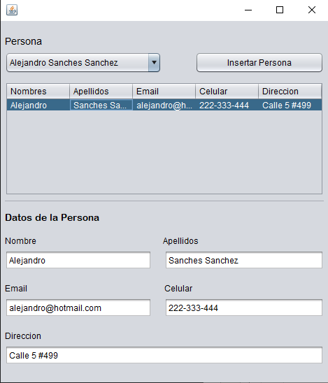

## 219. Ejercicio 5 - Desarrollando un cronometro (Explicacion del ejercicio)
## 220. Ejercicio 5 - Desarrollando un cronometro (Parte 1)
## 221. Ejercicio 5 - Desarrollando un cronometro (Parte 2)
## 222. Ejercicio 5 - Desarrollando un cronometro (Parte 3)
```java
/*
 * To change this license header, choose License Headers in Project Properties.
 * To change this template file, choose Tools | Templates
 * and open the template in the editor.
 */
package ventana;

import java.awt.event.ActionEvent;
import java.awt.event.ActionListener;
import javax.swing.Timer;

/**
 *
 * @author nicod
 */
public class Ventana extends javax.swing.JFrame {
    private Timer tiempo;
    private int centesimaSegundos=0,segundos=0,minutos=0,horas=0;
    
    private ActionListener acciones = new ActionListener() {
        @Override
        public void actionPerformed(ActionEvent e) {
            centesimaSegundos++;
            if (centesimaSegundos==100) {
               segundos++;
               centesimaSegundos=0;
            }
            if (segundos==60) {
                minutos++;
                segundos=0;
            }
            if (minutos==60) {
                horas++;
                minutos=0;
            }
            actualizarEtiquetaTiempo();
        }
    };
    private void actualizarEtiquetaTiempo(){
        String texto=(horas<=9?"0":"")+horas+":"+(minutos<=9?"0":"")+minutos+":"+(segundos<=9?"0":"")+segundos+":"+(centesimaSegundos<=9?"0":"")+centesimaSegundos;
        etiquetaTiempo.setText(texto);
    }

    /**
     * Creates new form Ventana
     */
    public Ventana() {
        initComponents();
        setLocationRelativeTo(null);
        tiempo = new Timer(10, acciones);
    }

    /**
     * This method is called from within the constructor to initialize the form.
     * WARNING: Do NOT modify this code. The content of this method is always
     * regenerated by the Form Editor.
     */
    @SuppressWarnings("unchecked")
    // <editor-fold defaultstate="collapsed" desc="Generated Code">                          
    private void initComponents() {

        panel = new javax.swing.JPanel();
        imagenCronometro = new javax.swing.JLabel();
        etiquetaCronometro = new javax.swing.JLabel();
        etiquetaTiempo = new javax.swing.JLabel();
        botonIniciar = new javax.swing.JButton();
        botonPausar = new javax.swing.JButton();
        botonDetener = new javax.swing.JButton();
        etiquetaFondo = new javax.swing.JLabel();

        setDefaultCloseOperation(javax.swing.WindowConstants.EXIT_ON_CLOSE);
        setTitle("Cronómetro");
        setResizable(false);

        panel.setLayout(new org.netbeans.lib.awtextra.AbsoluteLayout());

        imagenCronometro.setIcon(new javax.swing.ImageIcon(getClass().getResource("/Imagenes/cronometro.png"))); // NOI18N
        panel.add(imagenCronometro, new org.netbeans.lib.awtextra.AbsoluteConstraints(10, 20, 150, 150));

        etiquetaCronometro.setFont(new java.awt.Font("Arial Rounded MT Bold", 0, 33)); // NOI18N
        etiquetaCronometro.setForeground(new java.awt.Color(255, 255, 255));
        etiquetaCronometro.setText("Cronometro");
        panel.add(etiquetaCronometro, new org.netbeans.lib.awtextra.AbsoluteConstraints(200, 20, -1, -1));

        etiquetaTiempo.setFont(new java.awt.Font("Arial Rounded MT Bold", 0, 35)); // NOI18N
        etiquetaTiempo.setForeground(new java.awt.Color(255, 255, 255));
        etiquetaTiempo.setHorizontalAlignment(javax.swing.SwingConstants.CENTER);
        etiquetaTiempo.setText("00:00:00:00");
        panel.add(etiquetaTiempo, new org.netbeans.lib.awtextra.AbsoluteConstraints(200, 90, -1, -1));

        botonIniciar.setBackground(new java.awt.Color(0, 255, 204));
        botonIniciar.setFont(new java.awt.Font("Arial", 0, 14)); // NOI18N
        botonIniciar.setText("Iniciar");
        botonIniciar.addActionListener(new java.awt.event.ActionListener() {
            public void actionPerformed(java.awt.event.ActionEvent evt) {
                botonIniciarActionPerformed(evt);
            }
        });
        panel.add(botonIniciar, new org.netbeans.lib.awtextra.AbsoluteConstraints(130, 153, 120, 30));

        botonPausar.setBackground(new java.awt.Color(0, 255, 204));
        botonPausar.setFont(new java.awt.Font("Arial", 0, 14)); // NOI18N
        botonPausar.setText("Pausar");
        botonPausar.addActionListener(new java.awt.event.ActionListener() {
            public void actionPerformed(java.awt.event.ActionEvent evt) {
                botonPausarActionPerformed(evt);
            }
        });
        panel.add(botonPausar, new org.netbeans.lib.awtextra.AbsoluteConstraints(255, 153, 110, 30));

        botonDetener.setBackground(new java.awt.Color(0, 255, 204));
        botonDetener.setFont(new java.awt.Font("Arial", 0, 14)); // NOI18N
        botonDetener.setText("Detener");
        botonDetener.addActionListener(new java.awt.event.ActionListener() {
            public void actionPerformed(java.awt.event.ActionEvent evt) {
                botonDetenerActionPerformed(evt);
            }
        });
        panel.add(botonDetener, new org.netbeans.lib.awtextra.AbsoluteConstraints(370, 150, 110, 30));

        etiquetaFondo.setIcon(new javax.swing.ImageIcon(getClass().getResource("/Imagenes/fondo.jpg"))); // NOI18N
        panel.add(etiquetaFondo, new org.netbeans.lib.awtextra.AbsoluteConstraints(0, 0, -1, -1));

        javax.swing.GroupLayout layout = new javax.swing.GroupLayout(getContentPane());
        getContentPane().setLayout(layout);
        layout.setHorizontalGroup(
            layout.createParallelGroup(javax.swing.GroupLayout.Alignment.LEADING)
            .addComponent(panel, javax.swing.GroupLayout.DEFAULT_SIZE, javax.swing.GroupLayout.DEFAULT_SIZE, Short.MAX_VALUE)
        );
        layout.setVerticalGroup(
            layout.createParallelGroup(javax.swing.GroupLayout.Alignment.LEADING)
            .addComponent(panel, javax.swing.GroupLayout.DEFAULT_SIZE, javax.swing.GroupLayout.DEFAULT_SIZE, Short.MAX_VALUE)
        );

        pack();
    }// </editor-fold>                        

    private void botonIniciarActionPerformed(java.awt.event.ActionEvent evt) {                                             
        tiempo.start();
        botonIniciar.setEnabled(false);
        botonIniciar.setText("Reanudar");
        botonPausar.setEnabled(true);
        botonDetener.setEnabled(true);
    }                                            

    private void botonPausarActionPerformed(java.awt.event.ActionEvent evt) {                                            
        tiempo.stop();
        botonIniciar.setEnabled(true);
        botonPausar.setEnabled(false);
        
    }                                           

    private void botonDetenerActionPerformed(java.awt.event.ActionEvent evt) {                                             
        if(tiempo.isRunning()){
            tiempo.stop();
            botonIniciar.setEnabled(true);
        }
        botonIniciar.setText("Iniciar");
        botonPausar.setEnabled(false);
        botonDetener.setEnabled(false);
        
        horas=0;
        minutos=0;
        segundos=0;
        centesimaSegundos=0;
        
        actualizarEtiquetaTiempo();
    }                                            

    /**
     * @param args the command line arguments
     */
    public static void main(String args[]) {
        /* Set the Nimbus look and feel */
        //<editor-fold defaultstate="collapsed" desc=" Look and feel setting code (optional) ">
        /* If Nimbus (introduced in Java SE 6) is not available, stay with the default look and feel.
         * For details see http://download.oracle.com/javase/tutorial/uiswing/lookandfeel/plaf.html 
         */
        try {
            for (javax.swing.UIManager.LookAndFeelInfo info : javax.swing.UIManager.getInstalledLookAndFeels()) {
                if ("Nimbus".equals(info.getName())) {
                    javax.swing.UIManager.setLookAndFeel(info.getClassName());
                    break;
                }
            }
        } catch (ClassNotFoundException ex) {
            java.util.logging.Logger.getLogger(Ventana.class.getName()).log(java.util.logging.Level.SEVERE, null, ex);
        } catch (InstantiationException ex) {
            java.util.logging.Logger.getLogger(Ventana.class.getName()).log(java.util.logging.Level.SEVERE, null, ex);
        } catch (IllegalAccessException ex) {
            java.util.logging.Logger.getLogger(Ventana.class.getName()).log(java.util.logging.Level.SEVERE, null, ex);
        } catch (javax.swing.UnsupportedLookAndFeelException ex) {
            java.util.logging.Logger.getLogger(Ventana.class.getName()).log(java.util.logging.Level.SEVERE, null, ex);
        }
        //</editor-fold>

        /* Create and display the form */
        java.awt.EventQueue.invokeLater(new Runnable() {
            public void run() {
                new Ventana().setVisible(true);
            }
        });
    }

    // Variables declaration - do not modify                     
    private javax.swing.JButton botonDetener;
    private javax.swing.JButton botonIniciar;
    private javax.swing.JButton botonPausar;
    private javax.swing.JLabel etiquetaCronometro;
    private javax.swing.JLabel etiquetaFondo;
    private javax.swing.JLabel etiquetaTiempo;
    private javax.swing.JLabel imagenCronometro;
    private javax.swing.JPanel panel;
    // End of variables declaration                   
}
```
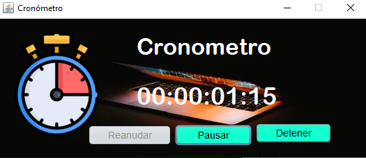

## 223. Ejercicio 6 - Interfaz grafica para un login (Explicacion del ejercicio)
## 224. Ejercicio 6 - Interfaz grafica para un login (parte 1)
## 225. Ejercicio 6 - Interfaz grafica para un login (parte 2)
```java
/*
 * To change this license header, choose License Headers in Project Properties.
 * To change this template file, choose Tools | Templates
 * and open the template in the editor.
 */
package ventana;

import javax.swing.JOptionPane;

/**
 *
 * @author nicod
 */
public class Ventana extends javax.swing.JFrame {

    /**
     * Creates new form Ventana
     */
    public Ventana() {
        initComponents();
        setLocationRelativeTo(null);
    }

    /**
     * This method is called from within the constructor to initialize the form.
     * WARNING: Do NOT modify this code. The content of this method is always
     * regenerated by the Form Editor.
     */
    @SuppressWarnings("unchecked")
    // <editor-fold defaultstate="collapsed" desc="Generated Code">                          
    private void initComponents() {

        panel = new javax.swing.JPanel();
        jButton1 = new javax.swing.JButton();
        imagenUsuario = new javax.swing.JLabel();
        etiquetaUsuario = new javax.swing.JLabel();
        etiquetaContraseña = new javax.swing.JLabel();
        cajaUsuario = new javax.swing.JTextField();
        cajaContraseña = new javax.swing.JPasswordField();
        botonIniciarSesion = new javax.swing.JButton();
        imagenFondo = new javax.swing.JLabel();

        setDefaultCloseOperation(javax.swing.WindowConstants.EXIT_ON_CLOSE);
        setUndecorated(true);
        setResizable(false);

        panel.setLayout(new org.netbeans.lib.awtextra.AbsoluteLayout());

        jButton1.setBackground(new java.awt.Color(0, 0, 204));
        jButton1.setFont(new java.awt.Font("Arial", 0, 14)); // NOI18N
        jButton1.setForeground(new java.awt.Color(255, 255, 255));
        jButton1.setText("Salir");
        jButton1.addActionListener(new java.awt.event.ActionListener() {
            public void actionPerformed(java.awt.event.ActionEvent evt) {
                jButton1ActionPerformed(evt);
            }
        });
        panel.add(jButton1, new org.netbeans.lib.awtextra.AbsoluteConstraints(300, 10, 90, 30));

        imagenUsuario.setIcon(new javax.swing.ImageIcon(getClass().getResource("/imagenes/persona.png"))); // NOI18N
        panel.add(imagenUsuario, new org.netbeans.lib.awtextra.AbsoluteConstraints(80, 30, 250, 250));

        etiquetaUsuario.setFont(new java.awt.Font("Arial", 0, 24)); // NOI18N
        etiquetaUsuario.setForeground(new java.awt.Color(255, 255, 255));
        etiquetaUsuario.setText("Usuario:");
        panel.add(etiquetaUsuario, new org.netbeans.lib.awtextra.AbsoluteConstraints(50, 310, -1, -1));

        etiquetaContraseña.setFont(new java.awt.Font("Arial", 0, 24)); // NOI18N
        etiquetaContraseña.setForeground(new java.awt.Color(255, 255, 255));
        etiquetaContraseña.setText("Contraseña:");
        panel.add(etiquetaContraseña, new org.netbeans.lib.awtextra.AbsoluteConstraints(50, 360, -1, -1));

        cajaUsuario.setFont(new java.awt.Font("Arial", 0, 14)); // NOI18N
        cajaUsuario.addActionListener(new java.awt.event.ActionListener() {
            public void actionPerformed(java.awt.event.ActionEvent evt) {
                cajaUsuarioActionPerformed(evt);
            }
        });
        panel.add(cajaUsuario, new org.netbeans.lib.awtextra.AbsoluteConstraints(200, 310, 170, 30));

        cajaContraseña.setFont(new java.awt.Font("Arial", 0, 14)); // NOI18N
        panel.add(cajaContraseña, new org.netbeans.lib.awtextra.AbsoluteConstraints(200, 360, 170, 30));

        botonIniciarSesion.setBackground(new java.awt.Color(0, 0, 255));
        botonIniciarSesion.setFont(new java.awt.Font("Arial", 0, 14)); // NOI18N
        botonIniciarSesion.setForeground(new java.awt.Color(255, 255, 255));
        botonIniciarSesion.setText("Iniciar Sesión");
        botonIniciarSesion.addActionListener(new java.awt.event.ActionListener() {
            public void actionPerformed(java.awt.event.ActionEvent evt) {
                botonIniciarSesionActionPerformed(evt);
            }
        });
        panel.add(botonIniciarSesion, new org.netbeans.lib.awtextra.AbsoluteConstraints(253, 433, 120, 30));

        imagenFondo.setIcon(new javax.swing.ImageIcon(getClass().getResource("/imagenes/fondo.jpg"))); // NOI18N
        panel.add(imagenFondo, new org.netbeans.lib.awtextra.AbsoluteConstraints(0, 0, -1, -1));

        javax.swing.GroupLayout layout = new javax.swing.GroupLayout(getContentPane());
        getContentPane().setLayout(layout);
        layout.setHorizontalGroup(
            layout.createParallelGroup(javax.swing.GroupLayout.Alignment.LEADING)
            .addComponent(panel, javax.swing.GroupLayout.DEFAULT_SIZE, javax.swing.GroupLayout.DEFAULT_SIZE, Short.MAX_VALUE)
        );
        layout.setVerticalGroup(
            layout.createParallelGroup(javax.swing.GroupLayout.Alignment.LEADING)
            .addComponent(panel, javax.swing.GroupLayout.DEFAULT_SIZE, javax.swing.GroupLayout.DEFAULT_SIZE, Short.MAX_VALUE)
        );

        pack();
    }// </editor-fold>                        

    private void jButton1ActionPerformed(java.awt.event.ActionEvent evt) {                                         
        System.exit(0);
    }                                        

    private void cajaUsuarioActionPerformed(java.awt.event.ActionEvent evt) {                                            
        // TODO add your handling code here:
    }                                           

    private void botonIniciarSesionActionPerformed(java.awt.event.ActionEvent evt) {                                                   
        String usuarioCorrecto = "nick";
        String contraseñaCorrecta = "programacion";
        
        if (usuarioCorrecto.equals(cajaUsuario.getText())) {
            String contraseña="";
            for (int i = 0; i < cajaContraseña.getPassword().length; i++) {
                contraseña+=cajaContraseña.getPassword()[i];
            }
            if (contraseñaCorrecta.equals(contraseña)) {
                JOptionPane.showMessageDialog(null, "Ingresaste al sistema");
            }
            else{
                JOptionPane.showMessageDialog(null, "Error, contraseña desconocida");
            }
        }
        else{
            JOptionPane.showMessageDialog(null, "Error, usuario desconocido");
        }
    }                                                  

    /**
     * @param args the command line arguments
     */
    public static void main(String args[]) {
        /* Set the Nimbus look and feel */
        //<editor-fold defaultstate="collapsed" desc=" Look and feel setting code (optional) ">
        /* If Nimbus (introduced in Java SE 6) is not available, stay with the default look and feel.
         * For details see http://download.oracle.com/javase/tutorial/uiswing/lookandfeel/plaf.html 
         */
        try {
            for (javax.swing.UIManager.LookAndFeelInfo info : javax.swing.UIManager.getInstalledLookAndFeels()) {
                if ("Nimbus".equals(info.getName())) {
                    javax.swing.UIManager.setLookAndFeel(info.getClassName());
                    break;
                }
            }
        } catch (ClassNotFoundException ex) {
            java.util.logging.Logger.getLogger(Ventana.class.getName()).log(java.util.logging.Level.SEVERE, null, ex);
        } catch (InstantiationException ex) {
            java.util.logging.Logger.getLogger(Ventana.class.getName()).log(java.util.logging.Level.SEVERE, null, ex);
        } catch (IllegalAccessException ex) {
            java.util.logging.Logger.getLogger(Ventana.class.getName()).log(java.util.logging.Level.SEVERE, null, ex);
        } catch (javax.swing.UnsupportedLookAndFeelException ex) {
            java.util.logging.Logger.getLogger(Ventana.class.getName()).log(java.util.logging.Level.SEVERE, null, ex);
        }
        //</editor-fold>

        /* Create and display the form */
        java.awt.EventQueue.invokeLater(new Runnable() {
            public void run() {
                new Ventana().setVisible(true);
            }
        });
    }

    // Variables declaration - do not modify                     
    private javax.swing.JButton botonIniciarSesion;
    private javax.swing.JPasswordField cajaContraseña;
    private javax.swing.JTextField cajaUsuario;
    private javax.swing.JLabel etiquetaContraseña;
    private javax.swing.JLabel etiquetaUsuario;
    private javax.swing.JLabel imagenFondo;
    private javax.swing.JLabel imagenUsuario;
    private javax.swing.JButton jButton1;
    private javax.swing.JPanel panel;
    // End of variables declaration                   
}
```

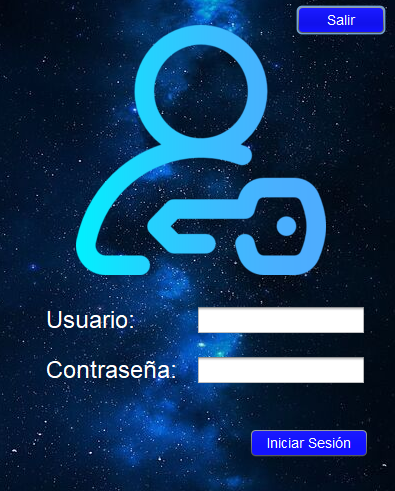

## 226. Diseños (Layout) - FlowLayout
## 227. Diseños (Layout) - BoxLayout
## 228. Diseños (Layout) - BorderLayout
## 229. Diseños (Layout) - GridLayout
## 230. Diseños (Layout) - GridBagLayout
## 231. Ejercicio 7 - Cartelera de cine (Explicacion del ejercicio)
## 232. Ejercicio 7 - Cartelera de cine (parte 1)
## 233. Ejercicio 7 - Cartelera de cine (parte 2)
## 234. Ejercicio 7 - Cartelera de cine (parte 3)
```java
/*
 * To change this license header, choose License Headers in Project Properties.
 * To change this template file, choose Tools | Templates
 * and open the template in the editor.
 */
package ventana;

/**
 *
 * @author nicod
 */
public class Ventana extends javax.swing.JFrame {

    /**
     * Creates new form Ventana
     */
    public Ventana() {
        initComponents();
    }

    /**
     * This method is called from within the constructor to initialize the form.
     * WARNING: Do NOT modify this code. The content of this method is always
     * regenerated by the Form Editor.
     */
    @SuppressWarnings("unchecked")
    // <editor-fold defaultstate="collapsed" desc="Generated Code">                          
    private void initComponents() {
        java.awt.GridBagConstraints gridBagConstraints;

        jScrollPane1 = new javax.swing.JScrollPane();
        panel = new javax.swing.JPanel();
        imagenPelicula1 = new javax.swing.JLabel();
        tituloPelicula1 = new javax.swing.JLabel();
        generoPelicula1 = new javax.swing.JLabel();
        imagenPelicula2 = new javax.swing.JLabel();
        tituloPelicula2 = new javax.swing.JLabel();
        generoPelicula2 = new javax.swing.JLabel();
        imagenPelicula3 = new javax.swing.JLabel();
        tituloPelicula3 = new javax.swing.JLabel();
        generoPelicula3 = new javax.swing.JLabel();
        imagenPelicula4 = new javax.swing.JLabel();
        tituloPelicula4 = new javax.swing.JLabel();
        generoPelicula4 = new javax.swing.JLabel();

        setDefaultCloseOperation(javax.swing.WindowConstants.EXIT_ON_CLOSE);
        setTitle("Peliculas para Programadores");

        panel.setLayout(new java.awt.GridBagLayout());

        imagenPelicula1.setIcon(new javax.swing.ImageIcon(getClass().getResource("/imagenes/mark.jpg"))); // NOI18N
        gridBagConstraints = new java.awt.GridBagConstraints();
        gridBagConstraints.gridx = 0;
        gridBagConstraints.gridy = 0;
        gridBagConstraints.gridheight = 2;
        gridBagConstraints.weightx = 0.5;
        gridBagConstraints.insets = new java.awt.Insets(20, 20, 0, 0);
        panel.add(imagenPelicula1, gridBagConstraints);

        tituloPelicula1.setFont(new java.awt.Font("Arial Rounded MT Bold", 0, 18)); // NOI18N
        tituloPelicula1.setText("Título: La Red Social");
        gridBagConstraints = new java.awt.GridBagConstraints();
        gridBagConstraints.gridx = 1;
        gridBagConstraints.gridy = 0;
        gridBagConstraints.fill = java.awt.GridBagConstraints.HORIZONTAL;
        gridBagConstraints.weightx = 0.5;
        gridBagConstraints.insets = new java.awt.Insets(20, 20, 0, 20);
        panel.add(tituloPelicula1, gridBagConstraints);

        generoPelicula1.setFont(new java.awt.Font("Arial", 0, 15)); // NOI18N
        generoPelicula1.setText("Género: Drama");
        gridBagConstraints = new java.awt.GridBagConstraints();
        gridBagConstraints.gridx = 1;
        gridBagConstraints.gridy = 1;
        gridBagConstraints.fill = java.awt.GridBagConstraints.HORIZONTAL;
        gridBagConstraints.anchor = java.awt.GridBagConstraints.NORTH;
        gridBagConstraints.weightx = 0.5;
        gridBagConstraints.insets = new java.awt.Insets(10, 20, 0, 0);
        panel.add(generoPelicula1, gridBagConstraints);

        imagenPelicula2.setIcon(new javax.swing.ImageIcon(getClass().getResource("/imagenes/jobs.jpg"))); // NOI18N
        gridBagConstraints = new java.awt.GridBagConstraints();
        gridBagConstraints.gridx = 0;
        gridBagConstraints.gridy = 2;
        gridBagConstraints.gridheight = 2;
        gridBagConstraints.weightx = 0.5;
        gridBagConstraints.insets = new java.awt.Insets(20, 20, 0, 0);
        panel.add(imagenPelicula2, gridBagConstraints);

        tituloPelicula2.setFont(new java.awt.Font("Arial Rounded MT Bold", 0, 18)); // NOI18N
        tituloPelicula2.setText("Título: Jobs");
        gridBagConstraints = new java.awt.GridBagConstraints();
        gridBagConstraints.gridx = 1;
        gridBagConstraints.gridy = 2;
        gridBagConstraints.fill = java.awt.GridBagConstraints.HORIZONTAL;
        gridBagConstraints.weightx = 0.5;
        gridBagConstraints.insets = new java.awt.Insets(20, 20, 0, 0);
        panel.add(tituloPelicula2, gridBagConstraints);

        generoPelicula2.setFont(new java.awt.Font("Arial", 0, 15)); // NOI18N
        generoPelicula2.setText("Género: Cine Biográfico - Drama");
        gridBagConstraints = new java.awt.GridBagConstraints();
        gridBagConstraints.gridx = 1;
        gridBagConstraints.gridy = 3;
        gridBagConstraints.fill = java.awt.GridBagConstraints.HORIZONTAL;
        gridBagConstraints.anchor = java.awt.GridBagConstraints.NORTH;
        gridBagConstraints.insets = new java.awt.Insets(10, 20, 0, 20);
        panel.add(generoPelicula2, gridBagConstraints);

        imagenPelicula3.setIcon(new javax.swing.ImageIcon(getClass().getResource("/imagenes/cientifico.jpg"))); // NOI18N
        gridBagConstraints = new java.awt.GridBagConstraints();
        gridBagConstraints.gridx = 0;
        gridBagConstraints.gridy = 4;
        gridBagConstraints.gridheight = 2;
        gridBagConstraints.weightx = 0.5;
        gridBagConstraints.insets = new java.awt.Insets(20, 20, 0, 0);
        panel.add(imagenPelicula3, gridBagConstraints);

        tituloPelicula3.setFont(new java.awt.Font("Arial Rounded MT Bold", 0, 18)); // NOI18N
        tituloPelicula3.setText("Título: Código Enigma");
        gridBagConstraints = new java.awt.GridBagConstraints();
        gridBagConstraints.gridx = 1;
        gridBagConstraints.gridy = 4;
        gridBagConstraints.fill = java.awt.GridBagConstraints.HORIZONTAL;
        gridBagConstraints.weightx = 0.5;
        gridBagConstraints.insets = new java.awt.Insets(20, 20, 0, 20);
        panel.add(tituloPelicula3, gridBagConstraints);

        generoPelicula3.setFont(new java.awt.Font("Arial", 0, 15)); // NOI18N
        generoPelicula3.setText("Género: Drama");
        gridBagConstraints = new java.awt.GridBagConstraints();
        gridBagConstraints.gridx = 1;
        gridBagConstraints.fill = java.awt.GridBagConstraints.HORIZONTAL;
        gridBagConstraints.anchor = java.awt.GridBagConstraints.NORTH;
        gridBagConstraints.weightx = 0.5;
        gridBagConstraints.insets = new java.awt.Insets(10, 20, 0, 0);
        panel.add(generoPelicula3, gridBagConstraints);

        imagenPelicula4.setIcon(new javax.swing.ImageIcon(getClass().getResource("/imagenes/becarios.jpg"))); // NOI18N
        gridBagConstraints = new java.awt.GridBagConstraints();
        gridBagConstraints.gridx = 0;
        gridBagConstraints.gridy = 6;
        gridBagConstraints.gridheight = 2;
        gridBagConstraints.weightx = 0.5;
        gridBagConstraints.insets = new java.awt.Insets(20, 20, 20, 0);
        panel.add(imagenPelicula4, gridBagConstraints);

        tituloPelicula4.setFont(new java.awt.Font("Arial Rounded MT Bold", 0, 18)); // NOI18N
        tituloPelicula4.setText("Título: Aprendices fuera de Linea");
        gridBagConstraints = new java.awt.GridBagConstraints();
        gridBagConstraints.gridx = 1;
        gridBagConstraints.gridy = 6;
        gridBagConstraints.fill = java.awt.GridBagConstraints.HORIZONTAL;
        gridBagConstraints.weightx = 0.5;
        gridBagConstraints.insets = new java.awt.Insets(20, 20, 0, 20);
        panel.add(tituloPelicula4, gridBagConstraints);

        generoPelicula4.setFont(new java.awt.Font("Arial", 0, 15)); // NOI18N
        generoPelicula4.setText("Género: Drama - Comedia");
        gridBagConstraints = new java.awt.GridBagConstraints();
        gridBagConstraints.gridx = 1;
        gridBagConstraints.gridy = 7;
        gridBagConstraints.fill = java.awt.GridBagConstraints.HORIZONTAL;
        gridBagConstraints.anchor = java.awt.GridBagConstraints.NORTH;
        gridBagConstraints.insets = new java.awt.Insets(10, 20, 0, 0);
        panel.add(generoPelicula4, gridBagConstraints);

        jScrollPane1.setViewportView(panel);

        javax.swing.GroupLayout layout = new javax.swing.GroupLayout(getContentPane());
        getContentPane().setLayout(layout);
        layout.setHorizontalGroup(
            layout.createParallelGroup(javax.swing.GroupLayout.Alignment.LEADING)
            .addComponent(jScrollPane1, javax.swing.GroupLayout.DEFAULT_SIZE, 480, Short.MAX_VALUE)
        );
        layout.setVerticalGroup(
            layout.createParallelGroup(javax.swing.GroupLayout.Alignment.LEADING)
            .addComponent(jScrollPane1, javax.swing.GroupLayout.DEFAULT_SIZE, 640, Short.MAX_VALUE)
        );

        pack();
    }// </editor-fold>                        

    /**
     * @param args the command line arguments
     */
    public static void main(String args[]) {
        /* Set the Nimbus look and feel */
        //<editor-fold defaultstate="collapsed" desc=" Look and feel setting code (optional) ">
        /* If Nimbus (introduced in Java SE 6) is not available, stay with the default look and feel.
         * For details see http://download.oracle.com/javase/tutorial/uiswing/lookandfeel/plaf.html 
         */
        try {
            for (javax.swing.UIManager.LookAndFeelInfo info : javax.swing.UIManager.getInstalledLookAndFeels()) {
                if ("Nimbus".equals(info.getName())) {
                    javax.swing.UIManager.setLookAndFeel(info.getClassName());
                    break;
                }
            }
        } catch (ClassNotFoundException ex) {
            java.util.logging.Logger.getLogger(Ventana.class.getName()).log(java.util.logging.Level.SEVERE, null, ex);
        } catch (InstantiationException ex) {
            java.util.logging.Logger.getLogger(Ventana.class.getName()).log(java.util.logging.Level.SEVERE, null, ex);
        } catch (IllegalAccessException ex) {
            java.util.logging.Logger.getLogger(Ventana.class.getName()).log(java.util.logging.Level.SEVERE, null, ex);
        } catch (javax.swing.UnsupportedLookAndFeelException ex) {
            java.util.logging.Logger.getLogger(Ventana.class.getName()).log(java.util.logging.Level.SEVERE, null, ex);
        }
        //</editor-fold>

        /* Create and display the form */
        java.awt.EventQueue.invokeLater(new Runnable() {
            public void run() {
                new Ventana().setVisible(true);
            }
        });
    }

    // Variables declaration - do not modify                     
    private javax.swing.JLabel generoPelicula1;
    private javax.swing.JLabel generoPelicula2;
    private javax.swing.JLabel generoPelicula3;
    private javax.swing.JLabel generoPelicula4;
    private javax.swing.JLabel imagenPelicula1;
    private javax.swing.JLabel imagenPelicula2;
    private javax.swing.JLabel imagenPelicula3;
    private javax.swing.JLabel imagenPelicula4;
    private javax.swing.JScrollPane jScrollPane1;
    private javax.swing.JPanel panel;
    private javax.swing.JLabel tituloPelicula1;
    private javax.swing.JLabel tituloPelicula2;
    private javax.swing.JLabel tituloPelicula3;
    private javax.swing.JLabel tituloPelicula4;
    // End of variables declaration                   
}
```

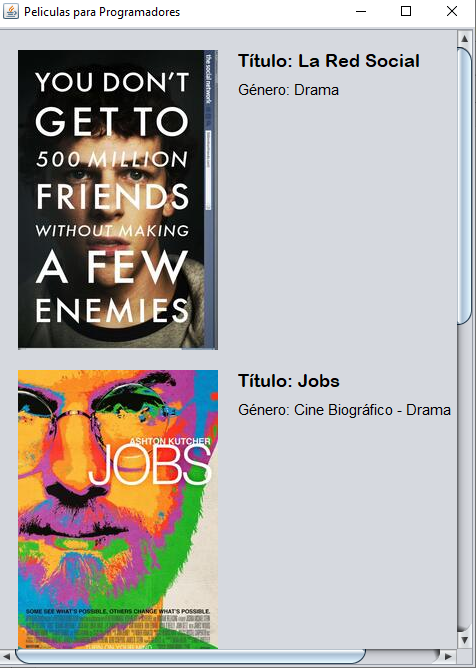


# SECCION 15: BASES DE DATOS EN MYSQL

## 286. Introduccion al capitulo de Base de datos en MySQL

### Objetivos:

Con el estudio de este capitulo usted podra:
- Crear bases de datos desde cero con MySQL.
- Podras realizar inserciones, consultas, modificaciones y eliminaciones sobre tablas.
- Aprenderas sobre vistas, procedimientos almacenados y triggers.

### Contenido:
1. Conceptos de Bases de datos.
2. Descargar e instalar MySQL.
3. Creacion de una base de datos.
4. Creacion de tablas.
5. Conceptos de relaciones entre tablas.
6. Relacion de uno a uno.
7. Relacion de uno a muchos.
8. Relacion de muchos a muchos
9. Insertar registros en las tablas.
10. Modificar registros de una tabla.
11. Eliminar registros de una tabla.
12. Consultas en una tabla.
13. Consultas mas avanzadas con operadores.
14. Consultas en varias tablas.
15. Vistas.
16. Procedimientos almacenados.
17. Triggers.

## 287. Conceptos de Bases de Datos
### ¿Que son las bases de datos?
Una base de datos es un "almacen" que nos permite guardar grandes cantidades de informacion de forma organizada para que luego podamos encontrar y utilizar facilmente.

### Modelos de bases de datos:
- Bases de datos jerarquicas.
- Bases de datos de red.
- Bases de datos transaccionales.
- Bases de datos relacionales.
- Bases de datos multidimensionales.
- Bases de datos orientadas a objetos.
- Bases de datos documentales.
- Bases de datos deductivas

### Bases de datos relacionales:
Una base de datos relacional es una coleccion de elementos de datos organizados en un conjunto de tablas formalmente descritas desde la que se puede acceder a los datos o volver a montarlos de muchas maneras diferentes sin tener que reorganizar las tablas de la base.

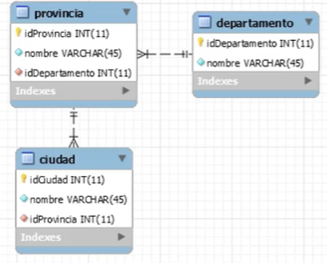

La interfaz estandar de programa de usuario y aplicacion a una base de datos relacional es el lenguaje de consultas estructuradas (SQL). Los comandos de SQL se utilizan tanto para consultas interactivas para obtener informacion de una base de datos relacional y para la recopilacion de datos para los informes.

### Gestores de bases de datos:
- MySQL.
- Microsoft SQL Server.
- Oracle.
- Microsoft Access.
- PostgrSQL.
- DB2.

## 288. Descargar e instalar MySQL
## 289. Creacion de una base de datos

```sql
create database prueba;     #crea una base de datos llamado prueba
```

## 290. Creacion de tablas
```sql
create database tienda;
use tienda;

# Creacion de una tabla para la BD tienda
create table producto(
	idProducto int auto_increment primary key,
    nombre varchar(50) not null,
    precio decimal(10,2) not null,
    fecha_venta date default '0000-00-00'
);
show tables;  /*Muestra las tablas de nuestra BD*/
show columns from producto; /*Muestras las columnas de nuestra tabla producto*/
```

## 291. Conceptos de relaciones entre tablas
### Relacion entre tablas:
Para que los datos de las tablas se puedan seleccionar, encontrar y procesar de forma rapida y eficaz, es necesario que las tablas no se encuentren aisladas unas de otras.

Las tablas tienen que estar relacionadas con otras formando estructuras relacionales. La relacion es una asociacion establecida entre campos comunes (columnas) en dos tablas. Los campos que entran en relacion pueden llamarse de distinta manera, pero tienen que ser del mismo tipo de datos.

Las relaciones pueden ser de 3 tipos:
- Relacion de uno a uno.
- Relacion de uno a muchos.
- Relacion de muchos a muchos

### Relacion de uno a uno:
Estas se dan cuando un registro esta relacionado con otro y con ese solamente, y a su vez este segundo tambien estara relacionado solamente con el primero.
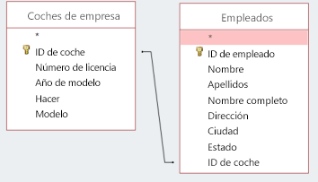

### Relacion de uno a muchos:
En este caso un registro estara relacionado son con otro, pero este segundo podra estar relacionado con mas de uno.
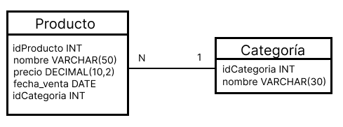

### Relacion de muchos a muchos:
En las relaciones de muchos a muchos a cada registro de la tabla A, se le pueden asociar varios registros de la tabla B, y cada registro de la tabla B puede estar relacionado con mas de un registro de la tabla A.
- Cuando hay relacion de muchos a muchos es conveniente agregar una tercera tabla para establecer la relacion
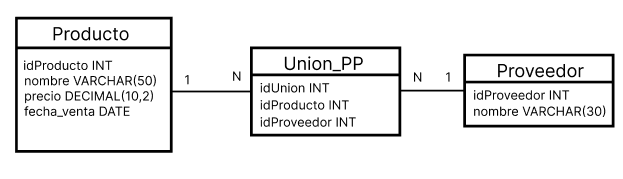

## 292. Relacion de uno a uno
```sql
create database tienda;
use tienda;
```
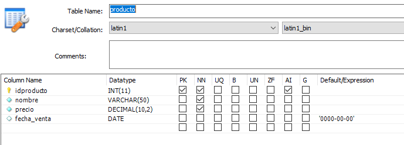
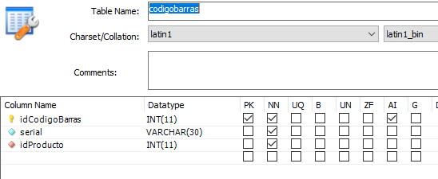
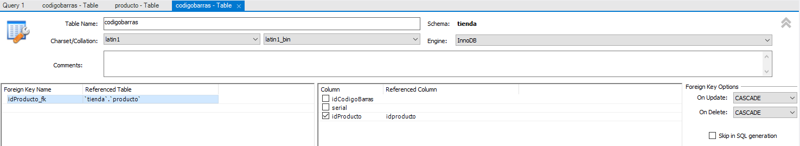
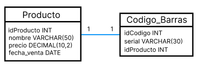

## 293. Relacion de uno a muchos
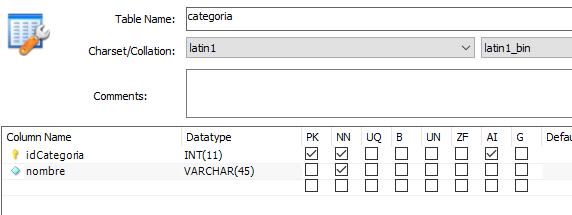
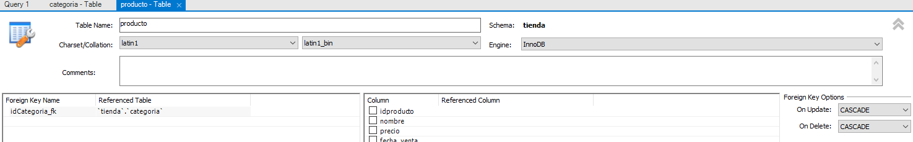


## 294. Relacion de muchos a muchos
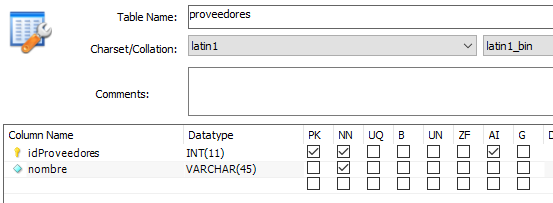
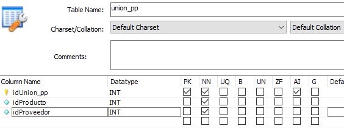
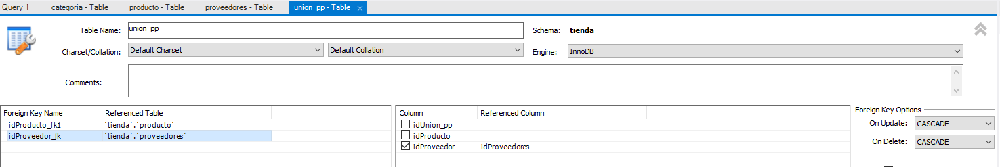

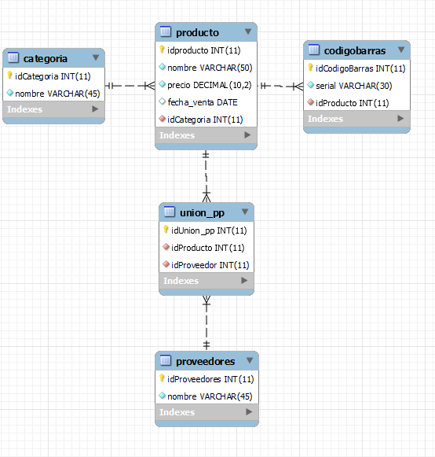

## 295. Insertar registros en las tablas
```sql
# Insertar registros en la tabla categoria
insert into categoria values (NULL, "Bebidas");

# Otra manera de insertar registros 
insert into categoria (nombre) values ("Aceite");

# Insertar varios registros
insert into categoria (nombre) values
("Detergentes"),("Galletas"),("Chocolates"),("Frituras");

# Insertar registros en la tabla producto
insert into producto (nombre,precio,fecha_venta,idCategoria) values
("Gaseosa Coca Cola",5.5,"2018-05-31",1),
("Gaseosa Inka Cola",5.4,"2018-05-30",1),
("Cerveza Heineken",3.6,curdate(),1),/*Con curdate() se pone la fecha actual*/
("Aceite de Oliva",2.7,curdate(),2);

# Insertar registros en la tabla codigo de barras
insert into codigobarras (serial,idProducto) values
("1231231231",1),("45454545",2),("767666556",3),("65776744",11);

# Mostrar todos los registros que hay en categoria
select * from categoria;
select * from producto;
select * from codigobarras;
```

## 296. Modificar registros de una tabla
```sql
# Modificar registros de categoria
update categoria set nombre = "Bebidas con gas" where idCategoria = 1;

# Modificar registros de producto pero en varias columnas
update producto set nombre = "Gaseosa Pepsi",precio = 5.2 where idProducto = 2;

# Vamos a alterar la tabla producto y agregaremos la columna cantidad
# Luego modificaremos  esa cantidad
update producto set cantidad = 5 where idproducto=1;

select * from categoria;
select * from producto;
```

## 297. Eliminar registros de una tabla
```sql
# Eliminar registros de una tabla
delete from producto where idProducto = 1;

/*Como la relacion entre producto y codigo de barras es de 
1 a 1 cuando eliminamos un registro de la tabla productos, automaticamente
se elimina el registro de codigo de barras. En una relacion de 
uno a muchos, cuando yo elimino una categoria se elimina todos
los productos que pertenecen a esa categoria*/

select * from codigobarras;
select * from producto;
select * from categoria;
```

## 298. Consultas en una tabla
```sql
# Consultas en las tablas
select nombre from producto;

# Consultar varias columnas
select nombre,precio,cantidad from producto;

# Agregando un alias temporal a la columna
select nombre as 'Nombre del producto' from producto;

# Consulta filtrada o especifica
select nombre,precio,fecha_venta from producto where idCategoria = 2;

select nombre,precio,fecha_venta from producto where idProducto = 1;

select nombre,precio,fecha_venta from producto where cantidad>100;

select min(cantidad), max(cantidad) from producto;

select min(cantidad) as 'cantidad minima', max(cantidad) as 'cantidad maxima' from producto;

select nombre,precio from producto order by nombre asc;

select * from producto;
```

# 299. Consultas mas avanzadas con operadores

```sql
# Consultas mas avanzadas con operadores
select * from producto where idCategoria = 1 and cantidad>100;

select * from producto where idCategoria = 1 or cantidad>100;

select * from producto where idCategoria !=1; /*Tambien se puede utilizar <>*/

select * from producto where precio is null;

select * from producto where precio is not null;

select * from producto where precio between 3 and 6;

select * from producto where precio not between 3 and 6;

select * from producto where cantidad = 50+50;

select * from producto where nombre like 'Gaseosa%';

select * from producto where nombre like '%o';

select * from producto where nombre like 'a%';

select * from producto where nombre like '%osa%';

select * from producto;
```

## 300. Consultas en varias tablas
```sql
# Consultas en varia tablas
select * from producto p inner join categoria as c on p.idCategoria=c.idCategoria;

select p.nombre,p.precio,p.cantidad,c.nombre as 'Categoria' from producto p inner join categoria as c on p.idCategoria=c.idCategoria;

select p.nombre,p.precio,p.cantidad,c.nombre as 'Categoria' from producto p inner join categoria as c on p.idCategoria=c.idCategoria where p.cantidad>100;

select p.nombre as 'Producto',cb.serial as 'Codigo Barras' from producto p
inner join codigobarras cb on p.idProducto = cb.idProducto;

select p.nombre as 'Producto',cb.serial as 'Codigo Barras',c.nombre as 'Categoria' from producto p
inner join codigobarras cb on p.idProducto = cb.idProducto
inner join categoria c on p.idCategoria = c.idCategoria;

select p.nombre as 'Producto',cb.serial as 'Codigo Barras',c.nombre as 'Categoria' from producto p
inner join codigobarras cb on p.idProducto = cb.idProducto
inner join categoria c on p.idCategoria = c.idCategoria;

select p.nombre as 'Producto',cb.serial as 'Codigo Barras',c.nombre as 'Categoria',pvv.nombre as 'Proveedor' from producto p
inner join codigobarras cb on p.idProducto = cb.idProducto
inner join categoria c on p.idCategoria = c.idCategoria
inner join union_pp as upp on p.idProducto = upp.idProducto
inner join proveedores as pvv on pvv.idProveedores = upp.idProveedor;

select p.nombre as 'Producto',cb.serial as 'Codigo Barras',c.nombre as 'Categoria',pvv.nombre as 'Proveedor' from producto p
inner join codigobarras cb on p.idProducto = cb.idProducto
inner join categoria c on p.idCategoria = c.idCategoria
inner join union_pp as upp on p.idProducto = upp.idProducto
inner join proveedores as pvv on pvv.idProveedores = upp.idProveedor
where p.cantidad>=100;
```

## 301. Vistas
- Es una forma sencilla de guardar una consulta muy extensa

```sql
# Vistas
create view vista_5tablas as
select p.nombre as 'Producto',cb.serial as 'Codigo Barras',c.nombre as 'Categoria',pvv.nombre as 'Proveedor' from producto p
inner join codigobarras cb on p.idProducto = cb.idProducto
inner join categoria c on p.idCategoria = c.idCategoria
inner join union_pp as upp on p.idProducto = upp.idProducto
inner join proveedores as pvv on pvv.idProveedores = upp.idProveedor
where p.cantidad>=100;

select * from vista_5tablas;


create view vista_producto_categoria as
select p.nombre,p.precio,p.cantidad,c.nombre as 'Categoria'
from producto as p
inner join categoria as c on p.idCategoria=c.idCategoria;

select * from vista_producto_categoria;
```

## 302. Procedimientos almacenados

```sql
# Procedimientos Almacenados

# Creacion de un procedimiento almacenado
delimiter //
create procedure productosXcategoria (in id int)
begin
	select * from producto where idCategoria = id;
end//

delimiter ;

# Llamada al procedimiento almacenado
call productosXcategoria(1);

# Eliminar un procedimiento almacenado
drop procedure productosXcategoria;

# Eliminar una vista
drop view vista_producto_categoria;
```

## 303. Triggers
Son eventos que se van a ejectuar automaticamente cuando suceda una determinada accion
```sql
# Triggers
/*Vamos a insertar algo en nuestra tabla temporal antes de que se inserte
en la tabla categoria*/
Delimiter |
create trigger insertarTemp before insert on categoria
for each row
begin
	insert into temporal(categoria) values (new.nombre);
end |

insert into categoria (nombre) values ("Embolsados");

select * from temporal;
select * from categoria;
select * from proveedores;

/* Este video arroja algunos errores*/
```

## 304. Respaldo y restauracion de una base de datos en MySQL

### Respaldo de una BD (Backup)
1. Damos clic en server
2. Data export
3. Seleccionamos la base de datos
4. Seleccionamos las tablas que queremos respaldar
5. Guardamos el archivo en un documento sql (Export to self-contained file) y seleccionamos ubicacion
6. Start Export

### Restauracion del respaldo de la BD
1. Damos clic en server
2. Data import
3. Seleccionamos el archivo sql (Import from self-contained file).
4. Escogemos la base de datos donde se abrira o creamos una(new).
4. Start Import

# Seccion 16: Conexion entre Java y Base de datos en MySQL
## 305. Intro al capitulo de conexion entre java y BD en MySQL
### Objetivos:
Con el estudio de este capitulo usted podra:
- Hacer la conexion entre sus aplicaciones en java y sus BD en MySQL.
- Podra llenar diferentes componentes con registros de su BD.
- Aprendera a registrar usuarios, iniciar sesion y dar privilegios a los usuarios.

### Contenido:
1. Conector de MySQL para Java
2. Conexion entre Java y Base de datos en MySQL.
3. Que es un CRUD.
4. Que es el Modelo-Vista-Controlador(MVC).
5. CRUD con MVC.
6. Cargar tabla de BD en un JTable
7. CRUD con JTable.
8. JComboBox anidados con datos de una BD.
9. Guardar una imagen en una BD.
10. Reportes en PDF.
11. Reportes en Excel.
12. JCalendar con BD en Java.
13. Mas controles con BD en Java (JRadioButton, JCheckBox, JSpinner)
14. Registros e inicio de sesion de usuarios.

## 306. Conector de MySQL para Java
Debemos descargar el conector entre java y mysql (Connector/J).
Una vez descargado , cada vez que creamos un proyecto debemos importar ese conector.
1. Una vez creado el proyecto nos vamos a la carpeta libreria del proyecto.
2. Clic derecho y seleccionamos Add JAR/Folder
3. Seleccionamos el conector

## 307. Conexion entre Java y BD en MySQL

```sql
# Crear la base de datos escuela
create database escuela;

# Usar la base de datos escuela
use escuela;

drop database escuela;
```

```java
package aplicacion;

import java.sql.Connection;
import java.sql.DriverManager;
import javax.swing.JOptionPane;

public class Conexion extends javax.swing.JFrame {
    public static final String URL = "jdbc:mysql://localhost:3306/escuela?autoReconnet=true&useSSL=false";
    public static final String usuario = "root";
    public static final String contraseña = "1234";
    
    public Conexion() {
        initComponents();
    }
    @SuppressWarnings("unchecked")
    // <editor-fold defaultstate="collapsed" desc="Generated Code">                          
    private void initComponents() {

        botonConectar = new javax.swing.JButton();

        setDefaultCloseOperation(javax.swing.WindowConstants.EXIT_ON_CLOSE);

        botonConectar.setText("Conectar");
        botonConectar.addActionListener(new java.awt.event.ActionListener() {
            public void actionPerformed(java.awt.event.ActionEvent evt) {
                botonConectarActionPerformed(evt);
            }
        });

        javax.swing.GroupLayout layout = new javax.swing.GroupLayout(getContentPane());
        getContentPane().setLayout(layout);
        layout.setHorizontalGroup(
            layout.createParallelGroup(javax.swing.GroupLayout.Alignment.LEADING)
            .addGroup(javax.swing.GroupLayout.Alignment.TRAILING, layout.createSequentialGroup()
                .addContainerGap(161, Short.MAX_VALUE)
                .addComponent(botonConectar)
                .addGap(162, 162, 162))
        );
        layout.setVerticalGroup(
            layout.createParallelGroup(javax.swing.GroupLayout.Alignment.LEADING)
            .addGroup(layout.createSequentialGroup()
                .addGap(121, 121, 121)
                .addComponent(botonConectar)
                .addContainerGap(156, Short.MAX_VALUE))
        );

        pack();
    }// </editor-fold>                        

    private void botonConectarActionPerformed(java.awt.event.ActionEvent evt) {                                              
        Connection conexion = getConnection();
    }                                             
   
    public Connection getConnection(){
        Connection conexion = null;
        
        try {
            Class.forName("com.mysql.jdbc.Driver");
            conexion=DriverManager.getConnection(URL,usuario,contraseña);
            JOptionPane.showMessageDialog(null, "Conexion exitosa");
        } catch (Exception ex) {
            System.err.println("Error, "+ex);
        }
        return conexion;
    }
    
    
    public static void main(String args[]) {
        /* Set the Nimbus look and feel */
        //<editor-fold defaultstate="collapsed" desc=" Look and feel setting code (optional) ">
        /* If Nimbus (introduced in Java SE 6) is not available, stay with the default look and feel.
         * For details see http://download.oracle.com/javase/tutorial/uiswing/lookandfeel/plaf.html 
         */
        try {
            for (javax.swing.UIManager.LookAndFeelInfo info : javax.swing.UIManager.getInstalledLookAndFeels()) {
                if ("Nimbus".equals(info.getName())) {
                    javax.swing.UIManager.setLookAndFeel(info.getClassName());
                    break;
                }
            }
        } catch (ClassNotFoundException ex) {
            java.util.logging.Logger.getLogger(Conexion.class.getName()).log(java.util.logging.Level.SEVERE, null, ex);
        } catch (InstantiationException ex) {
            java.util.logging.Logger.getLogger(Conexion.class.getName()).log(java.util.logging.Level.SEVERE, null, ex);
        } catch (IllegalAccessException ex) {
            java.util.logging.Logger.getLogger(Conexion.class.getName()).log(java.util.logging.Level.SEVERE, null, ex);
        } catch (javax.swing.UnsupportedLookAndFeelException ex) {
            java.util.logging.Logger.getLogger(Conexion.class.getName()).log(java.util.logging.Level.SEVERE, null, ex);
        }
        //</editor-fold>

        /* Create and display the form */
        java.awt.EventQueue.invokeLater(new Runnable() {
            public void run() {
                new Conexion().setVisible(true);
            }
        });
    }
    // Variables declaration - do not modify                     
    private javax.swing.JButton botonConectar;
    // End of variables declaration                   
}
```
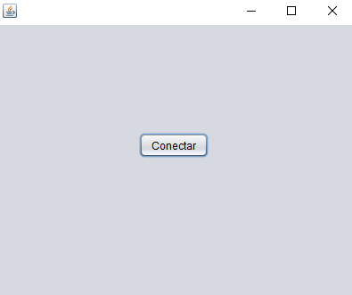

## 308. Consultas desde Java hacia la base de datos
```java
package aplicacion;

import java.sql.Connection;
import java.sql.DriverManager;
import java.sql.PreparedStatement;
import java.sql.ResultSet;
import javax.swing.JOptionPane;

public class Conexion extends javax.swing.JFrame {
    public static final String URL = "jdbc:mysql://localhost:3306/escuela?autoReconnet=true&useSSL=false";
    public static final String usuario = "root";
    public static final String contraseña = "1234";
    
    public Conexion() {
        initComponents();
    }
    @SuppressWarnings("unchecked")
    // <editor-fold defaultstate="collapsed" desc="Generated Code">                          
    private void initComponents() {

        botonConectar = new javax.swing.JButton();

        setDefaultCloseOperation(javax.swing.WindowConstants.EXIT_ON_CLOSE);

        botonConectar.setText("Conectar");
        botonConectar.addActionListener(new java.awt.event.ActionListener() {
            public void actionPerformed(java.awt.event.ActionEvent evt) {
                botonConectarActionPerformed(evt);
            }
        });

        javax.swing.GroupLayout layout = new javax.swing.GroupLayout(getContentPane());
        getContentPane().setLayout(layout);
        layout.setHorizontalGroup(
            layout.createParallelGroup(javax.swing.GroupLayout.Alignment.LEADING)
            .addGroup(javax.swing.GroupLayout.Alignment.TRAILING, layout.createSequentialGroup()
                .addContainerGap(161, Short.MAX_VALUE)
                .addComponent(botonConectar)
                .addGap(162, 162, 162))
        );
        layout.setVerticalGroup(
            layout.createParallelGroup(javax.swing.GroupLayout.Alignment.LEADING)
            .addGroup(layout.createSequentialGroup()
                .addGap(121, 121, 121)
                .addComponent(botonConectar)
                .addContainerGap(156, Short.MAX_VALUE))
        );

        pack();
    }// </editor-fold>                        

    private void botonConectarActionPerformed(java.awt.event.ActionEvent evt) {                                              
        Connection conexion = getConnection();
        PreparedStatement ps;
        ResultSet rs;      
        try {
            ps=conexion.prepareStatement("select * from persona");
            rs=ps.executeQuery();
            
            if (rs.next()) {
                JOptionPane.showMessageDialog(null, "Nombre: "+rs.getString("nombre")+
                        "\nDomicilio: "+rs.getString("domicilio")+
                        "\nCelular: "+rs.getString("celular")+
                        "\nCorreo Electronico: "+rs.getString("correo_electronico")+
                        "\nFecha Nacimiento: "+String.valueOf(rs.getDate("fecha_nacimiento"))+
                        "\nGenero: "+rs.getString("genero"));
            }
            else{
                JOptionPane.showMessageDialog(null, "No existen registros");
            }
            conexion.close();
        } catch (Exception ex) {
            System.err.println("Error, "+ex);
        }
    }                                             
   
    public Connection getConnection(){
        Connection conexion = null;
        
        try {
            Class.forName("com.mysql.jdbc.Driver");
            conexion=DriverManager.getConnection(URL,usuario,contraseña);
            JOptionPane.showMessageDialog(null, "Conexion exitosa");
        } catch (Exception ex) {
            System.err.println("Error, "+ex);
        }
        return conexion;
    }
    
    
    public static void main(String args[]) {
        /* Set the Nimbus look and feel */
        //<editor-fold defaultstate="collapsed" desc=" Look and feel setting code (optional) ">
        /* If Nimbus (introduced in Java SE 6) is not available, stay with the default look and feel.
         * For details see http://download.oracle.com/javase/tutorial/uiswing/lookandfeel/plaf.html 
         */
        try {
            for (javax.swing.UIManager.LookAndFeelInfo info : javax.swing.UIManager.getInstalledLookAndFeels()) {
                if ("Nimbus".equals(info.getName())) {
                    javax.swing.UIManager.setLookAndFeel(info.getClassName());
                    break;
                }
            }
        } catch (ClassNotFoundException ex) {
            java.util.logging.Logger.getLogger(Conexion.class.getName()).log(java.util.logging.Level.SEVERE, null, ex);
        } catch (InstantiationException ex) {
            java.util.logging.Logger.getLogger(Conexion.class.getName()).log(java.util.logging.Level.SEVERE, null, ex);
        } catch (IllegalAccessException ex) {
            java.util.logging.Logger.getLogger(Conexion.class.getName()).log(java.util.logging.Level.SEVERE, null, ex);
        } catch (javax.swing.UnsupportedLookAndFeelException ex) {
            java.util.logging.Logger.getLogger(Conexion.class.getName()).log(java.util.logging.Level.SEVERE, null, ex);
        }
        //</editor-fold>

        /* Create and display the form */
        java.awt.EventQueue.invokeLater(new Runnable() {
            public void run() {
                new Conexion().setVisible(true);
            }
        });
    }
    // Variables declaration - do not modify                     
    private javax.swing.JButton botonConectar;
    // End of variables declaration                   
}
```


## 309. ¿Que es un CRUD?
### ¿Que es un CRUD?
En informatica, CRUD es el acronimo de "Crear,Leer,Actualizar y Borrar"(del original en ingles Create,Read,Update and Delete), que se usa para referirse a las funciones basicas en bases de datos o la capa de persistencia en un software.

- C: Create-crear
- R: Read-Leer
- U: Update-Actualizar
- D: Delete-Borrar

## 310. Insertar registo desde Java hacia la base de datos
## 311. Buscar registro desde Java hacia la base de datos
## 312. Modificar registro desde Java hacia la base de datos
## 313. Eliminar registro desde Java hacia la base de datos
```java
package aplicacion;
import java.sql.Connection;
import java.sql.Date;
import java.sql.DriverManager;
import java.sql.PreparedStatement;
import java.sql.ResultSet;
import javax.swing.JOptionPane;

public class Persona extends javax.swing.JFrame {
    public static final String URL = "jdbc:mysql://localhost:3306/escuela?autoReconnet=true&useSSL=false";
    public static final String usuario = "root";
    public static final String contraseña = "1234";
    PreparedStatement ps;
    ResultSet rs;
    
    public Connection getConnection(){
        Connection conexion = null;
        
        try {
            Class.forName("com.mysql.jdbc.Driver");
            conexion= (Connection) DriverManager.getConnection(URL,usuario,contraseña);
            //JOptionPane.showMessageDialog(null, "Conexion exitosa");
        } catch (Exception ex) {
            System.err.println("Error, "+ex);
        }
        return conexion;
    }
    public void limpiarCajas(){
        cajaBuscar.setText(null);
        cajaClave.setText(null);
        cajaNombre.setText(null);
        cajaDomicilio.setText(null);
        cajaCelular.setText(null);
        cajaCorreoElectronico.setText(null);
        cajaFechaNacimiento.setText(null);
        comboGenero.setSelectedIndex(0);
    }
    
    public Persona() {
        initComponents();
        cajaID.setVisible(false);
        setLocationRelativeTo(null);
    }
    @SuppressWarnings("unchecked")
    // <editor-fold defaultstate="collapsed" desc="Generated Code">                          
    private void initComponents() {

        jTextField4 = new javax.swing.JTextField();
        cajaBuscar = new javax.swing.JTextField();
        botonBuscar = new javax.swing.JButton();
        cajaID = new javax.swing.JTextField();
        jLabel1 = new javax.swing.JLabel();
        cajaClave = new javax.swing.JTextField();
        jLabel2 = new javax.swing.JLabel();
        cajaNombre = new javax.swing.JTextField();
        jLabel3 = new javax.swing.JLabel();
        cajaDomicilio = new javax.swing.JTextField();
        jLabel4 = new javax.swing.JLabel();
        cajaCelular = new javax.swing.JTextField();
        jLabel5 = new javax.swing.JLabel();
        cajaCorreoElectronico = new javax.swing.JTextField();
        jLabel6 = new javax.swing.JLabel();
        cajaFechaNacimiento = new javax.swing.JTextField();
        jLabel7 = new javax.swing.JLabel();
        comboGenero = new javax.swing.JComboBox<>();
        botonInsertar = new javax.swing.JButton();
        botonModificar = new javax.swing.JButton();
        botonEliminar = new javax.swing.JButton();
        botonLimpiar = new javax.swing.JButton();

        jTextField4.setText("jTextField4");

        setDefaultCloseOperation(javax.swing.WindowConstants.EXIT_ON_CLOSE);

        cajaBuscar.addActionListener(new java.awt.event.ActionListener() {
            public void actionPerformed(java.awt.event.ActionEvent evt) {
                cajaBuscarActionPerformed(evt);
            }
        });

        botonBuscar.setText("Buscar");
        botonBuscar.addActionListener(new java.awt.event.ActionListener() {
            public void actionPerformed(java.awt.event.ActionEvent evt) {
                botonBuscarActionPerformed(evt);
            }
        });

        jLabel1.setText("Clave: ");

        jLabel2.setText("Nombre: ");

        jLabel3.setText("Domicilio:");

        jLabel4.setText("Celular");

        jLabel5.setText("Correo electrónico: ");

        jLabel6.setText("Fecha nacimiento: ");

        jLabel7.setText("Género: ");

        comboGenero.setModel(new javax.swing.DefaultComboBoxModel<>(new String[] { "Seleccionar", "Masculino", "Femenino" }));

        botonInsertar.setText("Insertar");
        botonInsertar.addActionListener(new java.awt.event.ActionListener() {
            public void actionPerformed(java.awt.event.ActionEvent evt) {
                botonInsertarActionPerformed(evt);
            }
        });

        botonModificar.setText("Modificar");
        botonModificar.addActionListener(new java.awt.event.ActionListener() {
            public void actionPerformed(java.awt.event.ActionEvent evt) {
                botonModificarActionPerformed(evt);
            }
        });

        botonEliminar.setText("Eliminar");
        botonEliminar.addActionListener(new java.awt.event.ActionListener() {
            public void actionPerformed(java.awt.event.ActionEvent evt) {
                botonEliminarActionPerformed(evt);
            }
        });

        botonLimpiar.setText("Limpiar");
        botonLimpiar.addActionListener(new java.awt.event.ActionListener() {
            public void actionPerformed(java.awt.event.ActionEvent evt) {
                botonLimpiarActionPerformed(evt);
            }
        });

        javax.swing.GroupLayout layout = new javax.swing.GroupLayout(getContentPane());
        getContentPane().setLayout(layout);
        layout.setHorizontalGroup(
            layout.createParallelGroup(javax.swing.GroupLayout.Alignment.LEADING)
            .addGroup(javax.swing.GroupLayout.Alignment.TRAILING, layout.createSequentialGroup()
                .addGroup(layout.createParallelGroup(javax.swing.GroupLayout.Alignment.TRAILING)
                    .addGroup(layout.createSequentialGroup()
                        .addContainerGap(javax.swing.GroupLayout.DEFAULT_SIZE, Short.MAX_VALUE)
                        .addComponent(cajaBuscar, javax.swing.GroupLayout.PREFERRED_SIZE, 138, javax.swing.GroupLayout.PREFERRED_SIZE)
                        .addGap(18, 18, 18)
                        .addGroup(layout.createParallelGroup(javax.swing.GroupLayout.Alignment.LEADING, false)
                            .addComponent(cajaID)
                            .addComponent(botonBuscar, javax.swing.GroupLayout.DEFAULT_SIZE, 81, Short.MAX_VALUE)))
                    .addGroup(javax.swing.GroupLayout.Alignment.LEADING, layout.createSequentialGroup()
                        .addGap(42, 42, 42)
                        .addGroup(layout.createParallelGroup(javax.swing.GroupLayout.Alignment.LEADING)
                            .addComponent(jLabel1, javax.swing.GroupLayout.PREFERRED_SIZE, 61, javax.swing.GroupLayout.PREFERRED_SIZE)
                            .addComponent(jLabel2)
                            .addComponent(jLabel3)
                            .addComponent(jLabel4)
                            .addComponent(jLabel5)
                            .addComponent(jLabel6)
                            .addComponent(jLabel7)
                            .addComponent(botonInsertar))
                        .addGroup(layout.createParallelGroup(javax.swing.GroupLayout.Alignment.LEADING)
                            .addGroup(layout.createSequentialGroup()
                                .addGap(58, 58, 58)
                                .addGroup(layout.createParallelGroup(javax.swing.GroupLayout.Alignment.LEADING)
                                    .addComponent(cajaCorreoElectronico)
                                    .addComponent(cajaFechaNacimiento)))
                            .addGroup(javax.swing.GroupLayout.Alignment.TRAILING, layout.createSequentialGroup()
                                .addPreferredGap(javax.swing.LayoutStyle.ComponentPlacement.RELATED, javax.swing.GroupLayout.DEFAULT_SIZE, Short.MAX_VALUE)
                                .addGroup(layout.createParallelGroup(javax.swing.GroupLayout.Alignment.LEADING)
                                    .addGroup(javax.swing.GroupLayout.Alignment.TRAILING, layout.createParallelGroup(javax.swing.GroupLayout.Alignment.LEADING, false)
                                        .addComponent(cajaClave)
                                        .addComponent(cajaNombre)
                                        .addComponent(cajaDomicilio)
                                        .addComponent(cajaCelular, javax.swing.GroupLayout.DEFAULT_SIZE, 313, Short.MAX_VALUE))
                                    .addComponent(comboGenero, javax.swing.GroupLayout.Alignment.TRAILING, javax.swing.GroupLayout.PREFERRED_SIZE, 313, javax.swing.GroupLayout.PREFERRED_SIZE)))
                            .addGroup(layout.createSequentialGroup()
                                .addGap(16, 16, 16)
                                .addComponent(botonModificar)
                                .addGap(40, 40, 40)
                                .addComponent(botonEliminar)
                                .addPreferredGap(javax.swing.LayoutStyle.ComponentPlacement.RELATED, javax.swing.GroupLayout.DEFAULT_SIZE, Short.MAX_VALUE)
                                .addComponent(botonLimpiar)))))
                .addGap(32, 32, 32))
        );
        layout.setVerticalGroup(
            layout.createParallelGroup(javax.swing.GroupLayout.Alignment.LEADING)
            .addGroup(layout.createSequentialGroup()
                .addGap(43, 43, 43)
                .addGroup(layout.createParallelGroup(javax.swing.GroupLayout.Alignment.BASELINE)
                    .addComponent(cajaBuscar, javax.swing.GroupLayout.PREFERRED_SIZE, javax.swing.GroupLayout.DEFAULT_SIZE, javax.swing.GroupLayout.PREFERRED_SIZE)
                    .addComponent(botonBuscar))
                .addPreferredGap(javax.swing.LayoutStyle.ComponentPlacement.RELATED)
                .addComponent(cajaID, javax.swing.GroupLayout.PREFERRED_SIZE, javax.swing.GroupLayout.DEFAULT_SIZE, javax.swing.GroupLayout.PREFERRED_SIZE)
                .addGap(27, 27, 27)
                .addGroup(layout.createParallelGroup(javax.swing.GroupLayout.Alignment.BASELINE)
                    .addComponent(jLabel1, javax.swing.GroupLayout.PREFERRED_SIZE, 22, javax.swing.GroupLayout.PREFERRED_SIZE)
                    .addComponent(cajaClave, javax.swing.GroupLayout.PREFERRED_SIZE, javax.swing.GroupLayout.DEFAULT_SIZE, javax.swing.GroupLayout.PREFERRED_SIZE))
                .addGap(18, 18, 18)
                .addGroup(layout.createParallelGroup(javax.swing.GroupLayout.Alignment.BASELINE)
                    .addComponent(jLabel2)
                    .addComponent(cajaNombre, javax.swing.GroupLayout.PREFERRED_SIZE, javax.swing.GroupLayout.DEFAULT_SIZE, javax.swing.GroupLayout.PREFERRED_SIZE))
                .addGap(18, 18, 18)
                .addGroup(layout.createParallelGroup(javax.swing.GroupLayout.Alignment.BASELINE)
                    .addComponent(jLabel3)
                    .addComponent(cajaDomicilio, javax.swing.GroupLayout.PREFERRED_SIZE, javax.swing.GroupLayout.DEFAULT_SIZE, javax.swing.GroupLayout.PREFERRED_SIZE))
                .addGap(18, 18, 18)
                .addGroup(layout.createParallelGroup(javax.swing.GroupLayout.Alignment.BASELINE)
                    .addComponent(jLabel4)
                    .addComponent(cajaCelular, javax.swing.GroupLayout.PREFERRED_SIZE, javax.swing.GroupLayout.DEFAULT_SIZE, javax.swing.GroupLayout.PREFERRED_SIZE))
                .addGap(18, 18, 18)
                .addGroup(layout.createParallelGroup(javax.swing.GroupLayout.Alignment.BASELINE)
                    .addComponent(jLabel5)
                    .addComponent(cajaCorreoElectronico, javax.swing.GroupLayout.PREFERRED_SIZE, javax.swing.GroupLayout.DEFAULT_SIZE, javax.swing.GroupLayout.PREFERRED_SIZE))
                .addGap(18, 18, 18)
                .addGroup(layout.createParallelGroup(javax.swing.GroupLayout.Alignment.BASELINE)
                    .addComponent(jLabel6)
                    .addComponent(cajaFechaNacimiento, javax.swing.GroupLayout.PREFERRED_SIZE, javax.swing.GroupLayout.DEFAULT_SIZE, javax.swing.GroupLayout.PREFERRED_SIZE))
                .addGap(18, 18, 18)
                .addGroup(layout.createParallelGroup(javax.swing.GroupLayout.Alignment.BASELINE)
                    .addComponent(jLabel7)
                    .addComponent(comboGenero, javax.swing.GroupLayout.PREFERRED_SIZE, javax.swing.GroupLayout.DEFAULT_SIZE, javax.swing.GroupLayout.PREFERRED_SIZE))
                .addPreferredGap(javax.swing.LayoutStyle.ComponentPlacement.RELATED, 44, Short.MAX_VALUE)
                .addGroup(layout.createParallelGroup(javax.swing.GroupLayout.Alignment.BASELINE)
                    .addComponent(botonInsertar)
                    .addComponent(botonModificar)
                    .addComponent(botonEliminar)
                    .addComponent(botonLimpiar))
                .addGap(27, 27, 27))
        );

        pack();
    }// </editor-fold>                        

    private void cajaBuscarActionPerformed(java.awt.event.ActionEvent evt) {                                           
        
    }                                          

    private void botonInsertarActionPerformed(java.awt.event.ActionEvent evt) {                                              
        Connection conexion = null;
        try {
            conexion=getConnection();
            ps=conexion.prepareStatement("insert into persona(clave,nombre,domicilio,celular,correo_electronico,fecha_nacimiento,genero) values (?,?,?,?,?,?,?)");
            ps.setString(1,cajaClave.getText());
            ps.setString(2,cajaNombre.getText());
            ps.setString(3,cajaDomicilio.getText());
            ps.setString(4,cajaCelular.getText());
            ps.setString(5,cajaCorreoElectronico.getText());
            ps.setDate(6,Date.valueOf(cajaFechaNacimiento.getText()));
            ps.setString(7, (String) comboGenero.getSelectedItem());
            
            int resultado=ps.executeUpdate();//Ejecutamos la insercion
            
            if (resultado>0) {
                JOptionPane.showMessageDialog(null, "Registro insertado correctamente");
                limpiarCajas();
            }
            else{
                JOptionPane.showMessageDialog(null, "Error al insertar el registro");
                limpiarCajas();
            }
            conexion.close();
        } catch (Exception ex) {
            System.err.println("Error, "+ex);
        }
    }                                             

    private void botonLimpiarActionPerformed(java.awt.event.ActionEvent evt) {                                             
        limpiarCajas();
    }                                            

    private void botonBuscarActionPerformed(java.awt.event.ActionEvent evt) {                                            
        Connection conexion = null;
        
        try {
            conexion=getConnection();
            ps=conexion.prepareStatement("select * from persona where clave=?");
            ps.setString(1, cajaBuscar.getText());
            rs=ps.executeQuery();
            
            if (rs.next()) {
                cajaID.setText(String.valueOf(rs.getInt("idPersona")));
                cajaClave.setText(rs.getString("clave"));
                cajaNombre.setText(rs.getString("nombre"));
                cajaDomicilio.setText(rs.getString("domicilio"));
                cajaCelular.setText(rs.getString("celular"));
                cajaCorreoElectronico.setText(rs.getString("correo_electronico"));
                cajaFechaNacimiento.setText(String.valueOf(rs.getDate("fecha_nacimiento")));
                comboGenero.setSelectedItem(rs.getString("genero"));
            }
            else{
                JOptionPane.showMessageDialog(null, "No existe una persona con esa clave");
            }
            conexion.close();
            
        } catch (Exception ex) {
            System.err.println("Error, "+ex);
        }
    }                                           

    private void botonModificarActionPerformed(java.awt.event.ActionEvent evt) {                                               
        Connection conexion = null;
        try {
            conexion=getConnection();
            ps=conexion.prepareStatement("update persona set clave=?,nombre=?,domicilio=?,celular=?,correo_electronico=?,fecha_nacimiento=?,genero=? where idPersona=?");
            ps.setString(1,cajaClave.getText());
            ps.setString(2,cajaNombre.getText());
            ps.setString(3,cajaDomicilio.getText());
            ps.setString(4,cajaCelular.getText());
            ps.setString(5,cajaCorreoElectronico.getText());
            ps.setDate(6,Date.valueOf(cajaFechaNacimiento.getText()));
            ps.setString(7, (String) comboGenero.getSelectedItem());
            ps.setInt(8, Integer.parseInt(cajaID.getText()));
            
            int resultado=ps.executeUpdate();//Ejecutamos la modificacion
            
            if (resultado>0) {
                JOptionPane.showMessageDialog(null, "Registro modificado correctamente");
                limpiarCajas();
            }
            else{
                JOptionPane.showMessageDialog(null, "Error al modificar el registro");
                limpiarCajas();
            }
            conexion.close();
        } catch (Exception ex) {
            System.err.println("Error, "+ex);
        }
    }                                              

    private void botonEliminarActionPerformed(java.awt.event.ActionEvent evt) {                                              
        Connection conexion = null;
        try {
            conexion=getConnection();
            ps=conexion.prepareStatement("delete from persona where idPersona=?");
            ps.setInt(1, Integer.parseInt(cajaID.getText()));
            
            int resultado=ps.executeUpdate();//Ejecutamos la eliminacion
            
            if (resultado>0) {
                JOptionPane.showMessageDialog(null, "Registro eliminado correctamente");
                limpiarCajas();
            }
            else{
                JOptionPane.showMessageDialog(null, "Error al eliminar el registro");
                limpiarCajas();
            }
            conexion.close();
        } catch (Exception ex) {
            System.err.println("Error, "+ex);
        }
    }                                             

    /**
     * @param args the command line arguments
     */
    public static void main(String args[]) {
        /* Set the Nimbus look and feel */
        //<editor-fold defaultstate="collapsed" desc=" Look and feel setting code (optional) ">
        /* If Nimbus (introduced in Java SE 6) is not available, stay with the default look and feel.
         * For details see http://download.oracle.com/javase/tutorial/uiswing/lookandfeel/plaf.html 
         */
        try {
            for (javax.swing.UIManager.LookAndFeelInfo info : javax.swing.UIManager.getInstalledLookAndFeels()) {
                if ("Nimbus".equals(info.getName())) {
                    javax.swing.UIManager.setLookAndFeel(info.getClassName());
                    break;
                }
            }
        } catch (ClassNotFoundException ex) {
            java.util.logging.Logger.getLogger(Persona.class.getName()).log(java.util.logging.Level.SEVERE, null, ex);
        } catch (InstantiationException ex) {
            java.util.logging.Logger.getLogger(Persona.class.getName()).log(java.util.logging.Level.SEVERE, null, ex);
        } catch (IllegalAccessException ex) {
            java.util.logging.Logger.getLogger(Persona.class.getName()).log(java.util.logging.Level.SEVERE, null, ex);
        } catch (javax.swing.UnsupportedLookAndFeelException ex) {
            java.util.logging.Logger.getLogger(Persona.class.getName()).log(java.util.logging.Level.SEVERE, null, ex);
        }
        //</editor-fold>

        /* Create and display the form */
        java.awt.EventQueue.invokeLater(new Runnable() {
            public void run() {
                new Persona().setVisible(true);
            }
        });
    }

    // Variables declaration - do not modify                     
    private javax.swing.JButton botonBuscar;
    private javax.swing.JButton botonEliminar;
    private javax.swing.JButton botonInsertar;
    private javax.swing.JButton botonLimpiar;
    private javax.swing.JButton botonModificar;
    private javax.swing.JTextField cajaBuscar;
    private javax.swing.JTextField cajaCelular;
    private javax.swing.JTextField cajaClave;
    private javax.swing.JTextField cajaCorreoElectronico;
    private javax.swing.JTextField cajaDomicilio;
    private javax.swing.JTextField cajaFechaNacimiento;
    private javax.swing.JTextField cajaID;
    private javax.swing.JTextField cajaNombre;
    private javax.swing.JComboBox<String> comboGenero;
    private javax.swing.JLabel jLabel1;
    private javax.swing.JLabel jLabel2;
    private javax.swing.JLabel jLabel3;
    private javax.swing.JLabel jLabel4;
    private javax.swing.JLabel jLabel5;
    private javax.swing.JLabel jLabel6;
    private javax.swing.JLabel jLabel7;
    private javax.swing.JTextField jTextField4;
    // End of variables declaration                   
}
```


## 314. ¿Que es el modelo vista controlador(MVC)?
- El MVC o Modelo-Vista-Controlador es un patron de arquitectura de software que, utilizando 3 componentes separa la logica de la aplicacion de la logica de la vista en una aplicacion. Es una arquitectura importante puesto que se utiliza tanto en componentes graficos basicos hasta sistemas empresariales.

### Modelo
Se encarga de los datos, generalmente consultando la base de datos. Actualizaciones, consultas, busquedas, etc.
### Vista
Son la representacion visual de los datos, todo lo que tenga que ver con la interfaz grafica va aqui. Ni el modelo ni el controlador se preocupan de como se veran los datos, esa responsabilidad es unicamente de la vista.
### Controlador
Se encarga de controlar, recibe las ordenes del usuario a traves de los eventos de la interfaz grafica y se encarga de solicitar los datos al modelo y de comunicarselos a la vista.

## 315. Ejemplo sencillo de Modelo-Vista-Controlador(MVC)
```java
package ejemplo_mvc;
import controlador.Controlador;
import modelo.Modelo;
import vista.Vista;

public class Ejemplo_MVC {
    public static void main(String[] args) {
        Vista vista = new Vista();
        Modelo modelo = new Modelo();
        Controlador controlador = new Controlador(vista, modelo);
        
        controlador.iniciar();
        vista.setVisible(true);
    }
}
```
```java
package modelo;
public class Modelo {
    private int numero1;
    private int numero2;
    private int resultado;

    public int getNumero1() {
        return numero1;
    }
    public void setNumero1(int numero1) {
        this.numero1 = numero1;
    }
    public int getNumero2() {
        return numero2;
    }
    public void setNumero2(int numero2) {
        this.numero2 = numero2;
    }
    public int getResultado() {
        return resultado;
    }
    public void setResultado(int resultado) {
        this.resultado = resultado;
    }
    public int sumar(){
        resultado = numero1+numero2;
        return resultado;
    }
}
```
```java
package controlador;
import java.awt.event.ActionEvent;
import java.awt.event.ActionListener;
import modelo.Modelo;
import vista.Vista;

public class Controlador implements ActionListener{
    private Vista vista;
    private Modelo modelo;

    public Controlador(Vista vista, Modelo modelo) {
        this.vista = vista;
        this.modelo = modelo;
        vista.botonSumar.addActionListener(this);
    }
    public void iniciar(){
        vista.setTitle("MVC Sumar");
        vista.setLocationRelativeTo(null);
    }
    @Override
    public void actionPerformed(ActionEvent e) {
        modelo.setNumero1(Integer.parseInt(vista.cajaNumero1.getText()));
        modelo.setNumero2(Integer.parseInt(vista.cajaNumero2.getText()));
        modelo.sumar();
        
        vista.cajaResultado.setText(String.valueOf(modelo.getResultado()));
    }    
}
```

## 316. CRUD con MVC
## 317. CRUD con MVC - Insertar
## 318. CRUD con MVC - Limpiar cajas
## 319. CRUD con MVC - Buscar